## The goal of this course

This course will teach you how to exploit `R` and apply its geospatial techniques in a social science context.

By the end of this course, you should...

-   Be comfortable with using **geospatial data** in `R`
-   Including **importing, wrangling, and exploring** geospatial data
-   Be able to **create maps** based on your very own processed geospatial data in `R`
-   Feel prepared for (your first steps in) **spatial analysis**


## We are (necessarily) selective

There's a multitude of spatial `R` packages

-   We cannot cover all of them
-   And we cannot cover all functions
-   You may have used some we are not familiar with

We will show the use of packages we exploit in practice

-   There's always another way of doing things in `R`
-   Don't hesitate to bring up your solutions

**You can't learn everything at once, but you also don't have to!**

## Prerequisites for this course

::::: columns
::: {.column width="40%"}
-   Knowledge of `R`, its syntax, and internal logic
-   Affinity for using script-based languages
-   Don't be scared to wrangle data with complex structures
-   Working versions of `R` (and `Rstudio`) on your computer
:::

::: {.column width="60%"}
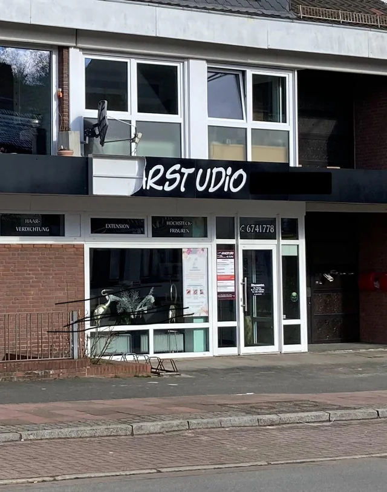{fig-align="center" width="60%"}
:::
:::::

## About us (Stefan)

::::: columns
::: {.column width="40%"}
{fig-align="center" width="60%"}
:::

::: {.column width="60%"}
-   Senior Researcher in the team Survey Data Augmentation at the GESIS department Survey Data Curation
-   Ph.D. in Social Sciences, University of Cologne
-   Research interests:
    -   Quantitative methods, Geographic Information Systems (GIS)
    -   Social inequalities
    -   Attitudes towards minorities
    -   Environmental attitudes
    -   Reproducible research
:::
:::::


## About us (Anne)

::::: columns
::: {.column width="40%"}
{fig-align="center" width="75%"}
:::

::: {.column width="60%"}
- Postdoctoral Researcher in the team Survey Data Augmentation at the GESIS department Survey Data Curation
- Ph.D. in Political Science, University of Mannheim
- Research interests:
  - Quantitative methods, Geographic Information Systems (GIS)
  - Political trust, resentment and voting
  - Spatial Disparities
  - Data Quality of Linked Data
:::
:::::


## About us (Dennis)

::::: columns
::: {.column width="40%"}
{fig-align="center" width="60%"}
:::

::: {.column width="60%"}
-   Postdoctoral Researcher in the team Survey Data Augmentation at the GESIS department Survey Data Curation
-   Ph.D. in Political Economy, University of Cologne
-   Research interests:
    -   Quantitative methods, Geographic Information Systems (GIS)
    -   Environmental attitudes and behavior
    -   Public policy
    -   Open source software
:::
:::::


## About you

::::: columns
::: {.column width="40%"}
-   What's your name?
-   Where do you work/research?
-   What are you working on/researching?
-   What is your experience with `R` or other programming languages?
-   Do you already have experience with geospatial data?
:::

::: {.column width="60%"}
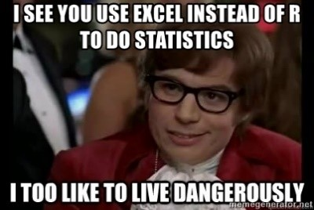{fig-align="center" width="75%"}
:::
:::::


## Course schedule

```{r}
#| echo: false
source("course_content.R")
course_content
```


## Now

```{r}
#| echo: false
course_content |> 
  kableExtra::row_spec(1, background = "yellow")
```


## "All things are connected"

**Catchphrase #1: Tobler's Law:** "*I invoke the first law of geography: everything is related to everything else, but near things are more related than distant things.*" (Tobler 1970)[^1]

**Catchphrase #2: Tobler's Addendum:** "*near can take on many meanings in different situations.*" (Tobler 2004)[^2]

$\rightarrow$ "*Space is more than geography*" (Beck et al. 2006)[^3]

<br>

[^1]: Tobler, Waldo R. 1970. A Computer Movie Simulating Urban Growth in the Detroit Region. *Economic Geography* 46, 234-240.
[^2]: Tobler, Waldo R. 2004. On the First Law of Geography: A Reply. *Annals of the Association of American Geographers* 94(2), 304-310.
[^3]: Beck, Nathaniel, Kristian Gleditsch, and Kyle Beardsley. 2006. Space Is More than Geography: Using Spatial Econometrics in the Study of Political Economy. *International Studies Quarterly* 50, 27-44.


## Spatial Association

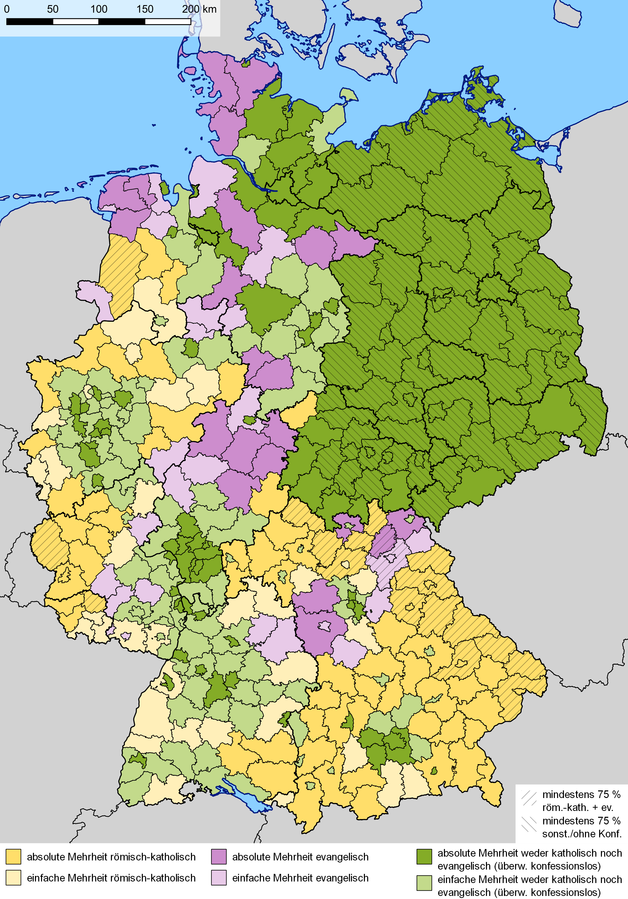{fig-align="center" width="20%"}


<small>Source: [Gretarsson based on Zensus 2022](https://de.wikipedia.org/wiki/Religionen_in_Deutschland#/media/Datei:Konfessionen_Deutschland_Zensus_2022.png) </small>


## "All things are connected"

A lot of (classic) theories inherently make use of space (e.g., Allport 1954)[^4]

[^4]: Allport, Gordon W. 1954. The Nature of Prejudice. Cambridge, Massachusetts: Addison-Wesley Publishing Company.

-   It's where people interact
-   It's what people collectively shape
-   **Space becomes place**

Thus, there's a deep intersection or even embeddedness of space in social science research

-   It's what geographers call "human-environment-system"
-   But often, these links are even only implicit in our data


## Geographic information in social science

::::: columns
::: {.column width="50%"}
Exploiting geographic information is not new.

For example, Siegfried (1913)[^5] used soil composition information to explain election results in France.

The book is often seen as foundational for **electoral geography** because it demonstrates that political behavior is embedded in place.
:::

::: {.column width="50%"}
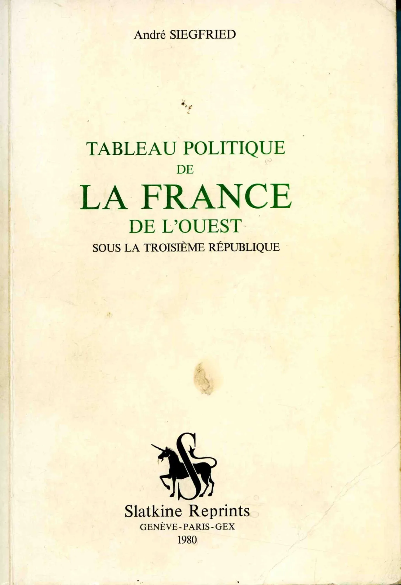{fig-align="center" width="50%"}
:::
:::::

[^5]: Siegfried, André. 1913. Tableau Politique de La France de l’Ouest Sous La Troisième République. Paris: Collin.


## Remember the Chicago School?

Park, Burgess, and McKenzie (1925) argue that the city should be studied not just as a physical settlement, but as a social and ecological order shaped by **interaction, competition, mobility, institutions, and patterns of land use**.

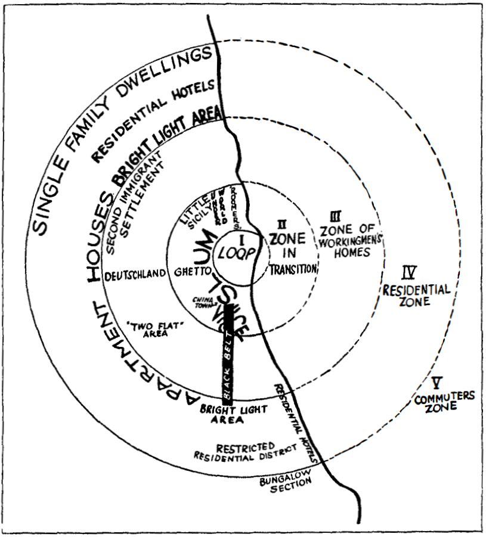{fig-align="center" width="25%"}


::: aside
Park, Robert E., Ernest W. Burgess, and Roderick D. McKenzie. 1925. The City. Suggestions for Investigation of Human Behavior in the Urban Environment. Chicago and London: University of Chicago Press.
:::


## Today {.smaller}

So many studies still rely on these ideas but incorporate space directly, e.g.,

::::: columns
::: {.column width="50%"}
<ul style="font-size:.55em;">

<li>Iyer, A., & Pryce, G. (2023). Theorising the causal impacts of social frontiers: The social and psychological implications of discontinuities in the geography of residential mix. Urban Studies, https://doi.org/10.1177/00420980231194834</li>

<li>Kent, J. (2022). Can urban fabric encourage tolerance? Evidence that the structure of cities influences attitudes toward migrants in Europe. Cities, 121, 103494. https://doi.org/10.1016/j.cities.2021.103494</li>

<li>Schmidt, K., Jacobsen, J., & Iglauer, T. (2023). Proximity to refugee accommodations does not affect locals’ attitudes toward refugees: Evidence from Germany. European Sociological Review, jcad028. https://doi.org/10.1093/esr/jcad028</li>

<li>Xu, A. Z. (2023). Segregation and the Spatial Externalities of Inequality: A Theory of Interdependence and Public Goods in Cities. American Political Science Review, 1–18. https://doi.org/10.1017/S0003055423000722</li>

<li>...</li>

<li>**Jünger**, S., & Schaeffer, M. (2023). Ethnic Diversity and Social Integration—What are the Consequences of Ethnic Residential Boundaries and Halos for Social Integration in Germany? KZfSS Kölner Zeitschrift Für Soziologie Und Sozialpsychologie. https://doi.org/10.1007/s11577-023-00888-1</li>

</ul>
:::

::: {.column width="50%"}
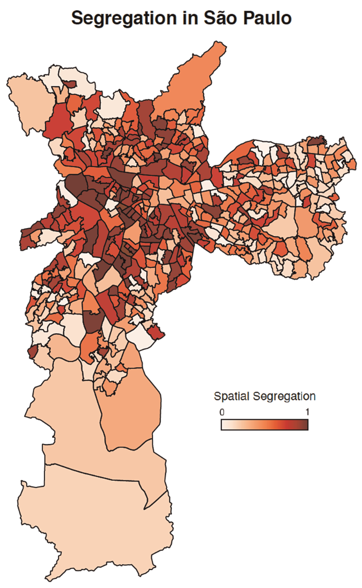{fig-align="center" width="40%"}

<p align="right">

<small>Xu, 2023</small>

</p>
:::
:::::


## PolSci perspectives

"*Since 1815, the probability that a randomly chosen country will be a democracy is about 0.75 if the majority of its neighbours are democracies, but only 0.14 if the majority of its neighbors are non-democracies*." (Gleditsch and Ward 2006)

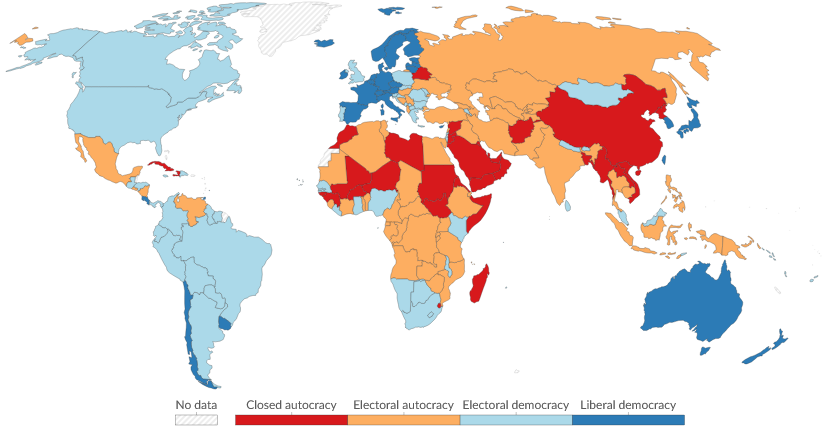{fig-align="center" width="70%"}

<small>[V-Dem. 2026](https://ourworldindata.org/grapher/political-regime) </small>


## Some recent studies

::::: columns
::: {.column width="50%"}
[Hoffmann et al. 2022](https://doi.org/10.1038/s41558-021-01263-8) analyse how the **experience of climate anomalies and extremes** influences **environmental attitudes** and **vote intention** in Europe

<ul style="font-size:.7em;">
- Data integration of 1. harmonized **Eurobarometer** data, 2. EU parliamentary **electoral** data, and 3. **climatological** data
- Aggregation on regional levels (**NUTS-2** and **NUTS-3**)
- Climatological data from ERA5 reanalysis (CS3)
- Calculations of temperature anomalies and extremes based on reference period (1971-2000) 
- Findings suggest effect of temperature anomalies (heat, "dry spell") on environmental concern and vote intention
</ul>
:::

::: {.column width="50%"}
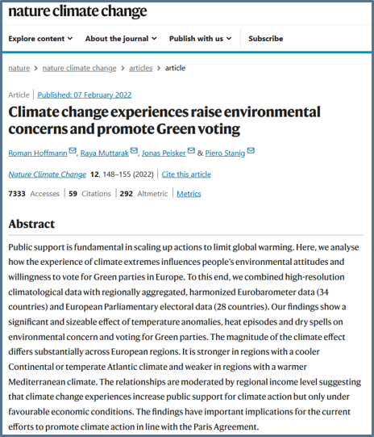{fig-align="center" width="80%"}
:::
:::::


## Some recent studies

::::: columns
::: {.column width="50%"}
[Jean et al. 2016](https://doi.org/10.1126/science.aaf7894) show how **nighttime maps** can be utilized as estimates of **household consumption and assets**

<ul style="font-size:.7em;">
- Economic indicators are hard to measure in poorer countries - satellite imagery could be an alternative proxy for it
- The authors integrate 1. **survey** data (World Bank’s Living Standards Measurement Surveys - LSMS; and Demographic and Health Surveys - DHS) with 2. **nighttime light** data in five African countries - Nigeria, Tanzania, Uganda, Malawi, and Rwanda
- ML approach for image feature extraction in nighttime maps
- Daytime satellite images from Google Static Maps, nighttime lights from US DMSP
- Model can explain up to 75% of variation in local-level economic outcomes
</ul>
:::

::: {.column width="50%"}
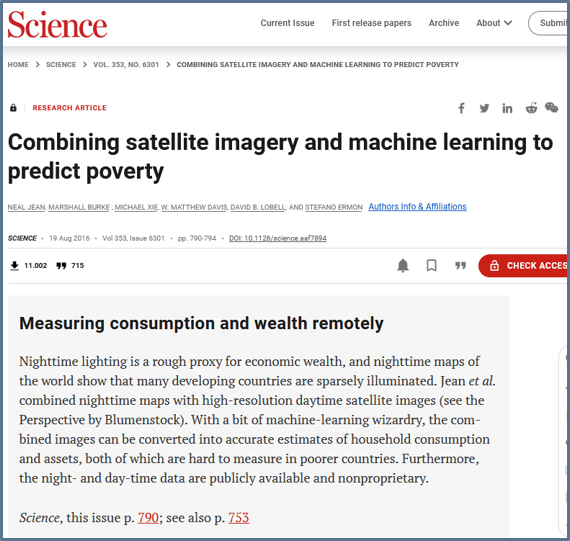{fig-align="center" width="80%"}
:::
:::::


## Our work: Deprivation & discontent

{fig-align="center" width="70%"}


## Our work: Climate risks

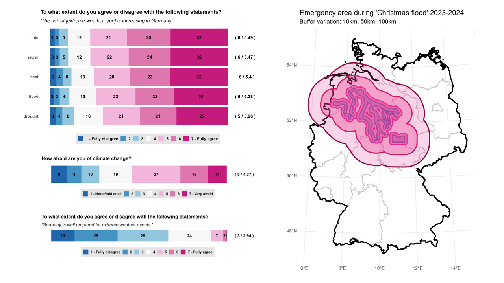{fig-align="center" width="50%"}


## The challenge in a nutshell

{fig-align="center" width="70%"}

## The challenge in a nutshell

{fig-align="center" width="70%"}

## The challenge in a nutshell

{fig-align="center" width="70%"}


## What are geospatial data?

::::: columns
::: {.column width="50%"}
Data with a direct spatial reference

$\rightarrow$ **geo-coordinates** x, y (and z)

Visualizing geometries in different styles depending on format:

-   Vector data (points, lines, polygons)
-   Raster data (grids) 
-   Coordinate Reference System (CRS)
:::

::: {.column width="50%"}
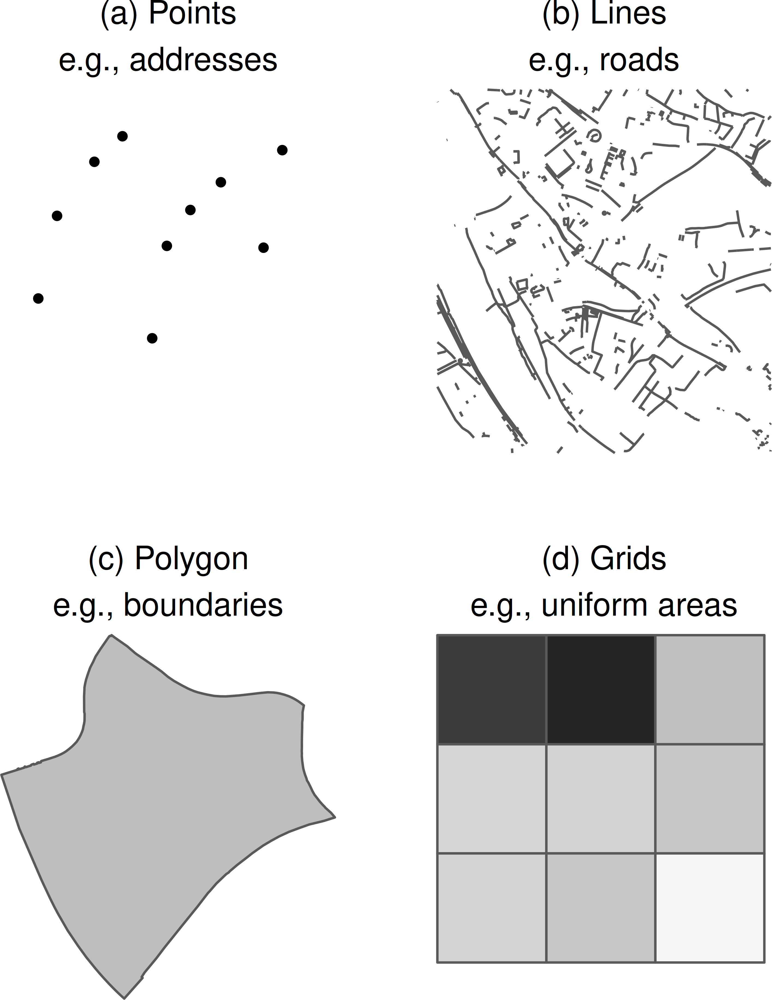{fig-align="center" width="50%"}

<small>Sources: OpenStreetMap / GEOFABRIK (2018), City of Cologne (2014), and the Statistical Offices of the Federation and the Länder (2016) / Jünger, 2019</small>
:::
:::::

------------------------------------------------------------------------

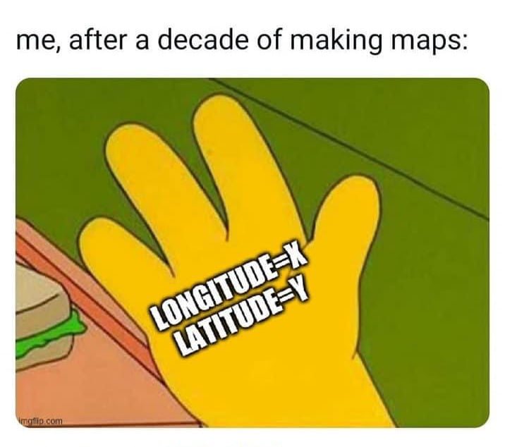{fig-align="center" width="30%"}

## Coordinate reference system (CRS)

- CRS is a reference system to determine the **precise location** of points in space
- GIS programs **MUST** know CRS for accurate processing, visualization, and analysis of data

**In practice, what matters most is that two or more layers match when integrating them.**


## Coordinate reference system (CRS)
<ul style="font-size:.8em;">
You may hear from **geographic**, **geocentric**, **projected**, or **local** CRS.

What's the difference?

-   whether **2 dimensional** (longitude, latitude) or **3 dimensional** (+height) coordinates are used
-   the location of the coordinate system's **origin** (center of Earth or not)
-   **projection** on a flat surface (transformation of longitudes and latitudes to x and y coordinates)
-   **location** (the smaller, the more precise the projections)

CRS is based on the:

1. **Geographic Coordinate System** (GCS) +
2. **Projected Coordinate System** (PCS)

</ul>

## Geographic Coordinate System (GCS)

*Necessary to know where exactly on Earth's surface data is located*

::::: columns
::: {.column width="50%"}
<ul style="font-size:.9em;">
- GCS uses three-dimensional spherical surface to define locations based on **datum** and **latitude** and **longitude** lines
- **Datum**: Mathematical model of the Earth that serves as reference point by defining size and shape of Earth
- **Local datum**: Optimizes fit for particular location (like NAD83)
- **Geocentric datum**: Optimizes fit for entire Earth (like Word Geodetic Survey 1984 - WGS84)
- **WGS84** is standard for GPS and many applications
</ul>

:::

::: {.column width="50%"}
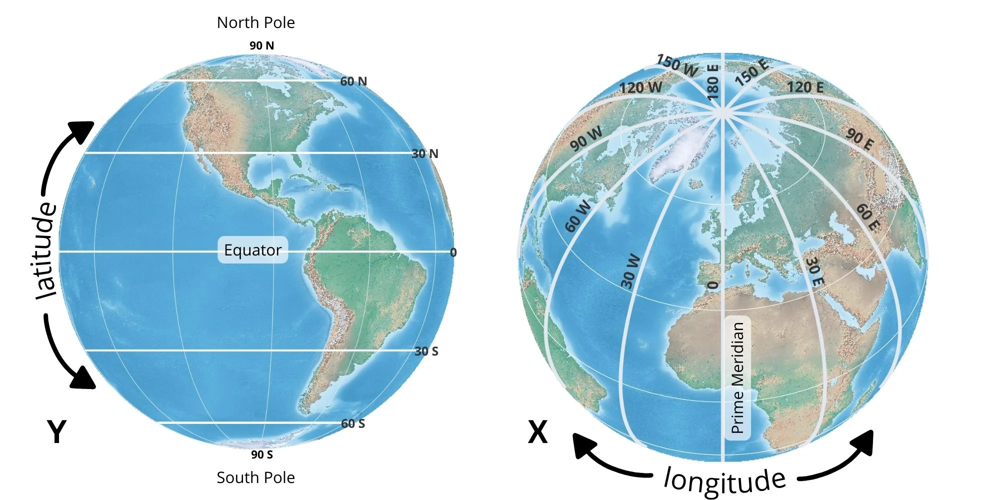{fig-align="center" width="90%"}

<small>Source: [Caitlin Dempsey](https://support.tribalgis.com/article/29-basics-of-coordinate-systems-and-projections) </small>

:::
:::::

## Projected Coordinate System (PCS)

*Necessary to draw the data on a flat map*

::::: columns
::: {.column width="50%"}
- PCS represents Earth' surface on a **flat plane** by mathematical transformations (projections)
- **Coordinate grid**: Here we talk about **x** and **y** coordinates (= easting and northing)
- Conversion of degrees of latitude and longitude into measurable units (like meters)

:::

::: {.column width="50%"}
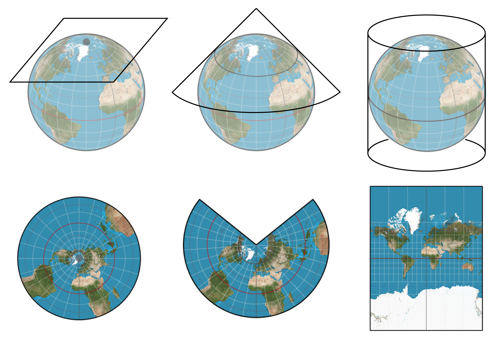{fig-align="center" width="90%"}

<small>Different projection approaches. Left: Planar, middle: conic, right: cylindrical. [Source](https://support.tribalgis.com/article/29-basics-of-coordinate-systems-and-projections) </small>

:::
:::::


## Common PCS - UTM

**Universal Transverse Mercator** (UTM) is a global map projection which:

<ul style="font-size:.7em;">
- Projects globe onto a cylinder tangent to a central meridian
- Divides it into 60 zones
- Distortion is minimized within each zone
- Provides high accuracy for small areas
</ul>

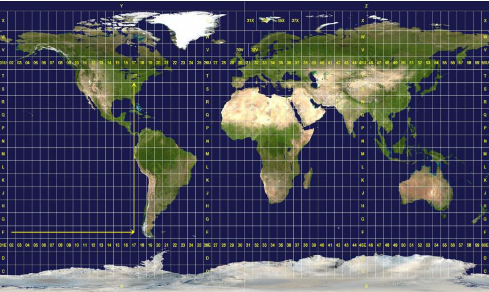{fig-align="center" width="120%"}

<small>[Source](https://support.tribalgis.com/article/29-basics-of-coordinate-systems-and-projections) </small>


## Projections are political

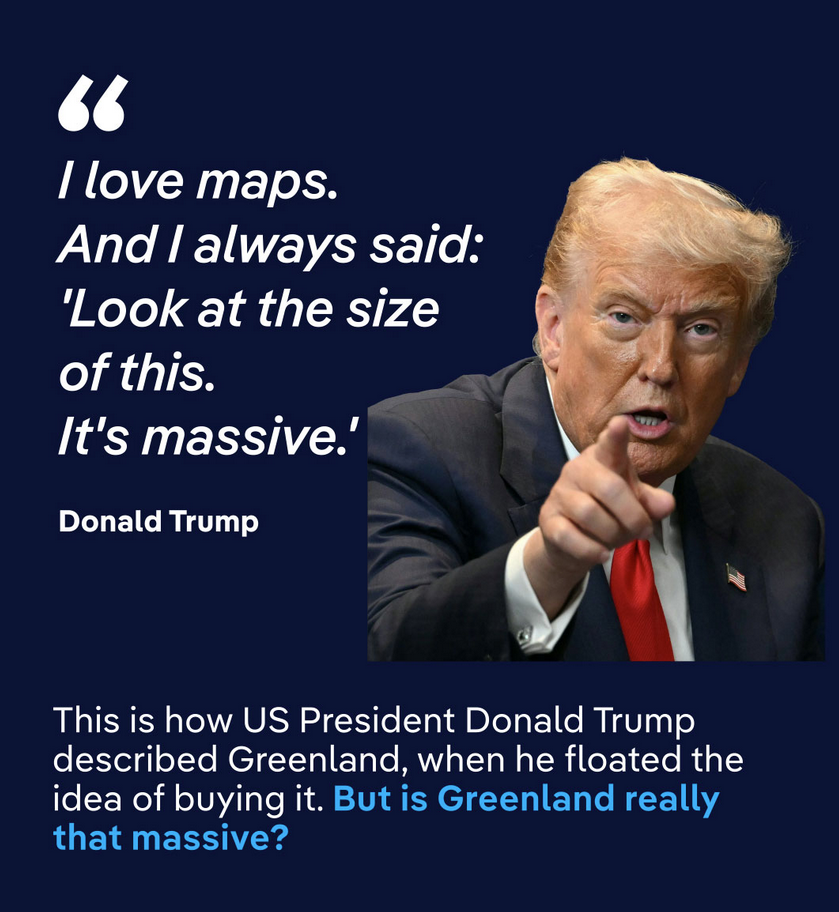{fig-align="center" width="40%"}

::: aside
<small>[Source: Deutsche Welle. 2026.](https://www.instagram.com/p/DTU48EIjRAa/) </small>
:::


## Projections are political

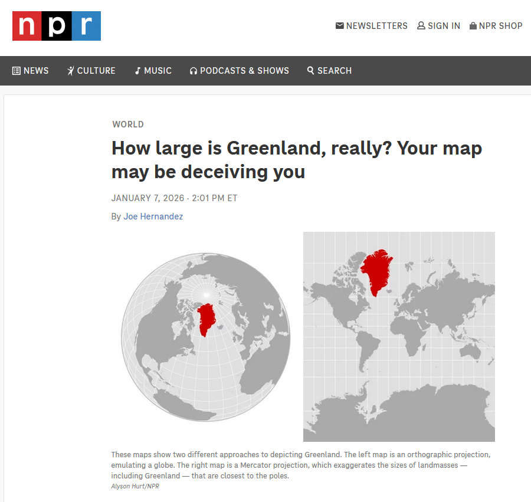{fig-align="center" width="50%"}

::: aside
<small>[Source: Joe Hernandez for NPR. 2026.](https://www.npr.org/2026/01/07/nx-s1-5668482/greenland-mercator-map-size-distortion) </small>
:::


## Documentation of CRS

Every geodata object requires a description of the CRS

- **GCS** and **datum**
- **PCS**
- **x** and **y units** (like meters)
- **Domain** (maximum allowable x and y values)
- **Resolution**


## Old standard: `PROJ.4` strings

This is how your information about the CRS are defined in a classic standard:

```         
+proj=laea +lat_0=52 +lon_0=10 +x_0=4321000 +y_0=3210000 +ellps=GRS80 +towgs84=0,0,0,0,0,0,0 +units=m +no_defs 
```

<small>Source: https://epsg.io/3035</small>

(It's nothing you would type by hand)


## `WKT` (“Well Known Text”)

<br>

```         
PROJCS["ETRS89 / LAEA Europe",
    GEOGCS["ETRS89",
        DATUM["European_Terrestrial_Reference_System_1989",
            SPHEROID["GRS 1980",6378137,298.257222101,
                AUTHORITY["EPSG","7019"]],
            TOWGS84[0,0,0,0,0,0,0],
            AUTHORITY["EPSG","6258"]],
        PRIMEM["Greenwich",0,
            AUTHORITY["EPSG","8901"]],
        UNIT["degree",0.0174532925199433,
            AUTHORITY["EPSG","9122"]],
        AUTHORITY["EPSG","4258"]],
    PROJECTION["Lambert_Azimuthal_Equal_Area"],
    PARAMETER["latitude_of_center",52],
    PARAMETER["longitude_of_center",10],
    PARAMETER["false_easting",4321000],
    PARAMETER["false_northing",3210000],
    UNIT["metre",1,
        AUTHORITY["EPSG","9001"]],
    AUTHORITY["EPSG","3035"]]
```

<small>Source: https://epsg.io/3035</small>


## EPSG Codes

::::: columns
::: {.column width="50%"}
Eventually, working with CRS in `R` will not be as challenging as it may seem since we don't have to use `PROJ.4` or `WKT` strings directly.

Most of the time, it's enough to use so-called **EPSG Codes** ("European Petroleum Survey Group Geodesy"), a small digit sequence.
:::

::: {.column width="50%"}
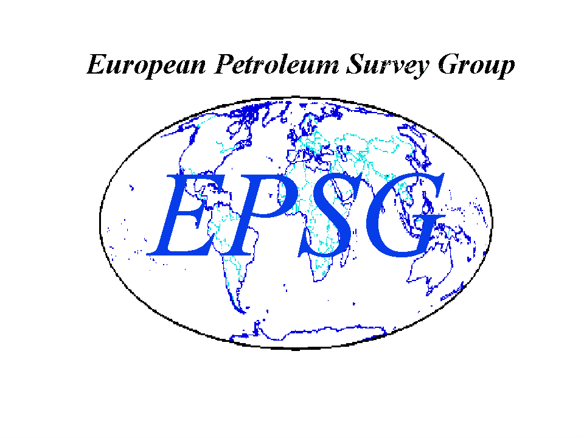{fig-align="center" width="70%"}

<p align="center">

<small>[Source](http://geotiff.maptools.org/proj_list/guid7.html)</small>

</p>
:::
:::::


## Layers Must Match!

::::: columns
::: {.column width="50%"}
<p style="text-align: center;">

EPSG:3857

</p>
:::

::: {.column width="50%"}
<p style="text-align: center;">

EPSG:3035

</p>
:::
:::::

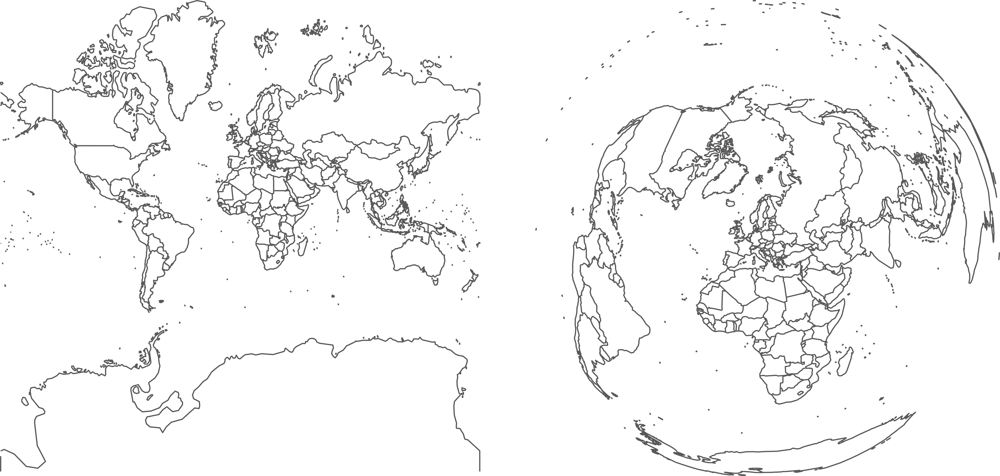{.r-stretch fig-align="center"}

<small>Source: Statistical Office of the European Union Eurostat (2018) / Jünger, 2019</small>


## Geospatial data and software

::::: columns
::: {.column width="50%"}
Increased amount of **available data**

- Quantitative and on a small spatial scale
- Often open source and free access

{fig-align="left" width="50%"}
:::

::: {.column width="50%"}
{fig-align="center" width="60%"}

Better **tools**

-   Standard software, such as `R`, can be used as Geographic Information System (GIS)
:::
:::::


## So this is GIS!

Most common understanding: **Geographic Information Systems** (GIS) as specific software to **process** geospatial data for

-   **Visualization**
-   **Analysis**
-   **Interpretation**

$\rightarrow$ In our case, of course, it is `R`

But base `R` is limited when it comes to handling geospatial data


## Packages in this course I `r emo::ji("package")`

We will use plenty of different packages during the course, but only a few are our main drivers (e.g., the `sf` package). Here's a list of core packages from CRAN you may need for the exercises. The first exercise
contains the full list, including Non-CRAN packages.

-   [`dplyr`](https://cran.r-project.org/web/packages/dplyr/index.html)
-   [`ggplot2`](https://cran.r-project.org/web/packages/ggplot2/index.html)
-   [`ggspatial`](https://cran.r-project.org/web/packages/ggspatial/index.html)
-   [`osmdata`](https://cran.r-project.org/web/packages/osmdata/index.html)
-   [**`OpenStreetMap`**](https://cran.r-project.org/web/packages/OpenStreetMap/index.html)[^6]
-   [`sf`](https://cran.r-project.org/web/packages/sf/index.html)
-   [`spatialreg`](https://cran.r-project.org/web/packages/spatialreg/index.html)

[^6]: If you use a Mac, you may need to install Java: https://www.java.com/de/download/

## Packages in this course II `r emo::ji("package")`

-   [`spatstat`](https://cran.r-project.org/web/packages/spatstat/index.html)
-   [`sfdep`](https://cran.r-project.org/web/packages/sfdep/index.html)
-   [`spdep`](https://cran.r-project.org/web/packages/spdep/index.html)
-   [`terra`](https://cran.r-project.org/web/packages/terra/index.html)
-   [`tidygeocoder`](https://cloud.r-project.org/web/packages/tidygeocoder/index.html)
-   [`tidyterra`](https://cran.r-project.org/web/packages/tidyterra/index.html)
-   [`tmap`](https://cran.r-project.org/web/packages/tmap/index.html)
-   [`tmaptools`](https://cran.r-project.org/web/packages/tmaptools/index.html)

------------------------------------------------------------------------

{.r-stretch fig-align="center"}

Illustration by [Allison Horst](https://github.com/allisonhorst/stats-illustrations)

## Geospatial data in this course I

In the folder called `./data`, you can find (most of) the data files prepped for all the exercises and slides. The following data are included:

-   Administrative borders of Germany (Prefix *VG250\_*) are provided by the German [Federal Agency for Cartography and Geodesy](http://www.bkg.bund.de) (2018). Check out their [Open Data Portal](https://gdz.bkg.bund.de/index.php/default/open-data.html).

-   The locations of e-car charging stations in Germany are retrieved from the [Bundesnetzagentur](https://www.bundesnetzagentur.de/DE/Fachthemen/ElektrizitaetundGas/E-Mobilitaet/Ladesaeulenkarte/start.html).

-   Election Results for the German Right-Wing Populist Party *AfD* in the 2021 German federal election ([Der Bundeswahlleiter, Wiesbaden 2018](https://www.bundeswahlleiter.de/bundestagswahlen/2017/ergebnisse/weitere-ergebnisse.html)).

-   District attributes are from [INKAR](https://www.inkar.de/) and curated by Bundesinstitut für Bau-, Stadt- und Raumforschung (BBSR)

## Geospatial data in this course II

-   German Census 2022 data are provided by the [Federal Statistical Office Germany, Wiesbaden 2025](https://ergebnisse.zensus2022.de/)

-   Shapefiles, voting data, and car-related data for Cologne are gathered from the [Open Data Portal Cologne](https://www.offenedaten-koeln.de/)

-   Information about public transport stops and streets are from [OpenStreetMap](https://www.openstreetmap.org/)

-   Weather data are gathered from [Climate Data Center of the German Weather Service](https://www.dwd.de/DE/klimaumwelt/cdc/cdc_node.html)

- Land use data are from the [IOER Monitor](https://www.ioer-monitor.de/)

**Please make sure that if you reuse any of the provided data to cite the original data sources.**


## More details on geospatial data

Let's learn about geospatial data as we learn about specific formats

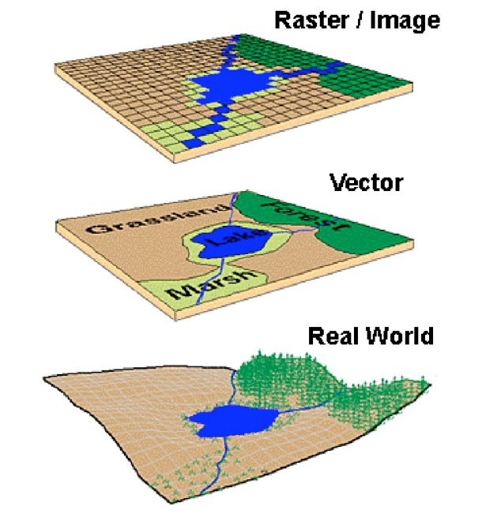{.r-stretch fig-align="center"}

<p align="center">

<small>[Source](https://dx.doi.org/10.13140/2.1.3030.1767)</small>

</p>


## Exercise 1: Package Installation

[Exercise](https://stefanjuenger.github.io/gesis-workshop-geospatial-techniques-R-2026/exercises/1_Package_Installation.html)
