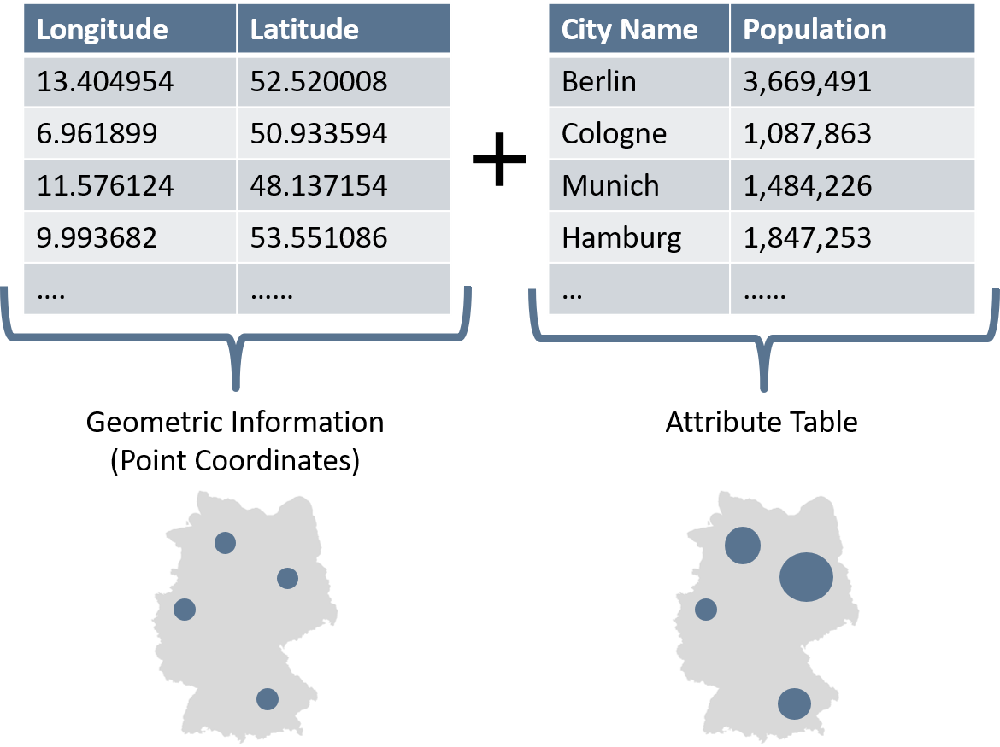
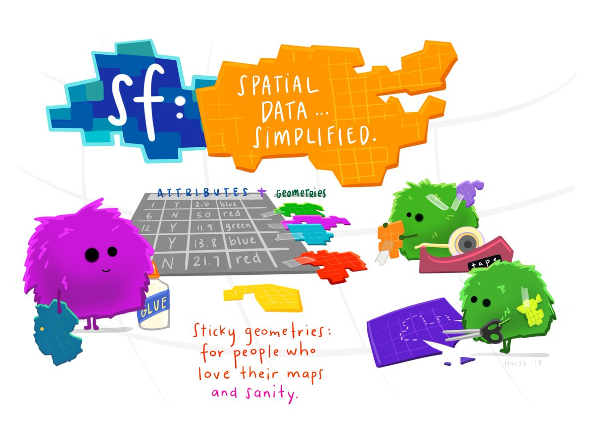
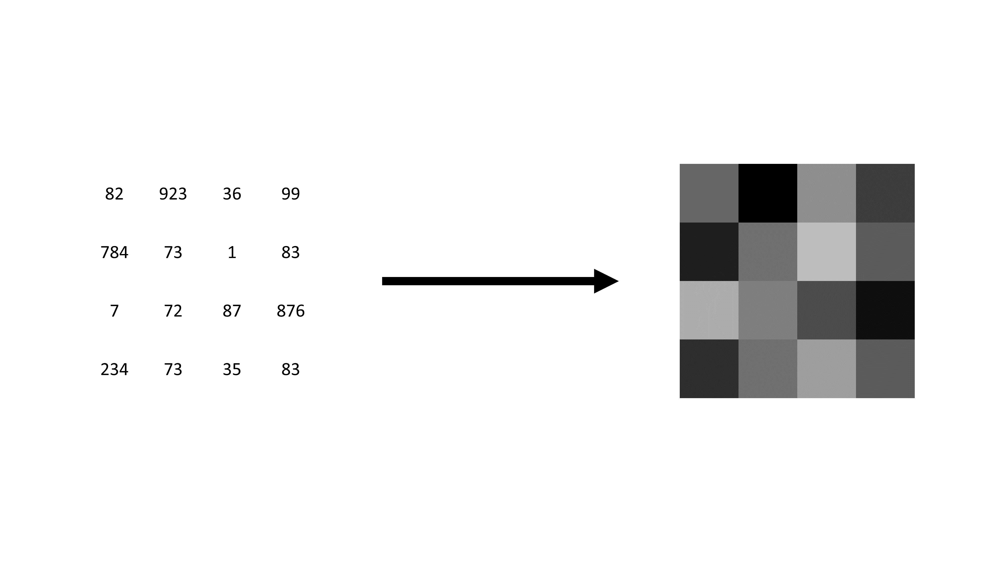

```{r}
#| echo: false
#| cache: false
library(dplyr)
library(sf)
library(terra)
library(tmap)
knitr::opts_knit$set(root.dir = normalizePath('../../'))
```

```{r}
#| echo: false
source("./_ignore/sessions/course_content.R") 

course_content |> 
  kableExtra::row_spec(3, background = "yellow")
```

## Why care about data types and formats?

There are differences in how spatial information is stored, processed, and visually represented.

-   Different commands for data import and manipulation
-   Spatial linking techniques and analyses partly determined by data format
-   Visualization of data can vary

So, always know what kind of data you are dealing with!

## Vector and raster data

{.r-stretch fig-align="center"}

<small>Sources: OpenStreetMap / GEOFABRIK (2018), City of Cologne (2014), and the Statistical Offices of the Federation and the Länder (2016) / Jünger, 2019</small>

## 1. Vector data {.center style="text-align: center;"}

## Representing the world in vectors

::::: columns
::: {.column width="50%"}
```{r}
#| echo: false
#| out.width: "120%"
library(tmap)
data(World, metro)

tm_shape(World) +
  tm_borders()+
  tm_shape(metro) +
  tm_dots()
```
:::

::: {.column width="50%"}
The surface of the earth is represented by simple geometries and attributes.

Each object is defined by longitude (x) and latitude (y) values.

It could also include z coordinates...
:::
:::::

## Vector data: geometries

::::: columns
::: {.column width="50%"}
Every real-world feature is one of three types of geometry:

-   Points: discrete location (e.g., a tree)
-   Lines: linear feature (e.g., a river)
-   Polygons: enclosed areas (e.g., a city, country, administrative boundaries)
:::

::: {.column width="50%"}
{fig-align="center" width="75%"} <small>National Ecological Observatory Network (NEON), cited by [Datacarpentry](https://datacarpentry.org/organization-geospatial/instructor/02-intro-vector-data.html)</small>
:::
:::::

## Vector data: attribute tables

Only geometries means that we do not have any other information.

We must assign attributes to each geometry to hold additional information $\rightarrow$ data tables called attribute tables.

-   Each row represents a geometric object, which we can also call observation, feature, or case
-   Each column holds an attribute or, in 'our' language, a variable

## Vector data: attribute tables

{.r-stretch fig-align="center"}

## File formats/extensions

-   GeoPackage `.gpkg`
-   Shapefile `.shp`
-   GeoJSON `.geojson`
-   ...
-   Sometimes, vector data come even in a text format, such as `CSV`

## Welcome to the proprietary reality: shapefiles

Both the geometric information and attribute table can be saved within one file. Rather often, *ESRI Shapefiles* are used to store vector data. Shapefiles consist of at least three mandatory files with the following extensions:

-   `.shp`: shape format
-   `.shx`: shape index format
-   `.dbf`: attribute format
-   (`.prj`: CRS/Projection)

You don't have to remember what they stand for, but you can only properly work with the data if none of those files is missing.

## Welcome to `simple features`

::::: columns
::: {.column width="50%"}
Several packages are out there to wrangle and visualize spatial and, especially, vector data within `R`. We will use the `sf` package ("simple features").

<br> Why?

`simple features` refers to a formal standard representing spatial geometries and supports interfaces to other programming languages and GIS systems (ISO 19125-1).
:::

::: {.column width="50%"}
{fig-align="center"}

<p style="text-align: right;">

<small>Illustration by [Allison Horst](https://allisonhorst.com/r-packages-functions)</small>

</p>
:::
:::::

## Load a shapefile

The first step is, of course, loading the data. We want to import the shapefile for the administrative borders of the German states (*Bundesländer*) called `VG250_LAN.shp`.

```{r}
# load library
library(sf)

# load data
german_states <- sf::read_sf("./data/VG250_LAN.shp")
```

## What is this thing?

```{r}
#| output-location: fragment
german_states
```

## We can already plot it

```{r}
#| output-location: fragment
plot(german_states["GEN"])
```

<!-- ## This is the bounding box -->

<!-- ```{r} -->
<!-- #| echo: false -->
<!-- sf::st_bbox(german_states) |>  -->
<!--     sf::st_as_sfc(crs = sf::st_crs(german_states)) |>  -->
<!--     plot() -->
<!-- ``` -->

<!-- ## Inspect your data: classics -->

<!-- Let's have a quick look at the imported data. Like with every other data set, we can inspect the data to check some metadata and see if the importing worked correctly. -->

<!-- ```{r} -->
<!-- #| echo: true -->
<!-- #| output: false -->
<!-- # object type -->
<!-- class(german_states)  -->
<!-- ``` -->

<!-- ::: {.fragment .fade-in-then-out} -->
<!-- ```{r} -->
<!-- #| echo: false -->
<!-- class(german_states)  -->
<!-- ``` -->
<!-- ::: -->

<!-- ## Inspect your data: classics -->

<!-- Let's have a quick look at the imported data. Like with every other data set, we can inspect the data to check some metadata and see if the importing worked correctly. -->

<!-- ```{r} -->
<!-- #| echo: true -->
<!-- #| output: false -->
<!-- #| code-line-numbers: "4-5" -->
<!-- # object type -->
<!-- class(german_states)  -->

<!-- # number of rows -->
<!-- nrow(german_states) -->
<!-- ``` -->

<!-- ::: {.fragment .fade-in-then-out} -->
<!-- ```{r} -->
<!-- #| echo: false -->
<!-- nrow(german_states) -->
<!-- ``` -->
<!-- ::: -->

<!-- ## Inspect your data: classics -->

<!-- Let's have a quick look at the imported data. Like with every other data set, we can inspect the data to check some metadata and see if the importing worked correctly. -->

<!-- ```{r} -->
<!-- #| echo: true -->
<!-- #| output: false -->
<!-- #| code-line-numbers: "7-8" -->
<!-- # object type -->
<!-- class(german_states) -->

<!-- # number of rows -->
<!-- nrow(german_states) -->

<!-- # number of columns -->
<!-- ncol(german_states) -->
<!-- ``` -->

<!-- ::: {.fragment .fade-in-then-out} -->
<!-- ```{r} -->
<!-- #| echo: false -->
<!-- ncol(german_states) -->
<!-- ``` -->
<!-- ::: -->

## Inspect your data: classics

There are no huge differences between the shapefile we just imported and a regular data table.

```{r}
#| output-location: fragment
# head of data table
head(german_states, 2)
```

## Inspect your data: spatial features

Besides our general data inspection, we may also want to check the spatial features of our import. This check includes the geometric type (points? lines? polygons?) and the coordinate reference system.

```{r}
#| output-location: fragment
# type of geometry
sf::st_geometry(german_states) 
```

## Inspect your data: spatial features

Each polygon is defined by several connected points to build an enclosed area. Several polygons in one data frame have the `sf` type `multipolygons`. Just as Germany consists of several states, the polygon Germany consists of several smaller polygons. That's true even for individual German states. Here's an example of North Rhine-Westphalia:

```{r}
#| output-location: fragment
# extract the simple features column and further inspecting 
german_states$geometry[5] |> 
  dplyr::glimpse()
```

## Inspect your data: spatial features

Remember: The Coordinate Reference System is critical. A crucial step is to check the CRS of your geospatial data.

```{r}
#| output-location: fragment
# coordinate reference system
sf::st_crs(german_states) 
```

## Exercise 2_1: Import Vector Data💪 {.center style="text-align: center;"}

🖱[Click here for the exercise](https://stefanjuenger.github.io/gesis-workshop-geospatial-techniques-R-2026/exercises/2_1_Import_Vector_Data.html)

## 2. Raster data {.center style="text-align: center;"}

## Difference to vector data

Data Structure:
-   Other data format(s), different file extensions
-   Geometries do not differ within one dataset

Implications:
-   Other geospatial operations possible

Benefits:
-   Can be way more efficient and straightforward to process
-   It's like working with simple tabular data

## Visual difference between vector and raster data

{.r-stretch fig-align="center"}

## What exactly are raster data?

-   Hold information on (most of the time) evenly shaped grid cells
-   Basically, a simple data table
-   Each cell represents one observation

{.r-stretch fig-align="center"}

## Metadata

-   Information about geometries is globally stored
-   They are the same for all observations
-   Their location in space is defined by their cell location in the data table
-   Without this information, raster data were simple image files

## Important metadata

**Raster Dimensions**: number of columns, rows, and cells

**Extent**: similar to bounding box in vector data

**Resolution**: the size of each raster cell

**Coordinate reference system**: defines where on the earth's surface the raster layer lies

## Setting up a raster dataset is easy

```{r}
#| output-location: fragment
input_data <- 
  sample(1:100, 16) |> 
  matrix(nrow = 4)

input_data
```

## Setting up a raster dataset is easy

```{r}
#| output-location: fragment
raster_layer <- terra::rast(input_data)

raster_layer
```

## We can already plot it

```{r}
#| output-location: fragment
terra::plot(raster_layer)
```

## File formats/extensions

-   GeoTIFF `tif`
-   Gridded data `.grd`
-   Network common data format `.nc`
-   Esri grid `.asc`
-   ...
-   Sometimes, raster data come even in a text format, such as `CSV`

**In this course, we will only use `tiff` files as they are pretty common. Just be aware that there are different formats out there.**

## Implementations in `R`

`terra` is the most commonly used package for raster data in `R`.

Some other developments, e.g., in the `stars` package, also implement an interface to simple features in `sf`.

The `terra` package helps to use more elaborate zonal statistics. But the `spatstat` package is more advanced.

## Loading raster tifs (German census data)

```{r}
#| echo: true
#| output: false
# Number of immigrants in Cologne
immigrants_cologne <- terra::rast("./data/immigrants_cologne.tif")

# Number of inhabitants in Cologne
inhabitants_cologne <- terra::rast("./data/inhabitants_cologne.tif")
```

## Loading raster tifs (German census data)

```{r}
#| echo: true
#| output: false
#| code-line-numbers: "7"
# Number of immigrants in Cologne
immigrants_cologne <- terra::rast("./data/immigrants_cologne.tif")

# Number of inhabitants in Cologne
inhabitants_cologne <- terra::rast("./data/inhabitants_cologne.tif")

immigrants_cologne
```

::: {.fragment .fade-in-then-out}
```{r}
#| echo: false
immigrants_cologne
```
:::

## Loading raster tifs (German census data)

```{r}
#| echo: true
#| output: false
#| code-line-numbers: "9"
# Number of immigrants in Cologne
immigrants_cologne <- terra::rast("./data/immigrants_cologne.tif")

# Number of inhabitants in Cologne
inhabitants_cologne <- terra::rast("./data/inhabitants_cologne.tif")

immigrants_cologne 
 
inhabitants_cologne  
```

::: {.fragment}
```{r}
#| echo: false
inhabitants_cologne
```
:::

## Compare layers by plotting

:::: columns
::: {.column width="50%"}
```{r}
#| fig.asp: 1
#| output-location: fragment
terra::plot(immigrants_cologne)
```
:::

::: {.column width="50%"}
```{r}
#| fig.asp: 1
#| output-location: fragment
terra::plot(inhabitants_cologne)
```
:::
::::

## Base `R` functionalities

```{r}
# Define missing values
immigrants_cologne[immigrants_cologne == -9] <- NA
inhabitants_cologne[inhabitants_cologne == -9] <- NA
```

## Base `R` functionalities

```{r}
#| echo: true
#| output: false
#| code-line-numbers: "5"
# Define missing values
immigrants_cologne[immigrants_cologne == -9] <- NA
inhabitants_cologne[inhabitants_cologne == -9] <- NA
 
immigrants_cologne
```

::: {.fragment}
```{r}
#| echo: false
immigrants_cologne
```
:::

## Base `R` functionalities

```{r}
#| echo: true
#| output: false
#| code-line-numbers: "7"
# Define missing values
immigrants_cologne[immigrants_cologne == -9] <- NA
inhabitants_cologne[inhabitants_cologne == -9] <- NA

immigrants_cologne

inhabitants_cologne 
```

::: {.fragment}
```{r}
#| echo: false
inhabitants_cologne
```
:::

## Simple statistics

Working with raster data is straightforward

-   quite speedy
-   yet not as comfortable as working with `sf` objects

For example, to calculate the mean, we would use the following:

```{r}
#| output-location: fragment
terra::global(immigrants_cologne, fun = "mean", na.rm = TRUE)
```

::: {.fragment}
**Note**: Using `mean()` on the whole raster dataset would calculate the mean in each raster cell (in case there are multiple attributes in the dataset).
:::

## Get all values as a vector

We can also extract the values of a raster directly as a vector:

```{r}
#| output-location: fragment
all_raster_values <- terra::values(immigrants_cologne)

mean(all_raster_values, na.rm = TRUE)
```

::: {.fragment}
Nevertheless, although raster data are simple data tables, working with them is a bit different compared to, e.g., simple features.
:::

## Combining raster layers to calculate new values

::::: columns
::: {.column width="50%"}
```{r}
#| output-location: fragment
immigrant_rate <-
  immigrants_cologne * 100 / 
  inhabitants_cologne

immigrant_rate
```
:::

::: {.column width="50%"}
```{r}
#| fig.asp: .8
#| output-location: fragment
terra::plot(immigrant_rate)
```
:::
:::::

## Exercise 2_2: Basic Raster Operations💪 {.center style="text-align: center;"}

🖱 [Click here for the exercise](https://stefanjuenger.github.io/gesis-workshop-geospatial-techniques-R-2026/exercises/2_2_Basic_Raster_Operations.html)
