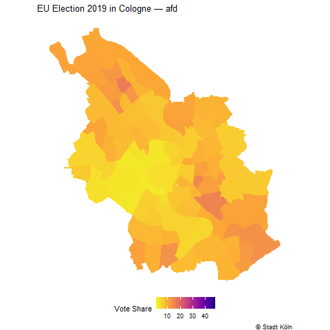

```{r}
#| include: false
library(sf)
library(terra)
library(dplyr)
library(readr)
library(tidyr)
library(ggplot2)
library(tidyterra)
library(ggspatial)
library(colorBlindness)
library(mapview)
library(leaflet)
library(gganimate)
library(gifski)
library(tmap)
```


## Now

```{r}
#| echo: false
source("./course_content.R") 

course_content |> 
  kableExtra::row_spec(5, background = "yellow")
```

## Fun with flags... MAPS!

{.r-stretch fig-align="center"}

<small>Fun with Flags by Dr. Sheldon Cooper. [Big Bang Theory](https://youtu.be/_e8PGPrPlwA)</small>

## Fun with maps

`plot()` does not allow us to manipulate the maps easily. But we already have the two most essential ingredients to create a nice map:

1. Vector data stored in the `./data` folder
2. Some (hopefully) interesting attributes linked with the geometries

```{r}
#| echo: false
attributes_cologne <- sf::read_sf("../../data/attributes_cologne.shp")

plot(attributes_cologne["ecar"])
```

## What makes a good map?

:::: columns
::: {.column width="40%"}
**Good Mapping**

- Reduction to most important information
- Legends, scales, descriptions
- Audience oriented
- Adjusted for color vision deficiencies
:::

::: {.column width="40%"}
**Bad Mapping**

- Overcrowding and overlapping
- Unreadable information
- Missing information like the legend or source
- Poor choice of color palettes
:::
::::

## What makes a good map?

:::: columns
::: {.column width="50%"}
{fig-align="left" width="40%"}

<small>[Source](https://media.giphy.com/media/C9x8gX02SnMIoAClXa/giphy-downsized-large.gif)</small>
:::

::: {.column width="50%"}
... but there is one other type:

**The fast but nice map.**

- Fast exploration of spatial data by visualizing the geometries and attributes
- Might not be publication-ready yet, but they are more rewarding than just plotting information
:::
::::

## Our approach: `ggplot2`

`R` offers several packages for mapping spatial data:

- Base R graphics package: [`mapdata`](https://rpubs.com/rbatzing/mapping)
- Mobile-friendly interactive maps: [`leaflet`](https://rstudio.github.io/leaflet/)
- Interactive and static thematic maps: [`tmap`](https://r-tmap.github.io/tmap/), [`mapview`](https://r-spatial.github.io/mapview/)

Today, we concentrate on [`ggplot2`](https://cran.r-project.org/web/packages/ggplot2/index.html):

- Part of the `tidyverse` — draws on knowledge many of you already have
- Maximum flexibility for customizing every element
- Seamlessly combines maps with other plots in one figure
- Integrates with many extension packages (`tidyterra`, `ggspatial`, ...)

## What is `ggplot2`?

`ggplot2` is well-known for creating plots. Thanks to `sf` and `terra`, we can exploit all amazing `ggplot2` functions for spatial data.

In general, on `ggplot2`:

- Well-suited for multi-dimensional data
- Expects data (frames) as input
- Components of the plot are added as layers

```{r}
#| eval: false
plot_call +
  layer_1 +
  layer_2 +
  ... +
  layer_n
```

## Components of a Plot

According to Wickham (2010, p. 8^[Wickham, Hadley. 2010. "A Layered Grammar of Graphics." Journal of Computational and Graphical Statistics 19(1):3–28. doi: 10.1198/jcgs.2009.07098.
]), a layered plot consists of the following components:

- Data and aesthetic mappings,
- Geometric objects,
- Scales,
- (and facet specification)

```{r}
#| eval: false
plot_call +
  data +
  aesthetics +
  geometries +
  scales +
  facets
```

## Cologne data

```{r}
#| eval: false
# cologne districts with attributes
attributes_cologne <- sf::read_sf("./data/attributes_cologne.shp")

# electric vehicle charging points
charger_cologne <- sf::read_sf("./data/charger_cologne.shp")

# raster: share of immigrants per grid cell
immigrants_cologne <- terra::rast("./data/immigrants_cologne.tif")
```

```{r}
#| echo: false
attributes_cologne  <- sf::read_sf("../../data/attributes_cologne.shp")
charger_cologne     <- sf::read_sf("../../data/charger_cologne.shp")
immigrants_cologne  <- terra::rast("../../data/immigrants_cologne.tif")

# Bandname umbenennen
names(immigrants_cologne) <- "immigrants_cologne"
# -9 als NA klassifizieren
immigrants_cologne[immigrants_cologne == -9] <- NA

```

## The attribute table

A quick look at what is in our data before we start mapping.  

```{r}
attributes_cologne |>
  sf::st_drop_geometry() |>       # drop geometry for a clean table view
  dplyr::select(id, ecar, cdu, spd, greens, afd, left, fdp) |>
  head(5)
```

The columns hold, e.g., the share of **electric cars** (`ecar`) and **EU election 2019 vote shares** per Cologne district.

## Here's a first basic map

:::: columns
::: {.column width="50%"}
```{r}
#| eval: false
#| fig.asp: 1
# a simple first map
ggplot() +
  geom_sf(data = attributes_cologne)
```
:::

::: {.column width="50%"}
```{r}
#| echo: false
#| fig.asp: 1
ggplot() +
  geom_sf(data = attributes_cologne)
```
:::
::::

## Making a plan

This map will be our canvas for the session. We will cover five building blocks:

- **THE MAP**: adding attributes, choosing colors/palettes, adding layers
- **THE LEGEND**: position, sizes, display
- **THE ENVIRONMENT**: choosing from themes and building your own
- **THE META-INFORMATION**: titles and sources
- **THE EXTRAS**: scales and compass

If you are working on your maps, the [ggplot2 cheatsheets](https://rstudio.github.io/cheatsheets/html/data-visualization.html) will help you with an overview of scales, themes, labels, facets, and more.


## THE MAP: a basis

:::: columns
::: {.column width="50%"}
```{r}
#| eval: false
#| fig.asp: 1
# easy fill with a fixed color
ggplot() +
  geom_sf(
    data = attributes_cologne,
    fill = "steelblue",
    color = "white"
  )
```
:::

::: {.column width="50%"}
```{r}
#| echo: false
#| fig.asp: 1
ggplot() +
  geom_sf(
    data = attributes_cologne,
    fill = "steelblue",
    color = "white"
  )
```
:::
::::

## THE MAP: add the `aesthetics`

We'll concentrate on mapping the share of electric cars per district.

:::: columns
::: {.column width="50%"}
```{r}
#| eval: false
#| fig.asp: .8
ggplot() +
  geom_sf(
    data = attributes_cologne,
    # map the attribute to fill color
    aes(fill = ecar)
  ) +
  # choose a continuous color scale
  scale_fill_continuous()
```
:::

::: {.column width="50%"}
```{r}
#| echo: false
#| fig.asp: .8
ggplot() +
  geom_sf(
    data = attributes_cologne,
    aes(fill = ecar)
  ) +
  scale_fill_continuous()
```
:::
::::

## THE MAP: color palette

Are you having trouble choosing the right color? Some excellent tutorials exist, e.g. by [Michael Toth](https://michaeltoth.me/a-detailed-guide-to-ggplot-colors.html).

:::: columns
::: {.column width="50%"}
```{r}
#| eval: false
#| fig.asp: .8
ggplot() +
  geom_sf(
    data = attributes_cologne,
    aes(fill = ecar)
  ) +
  # readable with color vision deficiencies
  scale_fill_viridis_c(option = "plasma")
```
:::

::: {.column width="50%"}
```{r}
#| echo: false
#| fig.asp: .8
ggplot() +
  geom_sf(
    data = attributes_cologne,
    aes(fill = ecar)
  ) +
  scale_fill_viridis_c(option = "plasma")
```
:::
::::

## THE MAP: fine-tuning

:::: columns
::: {.column width="50%"}
```{r}
#| eval: false
#| fig.asp: .8
ggplot() +
  geom_sf(
    data = attributes_cologne,
    aes(fill = ecar),
    # remove district borders
    color = NA
  ) +
  scale_fill_viridis_c(
    option = "plasma",
    # flip the scale direction
    direction = -1
  )
```
:::

::: {.column width="50%"}
```{r}
#| echo: false
#| fig.asp: .8
ggplot() +
  geom_sf(
    data = attributes_cologne,
    aes(fill = ecar),
    color = NA
  ) +
  scale_fill_viridis_c(
    option = "plasma",
    direction = -1
  )
```
:::
::::

## Save and reuse

Maps produced with `ggplot2` are standard `R` objects (they are lists). We can assign them to reuse, plot later, and keep adding layers.

```{r}

cologne_map <-
  ggplot() +
  geom_sf(
    data = attributes_cologne,
    aes(fill = ecar),
    color = NA
  )

cologne_map_better <-
  cologne_map +
  scale_fill_viridis_c(
    option = "plasma",
    direction = -1
  )

```


## Save and reuse

Furthermore, `ggsave()` automatically detects the file format from the extension. You can also control height, width, and dpi — particularly useful for publication-ready graphics.

```{r}
#| eval: false
ggsave("cologne_map_better.png", cologne_map_better, dpi = 300)

```


## THE MAP: point layers

Point data loaded with `sf::read_sf()` is displayed with the same `geom_sf()` — `ggplot2` detects the geometry type automatically.

Key aesthetics for point layers:

| Argument | What it controls | Fixed or mapped? |
|---|---|---|
| `color` | point color | both |
| `size` | point diameter | both |
| `alpha` | transparency (0–1) | both |
| `shape` | point shape (0–25) | both |


## Show some points


:::: columns
::: {.column width="50%"}
```{r}
#| eval: false
#| fig.asp: .9
ggplot() +
  geom_sf(
    data  = charger_cologne,
    color = "black",
    size  = 2,
    alpha = .6
  )
```
:::

::: {.column width="50%"}
```{r}
#| echo: false
#| fig.asp: .9
ggplot() +
  geom_sf(
    data  = charger_cologne,
    color = "black",
    size  = 2,
    alpha = .6
  )
```
:::
::::

## THE MAP: add a point layer

`geom_sf()` stacks layers in order — add the point layer **after** the polygon layer so it appears on top.

:::: columns
::: {.column width="50%"}
```{r}
#| eval: false
#| fig.asp: .9
ggplot() +
  # 1st layer: polygon — e-car share
  geom_sf(
    data = attributes_cologne,
    aes(fill = ecar),
    color = NA
  ) +
  scale_fill_viridis_c(
    option = "plasma",
    direction = -1
  ) +
  # 2nd layer: points  
  geom_sf(
    data = charger_cologne,
    # wrap color in aes(): force a legend entry
    aes(color = "Charging Stations"),
    size = 2
  ) +
  scale_color_manual(
    name   = NULL,
    values = c("Charging Stations" = "black")
  )
```
:::

::: {.column width="50%"}
```{r}
#| echo: false
#| fig.asp: .9
ggplot() +
  geom_sf(
    data = attributes_cologne,
    aes(fill = ecar),
    color = NA
  ) +
  scale_fill_viridis_c(
    option = "plasma",
    direction = -1
  ) +
  geom_sf(
    data = charger_cologne,
    aes(color = "Charging Stations"),
    size = 2
  ) +
  scale_color_manual(
    name   = NULL,
    values = c("Charging Stations" = "black")
  )
```
:::
::::


## THE LEGEND: dealing with the legend

You can handle everything concerning the legend within the `scale_*`. 

:::: columns
::: {.column width="50%"}
```{r}
#| eval: false
#| fig.asp: 1
ggplot() +
  geom_sf(
    data = attributes_cologne,
    aes(fill = ecar),
    color = NA
  ) +
  scale_fill_viridis_c(
    option = "plasma",
    direction = -1,
    # add a legend title
    name = "E-Car Share",
    # adjust legend display
    guide = guide_legend(
      # turn it horizontal
      direction = "horizontal",
      # put labels under the legend bar
      label.position = "bottom"
    )
  )

# check the help file for more options: ?guide_legend
```
:::

::: {.column width="50%"}
```{r}
#| echo: false
#| fig.asp: 1
ggplot() +
  geom_sf(
    data = attributes_cologne,
    aes(fill = ecar),
    color = NA
  ) +
  scale_fill_viridis_c(
    option = "plasma",
    direction = -1,
    name = "E-Car Share",
    guide = guide_legend(
      direction = "horizontal",
      label.position = "bottom"
    )
  )
```
:::
::::

## THE ENVIRONMENT: get rid of everything?!

The `theme` controls all non-data displays. Instead of removing everything, try the built-in themes.

:::: columns
::: {.column width="50%"}
```{r}
#| eval: false
#| fig.asp: .8
# use the cologne_map object as base
cologne_map +
  # remove all non-data ink
  theme_void()


# ... or try another built-in theme:
# theme_bw()
# theme_gray()
# theme_light()

# see all options: ?theme
```
:::

::: {.column width="50%"}
```{r}
#| echo: false
#| fig.asp: .8
cologne_map +
  theme_void()
```
:::
::::

## THE ENVIRONMENT: build your own `theme`

:::: columns
::: {.column width="50%"}
```{r}
#| eval: false
#| fig.asp: 1
cologne_map +
  theme_void() +
  theme(
    # bold all text elements
    title = element_text(face = "bold"),
    # move legend to bottom
    legend.position = "bottom",
    # change background color
    panel.background =
      element_rect(fill = "lightgrey")
  )
```
:::

::: {.column width="50%"}
```{r}
#| echo: false
#| fig.asp: 1
cologne_map +
  theme_void() +
  theme(
    title = element_text(face = "bold"),
    legend.position = "bottom",
    panel.background =
      element_rect(fill = "lightgrey")
  )
```
:::
::::

## THE META-INFORMATION: adding `labs`

Always include and cite your data sources. `labs()` lets you add titles, subtitles, and captions directly to the map.

:::: columns
::: {.column width="50%"}
```{r}
#| eval: false
#| fig.asp: .8
cologne_map +
  theme_void() +
  labs(
    title    = "Electric Cars in Cologne",
    subtitle = "Share of registered electric vehicles per district",
    caption  = "© Stadt Köln; Bundesnetzagentur"
  )
```
:::

::: {.column width="50%"}
```{r}
#| echo: false
#| fig.asp: .8
cologne_map +
  theme_void() +
  labs(
    title    = "Electric Cars in Cologne",
    subtitle = "Share of registered electric vehicles per district",
    caption  = "© Stadt Köln; Bundesnetzagentur"
  )
```
:::
::::

## Exercise 3_1: Basic Maps

[Exercise](exercises/3_1_Mapping.html)


## To be continued...

Our code has already grown. Without going into too much detail, the following slides showcase some more changes you can make to your maps.

**A map is never finished until you decide not to work on it anymore.**

## Facet maps: data preparation

`facet_wrap()` creates small multiples — one panel per group. The data must be in **long format** first.

```{r}
# pivot the six party columns into one long column
cologne_parties <-
  attributes_cologne |>
  tidyr::pivot_longer(
    cols      = c(cdu, spd, greens, afd, left, fdp),
    # new column holding the party name
    names_to  = "party",
    # new column holding the vote share value
    values_to = "vote_share"
  )

# each district now appears six times — once per party
cologne_parties |>
  sf::st_drop_geometry() |>
  dplyr::select(id, party, vote_share) |>
  head(8)
```

## Facet maps

:::: columns
::: {.column width="50%"}
```{r}
#| eval: false
#| fig.asp: .9
ggplot() +
  geom_sf(
    data  = cologne_parties,
    aes(fill = vote_share),
    color = NA
  ) +
  scale_fill_viridis_c(
    option    = "plasma",
    direction = -1,
    name      = "Vote Share"
  ) +
  # one panel per party
  facet_wrap(~ party, ncol = 3) +
  theme_void() +
  theme(legend.position = "bottom") +
  labs(
    title   = "EU Election 2019 in Cologne",
    caption = "© Stadt Köln"
  )
```
:::

::: {.column width="50%"}
```{r}
#| echo: false
#| fig.asp: .9
ggplot() +
  geom_sf(
    data  = cologne_parties,
    aes(fill = vote_share),
    color = NA
  ) +
  scale_fill_viridis_c(
    option    = "plasma",
    direction = -1,
    name      = "Vote Share"
  ) +
  facet_wrap(~ party, ncol = 3) +
  theme_void() +
  theme(legend.position = "bottom") +
  labs(
    title   = "EU Election 2019 in Cologne",
    caption = "© Stadt Köln"
  )
```
:::
::::

## Animated maps

`gganimate` extends `ggplot2` with animation — add one transition layer to any existing map.

Key transition functions:

| Function | Use case |
|---|---|
| `transition_manual(var)` | Step through a categorical variable (e.g. party, month name) |
| `transition_states(var)` | Smooth transitions between groups |
| `transition_time(var)` | Animate along a numeric time variable |

## Animated maps

:::: columns
::: {.column width="50%"}
```{r}
#| eval: false
library(gganimate)
library(gifski)

# reuse cologne_parties from the facets slide
vote_animation <-
  ggplot() +
  geom_sf(
    data  = cologne_parties,
    aes(fill = vote_share),
    color = NA
  ) +
  scale_fill_viridis_c(
    option    = "plasma",
    direction = -1,
    name      = "Vote Share"
  ) +
  theme_void() +
  theme(legend.position = "bottom") +
  labs(
    # {current_frame} is replaced by the active frame value
    title   = "EU Election 2019 in Cologne — {current_frame}",
    caption = "© Stadt Köln"
  ) +
  # one frame per party, no interpolation between categories
  gganimate::transition_manual(party)

# render (nframes = number of parties, fps = speed)
gganimate::animate(vote_animation, nframes = 6, fps = 1)

# save as GIF
gganimate::anim_save("vote_animation.gif")
```
:::

::: {.column width="50%"}
{fig-align="center" width="50%"}
:::
::::


## Adding map labels: data preparation

To add labels, we  need regular X/Y columns — not geometries. We use `sf::st_centroid()` to find polygon centers, then `sf::st_coordinates()` to extract the coordinates.

```{r}
# compute polygon centroids and pull X/Y into plain columns
precinct_labels <-
  attributes_cologne |>
  sf::st_centroid() |>
  dplyr::mutate(
    X = sf::st_coordinates(geometry)[, "X"],
    Y = sf::st_coordinates(geometry)[, "Y"]
  )

precinct_labels |> dplyr::select(name, X, Y)
```

## `geom_text` and `geom_label`

`geom_text()` adds plain text; `geom_label()` adds a text box with a background which is useful when the map underneath is busy.

:::: columns
::: {.column width="50%"}
```{r}
#| eval: false
#| fig.asp: .9
# geom_text: clean, no background
cologne_map +
  theme_void() +
  geom_text(
    data     = precinct_labels,
    aes(x = X, y = Y, label = name),
    size     = 2.5,
    color    = "white",
    fontface = "bold"
  )

# geom_label: text box with background
cologne_map +
  theme_void() +
  geom_label(
    data  = precinct_labels,
    aes(x = X, y = Y, label = name),
    size  = 2.5,
    color    = "white",
    alpha = .8 #box background
  )
```
:::

::: {.column width="50%"}
```{r}
#| echo: false
#| fig.asp: .9
cologne_map +
  theme_void() +
  geom_label(
    data  = precinct_labels,
    aes(x = X, y = Y, label = name),
    size  = 2.5,
    color    = "white",
    alpha = .8   # semi-transparent background
  )
```
:::
::::

## Interactive maps: `mapview`

`mapview` is the fastest route to an interactive map — one function call, no extra setup.

:::: columns
::: {.column width="50%"}
```{r}
#| eval: false
library(mapview)

# one line: instant interactive map
mapview::mapview(
  attributes_cologne,
  zcol       = "ecar",        # column to map
  layer.name = "E-Car Share"  # legend title
)
```

Features out of the box:

- Pan, zoom, click on features
- Basemap tiles automatically added
- Works with any `sf` object
:::

::: {.column width="50%"}
```{r}
#| echo: false
mapview::mapview(
  attributes_cologne,
  zcol       = "ecar",
  layer.name = "E-Car Share"
)
```
:::
::::

## Interactive maps: `leaflet`

`leaflet` gives you full control over basemaps, popups, and color scales.

```{r}
#| eval: false
library(leaflet)

# leaflet requires WGS84 (EPSG:4326)
attributes_wgs84 <-
  attributes_cologne |>
  sf::st_transform(crs = 4326)

# define a color palette function
pal <- leaflet::colorNumeric(palette = "plasma", domain = attributes_wgs84$ecar)

leaflet_map <- 
  leaflet::leaflet(attributes_wgs84) |>
  leaflet::addTiles() |>                    # add basemap
  leaflet::addPolygons(
    fillColor   = ~pal(ecar),              # map color to ecar
    fillOpacity = 0.7,
    color       = "white",
    weight      = 1,
    popup       = ~paste("E-Car Share:", round(ecar, 3))  # click popup
  ) |>
  leaflet::addLegend(
    pal    = pal,
    values = ~ecar,
    title  = "E-Car Share"
  )

# save as html map  
mapview::mapshot(leaflet_map, url = "leaflet_map.html")
  
```


## `ggplot2` and raster data

You can also use `ggplot2` to create maps with raster data. The easiest way is using the `tidyterra` package.

:::: columns
::: {.column width="50%"}
```{r}
#| eval: false
#| fig.asp: .8
ggplot() +
  tidyterra::geom_spatraster(
    data = immigrants_cologne,
    aes(fill = immigrants_cologne)
  ) +
  # set NA values to transparent
  scale_fill_viridis_c(
    option = "magma",
    na.value = "transparent",
    name = "Share of\nImmigrants"
  ) +
  theme_void()
```
:::

::: {.column width="50%"}
```{r}
#| echo: false
#| fig.asp: .8
ggplot() +
  tidyterra::geom_spatraster(
    data = immigrants_cologne,
    aes(fill = immigrants_cologne)
  ) +
  scale_fill_viridis_c(
    option = "magma",
    na.value = "transparent",
    name = "Share of\nImmigrants"
  ) +
  theme_void()
```
:::
::::

## Add-ons with `ggspatial` 

Typical cartographic elements are not included  in `ggplot2` — like a **compass** or **scale bar**.

The good thing: elements of the package `ggspatial` can be included as regular `ggplot2` layers.

Check out [paleolimbot.github.io/ggspatial](https://paleolimbot.github.io/ggspatial/).

## Scale bar & north arrow

:::: columns
::: {.column width="50%"}
```{r}
#| eval: false
#| fig.asp: .9
cologne_map +
  theme_void() +
  labs(
    title   = "Electric Cars in Cologne",
    caption = "© Stadt Köln; Bundesnetzagentur"
  ) +
  # scale bar: bottom-right
  ggspatial::annotation_scale(
    location = "br"
  ) +
  # north arrow: top-right
  ggspatial::annotation_north_arrow(
    location = "tr",
    style = ggspatial::north_arrow_minimal()
  )
```
:::

::: {.column width="50%"}
```{r}
#| echo: false
#| fig.asp: .9
cologne_map +
  theme_void() +
  labs(
    title   = "Electric Cars in Cologne",
    caption = "© Stadt Köln; Bundesnetzagentur"
  ) +
  ggspatial::annotation_scale(
    location = "br"
  ) +
  ggspatial::annotation_north_arrow(
    location = "tr",
    style = ggspatial::north_arrow_minimal()
  )
```
:::
::::


## Note On Mapping Responsibly

**In the best cases**, maps are easy to understand and an excellent way to transport (scientific) messages.
<br>

**In the worst cases**, they simplify (spurious) correlations and draw a dramatic picture of the world.
<br>

**Maps can shape narratives**

- Decisions on which projection you use (remember the `true size` projector?),
- The segment of the world you choose,
- And the colors and styles you add have a strong influence.

Example: [Kenneth Field's blog post](https://www.esri.com/arcgis-blog/products/product/mapping/mapping-coronavirus-responsibly/)

## Color vision deficiencies

The `colorBlindness` package simulates how your map looks for people with different types of color vision deficiency.

```{r}
#| echo: false
tmp <-
  ggplot() +
  geom_sf(
    data = attributes_cologne,
    aes(fill = ecar),
    color = NA
  ) +
  scale_fill_viridis_c(
    option = "plasma",
    direction = -1
  ) +
  theme_void() +
  theme(legend.position = "none")

colorBlindness::cvdPlot(tmp)
```

<small>Created with the package [`colorBlindness`](https://cran.r-project.org/web/packages/colorBlindness/index.html). Viridis palettes are designed to be perceptually uniform and accessible for color vision deficiencies.</small>

## Exercise 3_2: Fun with Maps

[Exercise](exercises/3_2_Fun_with_Maps.html)


## `tmap`: An Alternative

[`tmap`](https://r-tmap.github.io/tmap/) is another popular package for thematic mapping in R:

- Very intuitive — makes 'good' cartographic decisions automatically
- Syntax based on the same *grammar of graphics* as `ggplot2`
- Built-in support for **interactive maps** (`tmap_mode("view")`)
- Built-in support for **animated maps** (`tmap_animation()`)
- Ideal for quick exploratory mapping

When you need interactivity or animation without additional packages, `tmap` is a great choice.

## `tmap`: Quick Syntax Overview

```{r}
#| eval: false
library(tmap)

# define spatial object, then choose a display element
tm_shape(attributes_cologne) +
  tm_polygons(
    fill = "ecar",
    fill.legend = tm_legend(title = "E-Car Share")
  )

# switch to interactive mode
tmap_mode("view")
tm_shape(attributes_cologne) + tm_polygons("ecar")

# switch back to static
tmap_mode("plot")

# save options
# tmap_save(my_map, filename = "map.png")
# tmap_save(my_map, filename = "map.html")  # interactive
```

For learning more: [r-tmap.github.io/tmap](https://r-tmap.github.io/tmap/)
