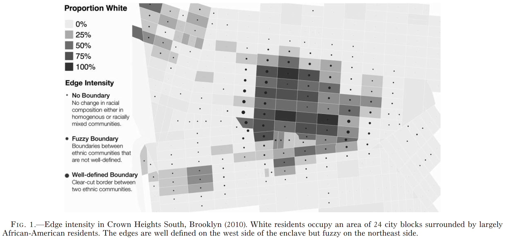

```{r}
#| echo: false
#| cache: false
library(dplyr)
library(sf)
library(terra)
library(tmap)
```

## Now

```{r}
#| echo: false
source("./_ignore/sessions/course_content.R") 

course_content |> 
  kableExtra::row_spec(7, background = "yellow") |> 
  kableExtra::kable_styling(font_size = 23)
```

## Mini wrap-up

::::: columns
::: {.column width="50%"}
Thus far, we have learned about

-   Different data formats
-   How to load them
-   First steps in interacting with them
-   Creating maps with `ggplot2`

But the real magic in geospatial data lies in their flexibility.
:::

::: {.column width="50%"}

:::
:::::

## Our plan for this afternoon

In this session, you will learn

-   How to wrangle the different geospatial data formats even further
-   Link/join different datasets

## 1. Advanced Importing {.center style="text-align: center;"}

## Importing of non-spatial data

Say the data we want to use are not available as a shapefile. Point coordinates are often stored in table formats like `.csv` -- like the location of charging stations for electric cars data in our `./data` folder.

```{r}
#| output-location: fragment
# Loading a simple CSV file
echarging_df <- readr::read_delim("./data/charging_points_ger.csv", delim = ";")

echarging_df
```

## From data table to geospatial data

We see that besides our attributes (e.g., operator, power,...), the table contains the two variables "longitude" (X) and "latitude" (Y), our point coordinates. When using the command `sf::st_as_sf()`, it is easy to transform the table into a point layer.

```{r}
#| output-location: fragment
# Transform to spatial data frame
echarging_sf <- 
  echarging_df |>  
  # there are some missings in the data which is not allowed 
  dplyr::filter(!is.na(longitude) & !is.na(latitude)) |> 
  sf::st_as_sf(coords = c("longitude", "latitude"))

# Check the class of the dataset
class(echarging_sf)
```

## Final check via plotting

```{r}
#| output-location: fragment
plot(echarging_sf)
```

## Check the CRS!

Make sure to use the option `crs = [EPSG_ID]`. If not used, your CRS will not be defined, and you can't perform further commands depending on the CRS. Here, we tried [EPSG IO](https://epsg.io) or <http://projfinder.com/> to find the correct CRS

```{r}
#| fig.asp: .8
#| output-location: column-fragment
#| code-line-numbers: "7,10"
echarging_sf <- 
  echarging_df |> 
  # there are some missings in the data which is not allowed  
  dplyr::filter(!is.na(longitude) & !is.na(latitude)) |> 
  sf::st_as_sf(   
    coords = c("longitude", "latitude"),
    crs = 4326
  )

plot(echarging_sf["operator"])
```

## ... and the other way round

Do you want to go back to handling a simple data frame? You can quickly achieve this by dropping the geometry column.

```{r}
#| output-location: fragment
# Remove geometry column
echarging_df <- sf::st_drop_geometry(echarging_sf)

# Check the output
head(echarging_df, 2)
```

## APIs / data from the internet

Geospatial data tend to be quite big, and there's a pressure to distribute data efficiently. Data dumps (on the internet) may not be helpful

-   When resources are low
-   Time's a factor
-   The data have a large geographic extent

Instead, a *Programming Application Interface* (API) is often used.

## Data providers offering geospatial data APIs

-   [OpenStreetMap](https://wiki.openstreetmap.org/wiki/API)
-   [Google](https://developers.google.com/maps/documentation/geolocation/overview)
-   [Bing](https://docs.microsoft.com/en-us/bingmaps/rest-services/locations/)
-   [Copernicus Climate Data Store](https://cds.climate.copernicus.eu/)
-   ...
-   [Cologne's Open Data Portal](https://www.offenedaten-koeln.de/dataset/taxonomy/term/44/field_tags/Geo-44)
-   Specialized `R` packages, such as the [`wiesbaden` package](https://cran.r-project.org/web/packages/wiesbaden/index.html), the [`tidycensus` package](https://cran.r-project.org/web/packages/tidycensus/index.html), or the [`z22` package](https://cloud.r-project.org/web/packages/z22/index.html)

## Example: access to public transport

Say, we're interested in the accessibility of public transport in Cologne.

-   Bus, tram, etc.
-   All platforms and vehicles should be wheel-chair accessible

**We can gather this information using OpenStreetMap!**

## Accessing OSM data: the Overpass API

> The Overpass API (formerly known as OSM Server Side Scripting, or OSM3S before 2011) is a read-only API that serves up custom selected parts of the OSM map data. It acts as a database over the web: the client sends a query to the API and returns the data set that corresponds to the query.

<small>Source: https://wiki.openstreetmap.org/wiki/Overpass_API</small>

------------------------------------------------------------------------

## Starting with a geographic area to query

Many geospatial API requests start with a bounding box or another geographical extent to define which area should be accessed.

```{r}
#| output-location: fragment
cologne_pt_stops <- osmdata::getbb("Köln")

cologne_pt_stops
```

## Defining some technical details

The Overpass API also requires a timeout parameter that repeats the request for a while if anything fails.


```{r}
#| code-line-numbers: "1,3,5"
#| output-location: fragment
cologne_pt_stops <-
  osmdata::getbb("Köln") |> 
  osmdata::opq(timeout = 25)

cologne_pt_stops
```

## Turning to the content

The content we aim to request is defined with key/value pairs. It's best to learn them by looking them up in the [official documentation](https://wiki.openstreetmap.org/wiki/Map_features).

```{r}
#| code-line-numbers: "1,4,6"
#| output-location: fragment
cologne_pt_stops <-
  osmdata::getbb("Köln") |> 
  osmdata::opq(timeout = 25) |> 
  osmdata::add_osm_feature(key = "public_transport", value = "stop_position")

cologne_pt_stops
```

## Conduct actual request/download

The data is finally downloaded in the `osmdata` package, e.g., using the `osmdata::osmdata_sf()` function.

```{r}
#| code-line-numbers: "1,5,7"
#| output-location: fragment
cologne_pt_stops <-
  osmdata::getbb("Köln") |> 
  osmdata::opq(timeout = 25) |> 
  osmdata::add_osm_feature(key = "public_transport", value = "stop_position") |> 
  osmdata::osmdata_sf()

cologne_pt_stops
```

## Filter and transform

The data comprises a list that can be accessed like any other list in `R`. Here, we extract the points and wrangle them (spatially).

```{r}
#| code-line-numbers: "1,6,7,9"
#| output-location: fragment
cologne_pt_stops <-
  osmdata::getbb("Köln") |> 
  osmdata::opq(timeout = 25*100) |> 
  osmdata::add_osm_feature(key = "public_transport", value = "stop_position") |> 
  osmdata::osmdata_sf() |> 
  _$osm_points |> 
  dplyr::filter(wheelchair == "yes")

cologne_pt_stops
```

## The data indeed are mappable

```{r}
#| fig.asp: 1
#| output-location: column-fragment
tm_shape(cologne_pt_stops) +
  tm_dots()
```

## Raster data access

It is not only vector data that can be processed through these mechanisms.

The idea is the same for raster data.

-   Accessing the information through URLs
-   Just the downloaded data formats differ

One example is data from European Earth observation (EOD) program "Copernicus" and `R` packages that can be used to download them, such as [`ecmwfr`](https://wiki.openstreetmap.org/wiki/Map_features).

📺**Commercial Break**📺: 

We use `ecmwfr` for our interface to EOD linking in our `R` package [`gxc`](https://github.com/denabel/gxc)

## Exercise 4_1: OSM Data💪 {.center style="text-align: center;"}

🖱\[Click here for the exercise\](https://stefanjuenger.github.io/gesis-workshop-geospatial-techniques-R-2026/exercises/4_1_OSM_Data.html)

## 2. Linking {.center style="text-align: center;"}

## 'Spreadsheet join' 📅 + 📅 = 💖

While much of our previous data were points, we only had a column for the German federal states as administrative information so far. We're now moving "a layer down" and looking at Germany on a more fine-grained spatial level: the district. We repeat what you already did in the exercise `3_1_Basic Maps`: joining data like simple spreadsheets.

## 'Spreadsheet join' 📅 + 📅 = 💖

```{r}
#| output: false
# Load district shapefile
german_districts <- sf::read_sf("./data/VG250_KRS.shp")

german_districts
```

::: {.fragment}
```{r}
#| echo: false
german_districts
```
:::

## 'Spreadsheet join' 📅 + 📅 = 💖

```{r}
#| output: false
#| code-line-numbers: "6-9"
# Load district shapefile
german_districts <- sf::read_sf("./data/VG250_KRS.shp")

german_districts

# Load district attributes
attributes_districts <- readr::read_csv2("./data/attributes_districts.csv") 

attributes_districts
```

::: {.fragment}
```{r}
#| echo: false
attributes_districts
```
:::

## 'Spreadsheet join' 📅 + 📅 = 💖

```{r}
#| output: false
#| code-line-numbers: "11-16"
# Load district shapefile
german_districts <- sf::read_sf("./data/VG250_KRS.shp")

german_districts

# Load district attributes
attributes_districts <- readr::read_csv2("./data/attributes_districts.csv") 

attributes_districts

# Join data
german_districts_enhanced <- 
  german_districts |>  
  dplyr::left_join(attributes_districts, by = "AGS")

german_districts_enhanced
```

::: {.fragment}
::: {style="font-size: 0.65em;"}
```{r}
#| echo: false
german_districts_enhanced
```
:::
:::


## Spatial join

But what can we do if we do not have a matching identifier? For example, there are no matching administrative identifiers in the German district data and the e-charger data.

```{r}
#| output: false
german_districts_enhanced
```

::: {.fragment}
```{r}
#| echo: false
german_districts_enhanced
```
:::

## Spatial join

But what can we do if we do not have a matching identifier? For example, there are no matching administrative identifiers in the German district data and the e-charger data.

```{r}
#| output: false
#| code-line-numbers: "3"
german_districts_enhanced

echarging_sf
```

::: {.fragment}
::: {style="font-size: 0.7em;"}
```{r}
#| echo: false
echarging_sf
```
:::
:::

::: {.fragment}
💡**Solution**: We conduct a spatial join!
:::

## Adding district information to the point layer

::::: columns
::: {.column width="50%"}
```{r}
#| fig.asp: .8
# Harmonize CRS between two datasets 
echarging_sf_transformed <-
  sf::st_crs(german_districts) |> 
  sf::st_transform(
    echarging_sf, 
    crs = _
  )
```
:::

::: {.column width="50%"}
:::
::::

## Adding district information to the point layer

::::: columns
::: {.column width="50%"}
```{r}
#| fig.asp: .8
#| output: false
#| code-line-numbers: "9-14"
# Harmonize CRS between two datasets 
echarging_sf_transformed <-
  sf::st_crs(german_districts) |> 
  sf::st_transform(
    echarging_sf, 
    crs = _
  )

# We are only interested in the municipality identifier
# AGS in the districts dataset; let's create a subset
german_districts_subset <- 
  dplyr::select(german_districts, AGS)

german_districts_subset
```
:::

::: {.column width="50%"}
::: {.fragment}
```{r}
#| echo: false
german_districts_subset
```
:::
:::
::::

## Adding district information to the point layer

::::: columns
::: {.column width="50%"}
```{r}
#| output: false
#| code-line-numbers: "16-23"
# Harmonize CRS between two datasets 
echarging_sf_transformed <-
  sf::st_crs(german_districts) |> 
  sf::st_transform(
    echarging_sf, 
    crs = _
  )

# We are only interested in the municipality identifier
# AGS in the districts dataset; let's create a subset
german_districts_subset <- 
  dplyr::select(german_districts, AGS)

german_districts_subset

# Finally, joining the two datasets is easy
echarging_sf_joined <-
  sf::st_join(
    echarging_sf_transformed, 
    german_districts_subset
  )

plot(echarging_sf_joined["AGS"])
```
:::

::: {.column width="50%"}
::: {.fragment .fade-in-then-out}
```{r}
#| echo: false
#| fig.asp: .7
plot(echarging_sf_joined["AGS"])
```
:::
:::
::::

## Counting objects

Imagine we want to count the number of charging stations in each German district.

```{r}
# Again, adjust crs first
echarging_sf_transformed <-
  sf::st_transform(
    echarging_sf, 
    crs = sf::st_crs(german_districts)
  )
```

## Counting objects

Imagine we want to count the number of charging stations in each German district. We now use `sf::st_intersects()` to identify all intersecting charging stations in each district.

```{r}
#| output: false
#| code-line-numbers: "7-12"
# Again, adjust crs first
echarging_sf_transformed <-
  sf::st_transform(
    echarging_sf, 
    crs = sf::st_crs(german_districts)
  )

# Identify all chargers in each district
chargers_in_districts <- 
  sf::st_intersects(german_districts_enhanced, echarging_sf_transformed)

chargers_in_districts
```

::: {.fragment}
::: {style="font-size: 0.7em;"}
```{r}
#| echo: false
chargers_in_districts
```
:::
:::

## Counting objects

Imagine we want to count the number of charging stations in each German district. We now use `sf::st_intersects()` to identify all intersecting charging stations in each district.

```{r}
#| output: false
#| code-line-numbers: "13-18"
# Again, adjust crs first
echarging_sf_transformed <-
  sf::st_transform(
    echarging_sf, 
    crs = sf::st_crs(german_districts)
  )

# Identify all chargers in each district
chargers_in_districts <- 
  sf::st_intersects(german_districts_enhanced, echarging_sf_transformed)

chargers_in_districts

# Finally counting them and adding them as a variable
german_districts_enhanced$charger_in_districts <-
  lengths(chargers_in_districts)

german_districts_enhanced$charger_in_districts
```

::: {.fragment}
```{r}
#| echo: false
german_districts_enhanced$charger_in_districts
```
:::

## Charger count per district

```{r}
#| fig.asp: 1
#| output-location: column-fragment
tm_shape(german_districts_enhanced) +
  tm_polygons(
    fill = "charger_in_districts",
    fill.legend = 
      tm_legend(
        title = "Charger Count (Quantiles)"
      ),
    fill.scale = 
      tm_scale_intervals(
        style = "quantile", 
        values = "viridis"
      ),
    col = "lightgrey"
  )
```

## 3. Subsetting {.center style="text-align: center;"}

## Subsetting vector data

One might be interested in only one specific area of Germany, like Cologne. To subset a `sf` object, you can often use your usual data wrangling workflow. In this case, I know the municipality ID (AGS), which is the only row (and column) I want to keep.

```{r}
#| fig.asp: .8
#| output-location: column-fragment
# Subsetting
cologne <-
  german_districts_enhanced |> 
  dplyr::filter(AGS == "05315") |>  
  dplyr::select(AGS) 

plot(cologne)
```

## Using `sf` for subsetting

If you have no information about *IDs* but only about the geolocation, you can use methods like `sf::st_touches()` (or again `sf::st_intersects()`, or `sf::st_within()`, `sf::st_crosses()`, ...) to identify, for example, all districts which share a border with Cologne.

```{r}
#| output: false
#| fig.asp: .7
# Extract the 'touch points' between two datasets
cologne_touch_points <-
  sf::st_touches(german_districts_enhanced, cologne)

cologne_touch_points
```

::: {.fragment}
```{r}
#| echo: false
cologne_touch_points
```
:::

## Using `sf` for subsetting

If you have no information about *IDs* but only about the geolocation, you can use methods like `sf::st_touches()` (or again `sf::st_intersects()`, or `sf::st_within()`, `sf::st_crosses()`, ...) to identify, for example, all districts which share a border with Cologne.

```{r}
#| output: false
#| fig.asp: .7
#| code-line-numbers: "5-8"
# Extract the 'touch points' between two datasets
cologne_touch_points <-
  sf::st_touches(german_districts_enhanced, cologne)

# Again, we are counting the numbers of touch points. 
cologne_touch_points <- lengths(cologne_touch_points) 

cologne_touch_points
```

::: {.fragment}
```{r}
#| echo: false
cologne_touch_points
```
:::

## Using `sf` for subsetting

If you have no information about *IDs* but only about the geolocation, you can use methods like `sf::st_touches()` (or again `sf::st_intersects()`, or `sf::st_within()`, `sf::st_crosses()`, ...) to identify, for example, all districts which share a border with Cologne.

```{r}
#| output: false
#| fig.asp: .7
#| code-line-numbers: "10-13"
# Extract the 'touch points' between two datasets
cologne_touch_points <-
  sf::st_touches(german_districts_enhanced, cologne)

# Again, we are counting the numbers of touch points. 
cologne_touch_points <- lengths(cologne_touch_points) 

cologne_touch_points

# Length of mutual border > 0
cologne_touch_points <- lengths(cologne_touch_points) > 0

cologne_touch_points
```

::: {.fragment}
```{r}
#| echo: false
cologne_touch_points
```
:::

## Using `sf` for subsetting

If you have no information about *IDs* but only about the geolocation, you can use methods like `sf::st_touches()` (or again `sf::st_intersects()`, or `sf::st_within()`, `sf::st_crosses()`, ...) to identify, for example, all districts which share a border with Cologne.

::::: columns 
::: {.column width="50%"}
```{r}
#| output: false
#| code-line-numbers: "15-20"
# extract the 'touch points' between two datasets
cologne_touch_points <-
  sf::st_touches(german_districts_enhanced, cologne)

# again, we are counting the numbers of touch points. 
cologne_touch_points <- lengths(cologne_touch_points) 

cologne_touch_points

# length of mutual border > 0
cologne_touch_points <- cologne_touch_points > 0

cologne_touch_points

cologne_surrounding <-
  german_districts_enhanced |> 
  dplyr::select(AGS) |>  
  dplyr::filter(cologne_touch_points) 

plot(cologne_surrounding)
```
:::

::: {.column width="50%"}
::: {.fragment}
```{r}
#| echo: false
plot(cologne_surrounding)
```
:::
:::
:::::

## Cropping data

We could also use as simple spatial extent, e.g., from a raster dataset, to subset our e-charging data. But first, we have to adjust the CRS again (use `sf::st_crs(echarging_sf)` to look up EPSG code):

```{r}
inhabitants_cologne <- terra::rast("./data/inhabitants_cologne.tif")
```

Now we can use a procedure called cropping to subset the data:

```{r}
#| output-location: fragment
echarging_sf_cologne <-
  echarging_sf |>
  # if possible, always transform to CRS of the raster dataset
  sf::st_transform(3035) |> 
  sf::st_crop(inhabitants_cologne)
```

## E-charging stations in Cologne

The result is an vector dataset comprising e-charging stations in Cologne.

```{r}
#| fig.asp: .7
#| output-location: column-fragment
tm_shape(echarging_sf_cologne) +
  tm_dots()
```

## 'Subsetting' Raster Layers

As you know, we can subset vector data by simply filtering for specific attribute values. For example, to subset Cologne's districts only by the one of Deutz, we can use the `dplyr` for `sf` data:

```{r}
#| message: false
#| warning: false
#| fig-asp: .7
#| output-location: column-fragment
# raster data for Cologne
inhabitants_cologne <- 
  terra::rast("./data/inhabitants_cologne.tif")

inhabitants_cologne[inhabitants_cologne < 0] <- NA

# Cologne district data
deutz <-
  sf::st_read(
    "./data/cologne.shp",
    quiet = TRUE
  ) |> 
  # convert to same CRS as raster data
  sf::st_transform(3035) |> 
  dplyr::filter(NAME == "Deutz")

tm_shape(inhabitants_cologne) +
  tm_raster() +
  tm_shape(deutz) +
  tm_borders()
```

## Cropping raster data

Cropping is a method of cutting out a specific `slice` of a raster layer based on an input dataset or geospatial extent, such as a bounding box.

```{r}
#| fig.asp: .8
#| output-location: column-fragment
cropped_inhabitants_cologne <-
  terra::crop(
    inhabitants_cologne, 
    deutz
  )

tm_shape(cropped_inhabitants_cologne) +
  tm_raster()
```

## Masking

Masking is similar to cropping, yet values outside the extent are set to missing values (`NA`).

```{r}
#| fig.asp: .8
#| output-location: column-fragment
masked_inhabitants_cologne <-
  raster::mask(
    inhabitants_cologne, 
    deutz
  )

tm_shape(masked_inhabitants_cologne) +
  tm_raster()
```


## Combining Cropping and Masking

```{r}
#| fig.asp: 1
#| output-location: column-fragment
cropped_masked_inhabitants_cologne <-
  terra::crop(
    inhabitants_cologne, 
    deutz
  ) |> 
  terra::mask(deutz)

tm_shape(cropped_masked_inhabitants_cologne) +
  tm_raster()
```

## 4. Extraction & Aggregation {.center style="text-align: center;"}

## Changes in terminology

If we only want to add one attribute from a vector dataset `Y` to another vector dataset `X`, we can conduct a spatial join using `sf::st_join()` as before. There is nothing new to tell. In the raster data world, these operations are called raster extractions.

## Extracting information from raster data

Raster data are helpful when we aim to

-   Apply calculations that are the same for all geometries in the dataset
-   **Extract information from the raster fast and efficient**

Do you remember these data operations?

```{r}
immigrants_cologne <-  terra::rast("./data/immigrants_cologne.tif")
inhabitants_cologne <- terra::rast("./data/inhabitants_cologne.tif")

immigrants_cologne[immigrants_cologne == -9] <- NA
inhabitants_cologne[inhabitants_cologne == -9] <- NA

immigrant_rate <-
  immigrants_cologne * 100 / 
  inhabitants_cologne
```

## Raster extraction

To extract the raster values at a specific point by location, also called **lookup**, we use the following:

```{r}
#| output-location: fragment
immigrant_rate_lookup <-
  terra::extract(
    x = immigrant_rate, # raster layer to extract from
    y = echarging_sf_cologne, # points to extract to
    raw = TRUE, # output as raw data (no data.frame)
    ID = FALSE  # no ID column before values (really just the raw data...)
  )

# there are many missing values which is why we are looking at such a weird
# data range
immigrant_rate_lookup[170:180,] 
```

## Add results to existing dataset

This information can be added to an existing dataset (our points in this example):

```{r}
#| output-location: fragment
# Adding the extracted values to our dataset as a new column
# Note: the output of terra::extract() is a raw data matrix, which produces
# not so pretty column names. Therefore, we wrap it in the as.vector()
# function.
echarging_sf_cologne$immigrant_rate_value <- as.vector(immigrant_rate_lookup)

echarging_sf_cologne[170:180,]
```

## More elaborated: spatial buffers

Sometimes, extracting information 1:1 is not enough.
-   It's too narrow
-   There is missing information about the surroundings of a point

For this endeavor, we can use the function `sf::st_buffer()`. Here's an example of creating a circular area of 500 meters around each point in our e-charging subset data of Cologne:

::::: columns
::: {.column width="50%"}
```{r}
#| output-location: fragment
# original data
sf::st_geometry_type(
  echarging_sf_cologne, 
  by_geometry = FALSE
)
```
:::

::: {.column width="50%"}
```{r}
#| output-location: fragment
# buffered data
echarging_sf_cologne_buffered <-
  sf::st_buffer(echarging_sf_cologne, 500) 

sf::st_geometry_type(
  echarging_sf_cologne_buffered, 
  by_geometry = FALSE
)
```
:::
:::::

## This is how buffers looks together with the raster data

```{r}
#| fig.asp: .7
#| output-location: column-fragment
tm_shape(immigrant_rate) +
  tm_raster() +
  tm_shape(
    echarging_sf_cologne_buffered 
  ) +
  tm_dots(size = .1) +
  tm_borders()
```

## Buffer extraction

We can use spatial buffers of different sizes to extract information on surroundings:

```{r}
#| output-location: column-fragment
immigrant_rate_buffer <-
  terra::extract(
    x = immigrant_rate, 
    y = echarging_sf_cologne_buffered,
    fun = mean,
    na.rm = TRUE,
    raw = TRUE,
    ID = FALSE
  )

immigrant_rate_buffer[170:180,]
```

## Add results to existing dataset

This information can be added to an existing dataset (our points in this example):

```{r}
#| output-location: fragment
# Adding the extracted values to our dataset as a new column
# Note: the output of terra::extract() is a bit annoying as it is stored as a
# list (despite the raw = TRUE argument). Therefore, we wrap the output in the
# unlist() function
echarging_sf_cologne$immigrant_rate_500 <- unlist(immigrant_rate_buffer)

echarging_sf_cologne[170:180,]
```

## Raster aggregation

We can use the same procedure to aggregate a raster dataset into a vector polygon dataset. That's a widespread use case. Let's load our Cologne shapefile.

```{r}
#| label: is_error_here
#| output-location: fragment
cologne <- 
  sf::st_read(
    "./data/cologne.shp",
    quiet = TRUE
  ) |> 
  # transform to CRS of raster data
  sf::st_transform(3035)

cologne
```

## Add the aggregated data

```{r}
#| output-location: column-fragment
cologne$immigrant_rate <-
  terra::extract(
    x = immigrant_rate, 
    y = cologne, 
    fun = mean, 
    na.rm = TRUE, 
    ID = FALSE
  ) |> 
  unlist()

plot(cologne["immigrant_rate"])
```

## Other forms of data aggregation

If you 'simply' want to aggregate attributes and geometries of vector data, you can rely on `st_combine(x)` , `st_union(x,y)` and `st_intersection(x, y)` to combine vector datasets, resolve borders and return the intersection of two vector datasets 

For raster data, you can aggregate with the function `terra::aggregate()`(if you have matching raster files) in combination with `terra::resample()` (if your raster files don't match).

To deal with spatial misalignment:

- [Our `AreaMatch` tool](https://kodaqs-toolbox.gesis.org/github.com/StefanJuenger/zipmatching/index/)
- [`smile` package](https://lcgodoy.me/smile/)
- [`areal` package](https://chris-prener.github.io/areal/)

## Data aggregation

```{r}
#| fig.asp: 1
#| output-location: column-fragment
german_districts <-
  sf::read_sf("./data/VG250_KRS.shp") |> 
  dplyr::mutate(
    federal_state =
      as.numeric(stringr::str_sub(AGS,1,2))
  ) 

german_states <-
  german_districts |>  
  dplyr::group_by(federal_state) |>  
  dplyr::summarize(
    geometry = sf::st_union(geometry)
  )

plot(german_states["geometry"])
```

## Exercise 4_2: Subsetting and Linking💪 {.center style="text-align: center;"}

🖱[Click here for the exercise](https://stefanjuenger.github.io/gesis-workshop-geospatial-techniques-R-2026/exercises/4_2_Subsetting_Linking.html)

## Backup / For Home Use {.center style="text-align: center;"}

## 5. Conversion & Analysis {.center style="text-align: center;"}

## Raster to points

::::: columns
::: {.column width="50%"}
```{r}
#| eval: false
#| fig.asp: 1
raster_now_points <-
  immigrant_rate |> 
  terra::as.points()

plot(raster_now_points)
```
:::

::: {.column width="50%"}
```{r}
#| echo: false
#| fig.asp: 1
raster_now_points <-
  immigrant_rate |> 
  terra::as.points()

plot(raster_now_points)
```
:::
:::::

## Points to raster

::::: columns
::: {.column width="50%"}
```{r}
#| eval: false
#| fig.asp: 1
raster_target_layer <- 
  terra::ext(raster_now_points) |> 
  terra::rast(res = 100)

points_now_raster <- 
  raster_now_points |> 
  terra::rasterize(
    raster_target_layer, 
    field = "cat_0", # get it with names(raster_now_points) 
    fun = "mean",
    background = 0
  )

plot(points_now_raster)
```
:::

::: {.column width="50%"}
```{r}
#| echo: false
#| fig.asp: 1
raster_target_layer <- 
  terra::ext(raster_now_points) |> 
  terra::rast(res = 100)

points_now_raster <- 
  raster_now_points |> 
  terra::rasterize(
    raster_target_layer, 
    field = "cat_0", # get it with names(raster_now_points) 
    fun = "mean",
    background = 0
  )

plot(points_now_raster)
```
:::
:::::

## Raster to polygons

::::: columns
::: {.column width="50%"}
```{r}
#| eval: false
#| fig.asp: 1
polygon_raster <-
  immigrant_rate |>  
  terra::as.polygons() |> 
  sf::st_as_sf()

plot(polygon_raster)
```
:::

::: {.column width="50%"}
```{r}
#| echo: false
#| fig.asp: 1
polygon_raster <-
  immigrant_rate |>  
  terra::as.polygons() |> 
  sf::st_as_sf()

plot(polygon_raster)
```
:::
:::::

## Analysis application: creating a quick 'heatmap'

Points of interest data are nice for analyzing urban infrastructure. Let's draw a quick 'heatmap' using observation densities.

::::: columns
::: {.column width="50%"}
```{r}
#| eval: false
#| fig.asp: .8
echarging_sf_cologne_raster <-
  terra::rast(
    echarging_sf_cologne, 
    res = 1000
  )

echarging_sf_cologne_densities <- 
  echarging_sf_cologne |> 
  terra::rasterize(
    echarging_sf_cologne_raster, 
    fun = length, 
    background = 0
  )

plot(echarging_sf_cologne_densities)
```
:::

::: {.column width="50%"}
```{r}
#| echo: false
#| fig.asp: .8
echarging_sf_cologne_raster <-
  terra::rast(
    echarging_sf_cologne, 
    res = 1000
  )

echarging_sf_cologne_densities <- 
  echarging_sf_cologne |> 
  terra::rasterize(
    echarging_sf_cologne_raster, 
    fun = length, 
    background = 0
  )

plot(echarging_sf_cologne_densities)
```
:::
:::::

## Focal statistics / spatial filter

Focal statistics are another method of including information near a point in space. However, it's applied to the whole dataset and is independent of arbitrary points we project onto a map.

-   Relates focal cells to surrounding cells
-   Vastly used in image processing
-   But also applicable in social science research, as we will see

## Analysis: edge detection

::::: columns
::: {.column width="50%"}
{fig-align="center" width="75%"}
:::

::: {.column width="50%"}
{fig-align="center" width="75%"}
:::
:::::

<small>Source: https://en.wikipedia.org/wiki/Sobel_operator</small>

## Edges of immigrant rates

{.r-stretch fig-align="center"}

## We can do that as well using a sobel filter

$$r_x = \begin{bmatrix}1 & 0 & -1 \\2 & 0 & -2 \\1 & 0 & -1\end{bmatrix} \times raster\_file \\r_y = \begin{bmatrix}1 & 2 & 1 \\0 & 0 & 0 \\-1 & -2 & -1\end{bmatrix}\times raster\_file \\r_{xy} = \sqrt{r_{x}^2 + r_{y}^2}$$

------------------------------------------------------------------------

## Implementation in R

From the [official documentation](http://search.r-project.org/R/library/terra/html/focal.html):

```{r}
sobel <- function(r) {
  fy <- matrix(c(1, 0, -1, 2, 0, -2, 1, 0, -1), nrow = 3)
  fx <- matrix(c(-1, -2, -1, 0, 0, 0, 1, 2, 1) , nrow = 3)
  rx <- terra::focal(r, fx)
  ry <- terra::focal(r, fy)
  sqrt(rx^2 + ry^2)
}
```

## Data preparation and application of filter

```{r}
old_extent <- terra::ext(immigrant_rate) 
new_extent <- old_extent + c(10000, -10000, 10000, -10000)

smaller_immigrant_rate <-
  immigrant_rate |> 
  terra::crop(new_extent)

smaller_immigrant_rate[smaller_immigrant_rate < 10] <- NA

immigrant_edges <- sobel(smaller_immigrant_rate)
```

## Comparison

```{r}
#| echo: true
#| layout-ncol: 2
#| fig.asp: .7
plot(smaller_immigrant_rate)
plot(immigrant_edges)
```
