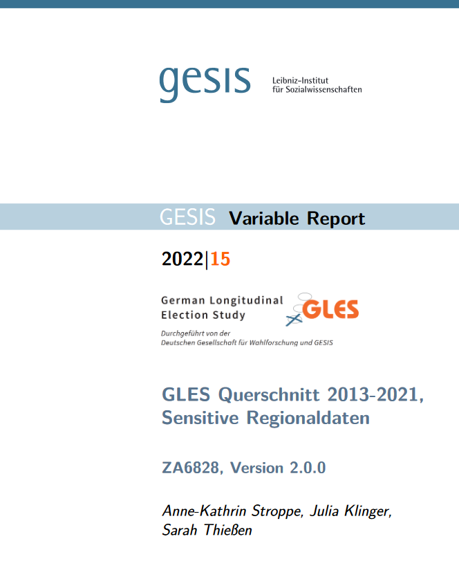
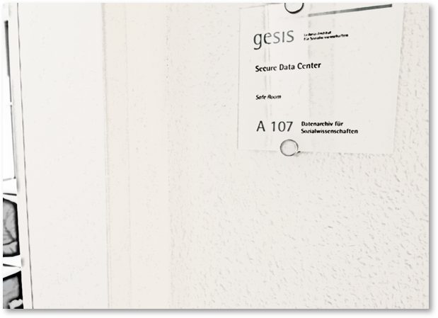
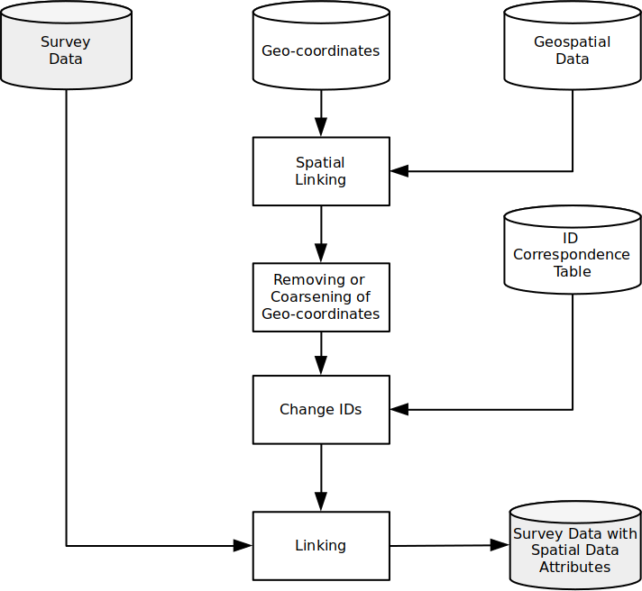
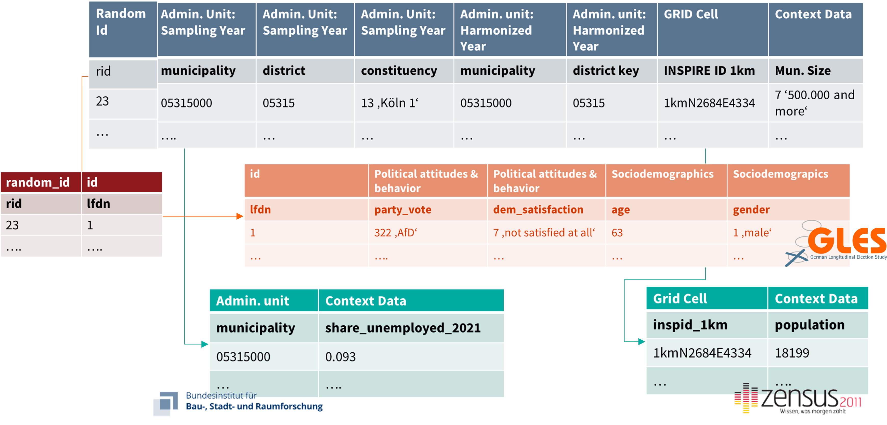
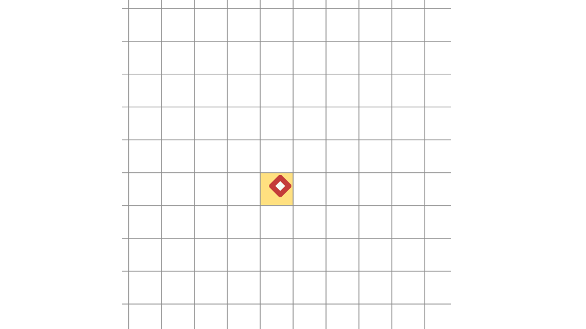
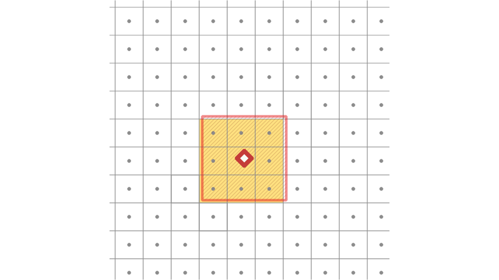
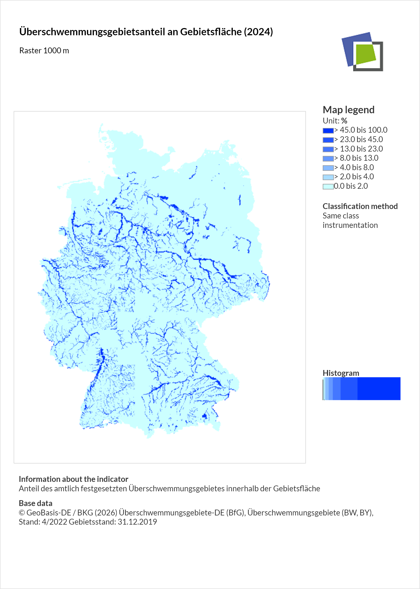

```{r}
#| echo: false
#| include: false
library(tmap)
```


## Now

```{r}
#| echo: false
source("./_ignore/sessions/course_content.R") 

course_content |> 
  kableExtra::row_spec(10, background = "yellow") |> 
  kableExtra::kable_styling(font_size = 20)
```

## What are georeferenced data?

Data with a direct spatial reference $\rightarrow$ **geo-coordinates**

- Information about geometries
- Optional: Content in relation to the geometries

{.r-stretch fig-align="center"}

<small>Sources: OpenStreetMap / GEOFABRIK (2018), City of Cologne (2014), and the Statistical Offices of the Federation and the Länder (2016) / Jünger, 2019</small>


---


## Georeferenced survey data

Survey data enriched with geo-coordinates (or other direct spatial references).

{.r-stretch fig-align="center"}

**With georeferenced survey data, we can analyze interactions between individual behaviors and attitudes and the environment.**

## An example workflow

:::: columns
::: {.column width="50%"}
From the addresses to analyses with georeferenced survey data, several steps and challenges along the way. We will talk about:

- Data Protection & Data Access
- Geocoding 
- Spatial Data Linking
- An example workflow using the `sora` package
:::

::: {.column width="50%"}
{fig-align="center" width="50%"}
:::
::::


## Data protection

That‘s one of the biggest issues.

- Explicit spatial references increase the risk of re-identifying anonymized survey respondents
- Can occur during the processing of data but also during the analysis


**Affects all phases of research and data management!**

## Data availability

:::: columns
::: {.column width="50%"}
Geospatial Data

- Often de-centralized distributed 
- Fragmented data landscape, at least in Germany

Georeferenced Survey Data

- Primarily, survey data
- Depends on documentation
- Access difficult due to data protection restrictions
:::

::: {.column width="50%"}
{fig-align="center" width="50%"}

<small>
https://www.eea.europa.eu/data-and-maps
https://datasearch.gesis.org/
https://datasetsearch.research.google.com/
</small>
:::
::::

## Distribution & re-identification risk

Even without (in)direct spatial references, data may still be sensitive.

- Geospatial attributes add new information to existing data
- Maybe part of general data privacy checks, but we may not distribute these data as is

:::: columns
::: {.column width="50%"}
Safe Rooms / Secure Data Centers

- Control access
- Checks output
:::

::: {.column width="50%"}
{fig-align="center" width="50%"}
<small>https://www.gesis.org/en/services/processing-and-analyzing-data/guest-research-stays/secure-data-center-sdc</small>
:::
::::

## Legal Regulations in Data Processing

:::: columns
::: {.column width="50%"}
In Germany, storing personal information such as addresses in the same place as actual survey attributes is usually not allowed.

- Projects keep them in separate locations
- Can only be matched with a correspondence table
- Necessary to conduct data linking
:::

::: {.column width="50%"}
{fig-align="center" width="50%"}

<small>Jünger, 2019</small>
:::
::::

## Geocoding

Geocoding is the conversion of indirect spatial references (e.g., addresses) into direct spatial references (e.g., coordinates)

However, conducting this procedure is tricky (not only in `R`). Many services are either

- Expensive (at least they cost money or have other restrictions)
- Probably not data protection-friendly (Hey Google)
- Or both

## Our Approach

We rely on a service offered by the Federal Agency of Cartography and Geodesy (BKG):

- Online interface and API for online geocoding
- Offline geocoding possible based on raw data
- But: Data and service used to be restricted

## `bkggeocoder`

:::: columns
::: {.column width="50%"}
`R` package `bkggeocoder` developed at GESIS for (offline) geocoding by Stefan and Jonas Lieth:

- Access via [Github](https://github.com/StefanJuenger/bkggeocoder)
- Introduction in the [Meet the Experts Talk](https://www.youtube.com/watch?v=ZnA21LyKK88&feature=youtu.be) by Stefan
:::

::: {.column width="50%"}
{fig-align="center" width="50%"}
:::
::::

## New interface in the `sora` package

We can now also use the `sora` package to geocode addresses (but thus far, with fewer features than `bkggeocoder`).

```{r}
#| output-location: fragment
leibniz_addresses <-
  tibble::tribble(
    ~id, ~street, ~house_number, ~zip_code, ~place, ~institute,
    1, "B 2", "1", "68159", "Mannheim", "GESIS",
    2, "Unter Sachsenhausen", "6-8",  "50667", "Köln", "GESIS",
    3, "Kellnerweg", "4", "37077", "Göttingen", "DPZ",
    4, "Reichsstr.", "4-6", "04109",  "Leipzig", "GWZO",
    5, "Schöneckstraße", "6", "79104", "Freiburg", "KIS",
    6, "Albert-Einstein-Straße", "29a", "18059", "Rostock", "LIKAT",
    7, "L7", "1", "68161", "Mannheim", "ZEW",
    8, "Müggelseedamm", "310", "12587", "Berlin", "IGB",
    9, "Campus D2", "2", "66123", "Saarbrücken", "INM",
    10, "Eberswalder Straße", "84", "15374", "Müncheberg (Mark)", "ZALF"
  )

leibniz_addresses
```

## Setup and run the Geocoding

```{r}
#| output-location: fragment
# load sora package
library(sora)

# set API key for the session
Sys.setenv(SORA_API_KEY = readLines("sora_key"))

# check if the sora API can be reached
sora_available()
```

## Setup and run the Geocoding

```{r}
#| eval: false
# load sora package
library(sora)

# set API key for the session
Sys.setenv(SORA_API_KEY = readLines("sora_key"))

# check if the sora API can be reached
sora_available()

# start the geocoding
leibniz_addresses <-
  sora::sora_geocoder(
    leibniz_addresses
  )
```

::: {.fragment}
```{r}
#| echo: false
leibniz_addresses <-
  sora::sora_geocoder(
    leibniz_addresses
  )
```
:::

## Setup and run the Geocoding

```{r}
#| eval: false
# load sora package
library(sora)

# set API key for the session
Sys.setenv(SORA_API_KEY = readLines("sora_key"))

# check if the sora API can be reached
sora_available()

# start the geocoding
leibniz_addresses <-
  sora::sora_geocoder(
    leibniz_addresses
  )

# check status
sora::sora_job_status(leibniz_addresses)
```

::: {.fragment}
```{r}
#| echo: false
sora::sora_job_status(leibniz_addresses)
```
:::

## Setup and run the Geocoding

```{r}
#| eval: false
# load sora package
library(sora)

# set API key for the session
Sys.setenv(SORA_API_KEY = readLines("sora_key"))

# check if the sora API can be reached
sora_available()

# start the geocoding
leibniz_addresses <-
  sora::sora_geocoder(
    leibniz_addresses
  )

# check status
sora::sora_job_status(leibniz_addresses)
```

::: {.fragment}
```{r}
#| echo: false
while(isFALSE(sora::sora_job_done(leibniz_addresses))) {
  print("Waiting for SoRa API to be finished...")
  Sys.sleep(10)
}

sora::sora_job_status(leibniz_addresses)
```
:::

## Setup and run the Geocoding

```{r}
#| eval: false
#| output-location: fragment
# load sora package
library(sora)

# set API key for the session
Sys.setenv(SORA_API_KEY = readLines("sora_key"))

# check if the sora API can be reached
sora_available()

# start the geocoding
leibniz_addresses <-
  sora::sora_geocoder(
    leibniz_addresses
  )

# check status
sora::sora_job_status(leibniz_addresses)

# pulling the results from the server
leibniz_addresses <- sora::sora_results(leibniz_addresses)

leibniz_addresses
```

::: {.fragment}
```{r}
#| echo: false
# pulling the results from the server
leibniz_addresses <- sora::sora_results(leibniz_addresses)

leibniz_addresses
```
:::

## Convert To `sf` Object And Plot

```{r}
#| fig.asp: 1
#| message: false
#| output-location: column-fragment
leibniz_addresses_sf <-
  leibniz_addresses |> 
  sf::st_as_sf(coords = c("x", "y"), crs = 4326)

tmaptools::read_osm(
  leibniz_addresses_sf, 
  type = "esri-topo"
) |> 
  terra::rast() |> 
  tm_shape() +
  tm_rgb() +
  tm_shape(leibniz_addresses_sf) +
  tm_dots(size = 2, col = "red")
```


## Data Linking

Linking via common identifiers is most commonly used but comes with challenges (e.g., territorial status and land reforms? Comparable units? Heterogeneity within units?).

{.r-stretch fig-align="center"}

## Spatial linking methods (examples) I

:::: columns
::: {.column width="50%"}
Lookups

<small>e.g., `sf::st_join()`</small>

{fig-align="center" width="50%"}
:::

::: {.column width="50%"}
Circles 

<small>e.g., `sf::st_buffer()`</small>

{fig-align="center" width="50%"}
:::
::::

## Spatial linking methods (examples) II

:::: columns
::: {.column width="50%"}
Squares

<small>e.g., `sf::st_buffer(..., endCapStyle = "SQUARE")`</small>

{fig-align="center" width="50%"}
:::

::: {.column width="50%"}
Isochrones

<small>e.g., `openrouteservice::ors_isochrones()`</small>

{fig-align="center" width="50%"}
:::
::::

## Cheatsheet: Spatial Operations

An overview of spatial operations using the `sf` package can be accessed [here](https://ugoproto.github.io/ugo_r_doc/pdf/sf.pdf).

{.r-stretch fig-align="center"}

## `sf` vs. `sora`

::::: columns
::: {.column width="50%"}
In principle, you are now well-suited to conduct many of these methods on your own, locally using `sf` and other spatial packages. However, this endeavor can still be complicated to setup, data may not be available, or your work station is simply not able to run your applications. To navigate these issues, we (GESIS, IÖR, SOEP) developed a full-blown spatial linking infrastructure in the [SoRa project](https://sora-service.org/). You can install the `sora` package to access its API with this code:

```{r}
#| eval: false
pak::pkg_install(
  "git::https://git.gesis.org/sora-service/sora.git"
)
```
:::

::: {.column width="50%"}
{fig-align="center" width="75%"}
:::
:::::

## Cheatsheet: Spatial Linking

An overview of (most) of the spatial linking operations using the `sora` package can be accessed in the folder `sessions`.

{.r-stretch fig-align="center"}


## Fake research question

:::: columns
::: {.column width="50%"}
Say we're interested in the impact of flooding zones in a neighborhood on individual-level attitudes towards the prepardness of one's municipality regarding future flooding events.

We plan to conduct a survey which is representative of the population of Germany.
:::

::: {.column width="50%"}
{fig-align="center" width="50%"}

<p align = "center"><small>https://imgflip.com/i/9ptcuu</small></p>
:::
::::

## Synthetic georeferenced survey data

We have added a synthetic dataset of 500 geocoordinates in the `./data/` folder (aggregated to 1 sq km centroids). Initially, it was based on a sample of the georeferenced GESIS Panel.

```{r}
#| fig.asp: .7
#| output-location: column-fragment
synthetic_survey_geocoordinates <-
  readRDS("./data/synthetic_survey_geocoordinates.rds")

tmaptools::read_osm(
  synthetic_survey_geocoordinates, 
  type = "esri-topo"
) |> 
  terra::rast() |> 
  tm_shape() +
  tm_rgb() +
  tm_shape(synthetic_survey_geocoordinates) +
  tm_dots(col = "red")
```


## Correspondence table

As in any survey that deals with addresses, we need a correspondence table of the distinct identifiers.

```{r}
correspondence_table <-
  dplyr::bind_cols(
    id_survey = 
      stringi::stri_rand_strings(10000, 10) |>  
      sample(500, replace = FALSE),
    id = synthetic_survey_geocoordinates$id
  )

correspondence_table
```

## Conduct the survey

We 'ask' respondents for some standard sociodemographics. But we also include an item from the [GESIS Panel](https://doi.org/10.4232/1.14114) on environmental attitudes: "The risk of flooding is increasing in the municipality where I live." (`risk_flood`; Range `1`, "Do not agree at all", to `7`, "Fully agree"). Since we cannot share the actual data, we created fake data using the [`faux` package](https://cran.r-project.org/web/packages/faux/index.html).

```{r}
#| include: false
secret_data <-
  sora::sora_request(
    dataset = sora::sora_custom(synthetic_survey_geocoordinates),
    link_to = "ioer-monitor-r01rg-2021-1000m",
    method = "aggregate_attribute",
    selection_area = "circle",
    radius = 5000,
    output = "mean",
    wait = TRUE
  )

secret_variable_we_are_hiding_from_you <-
  faux::rnorm_pre(
    secret_data$mean, 
    mu = 5, 
    sd = 2, 
    r = -0.3
  ) |> 
  round(0)

secret_variable_we_are_hiding_from_you[
  secret_variable_we_are_hiding_from_you < 1
] <- 1
secret_variable_we_are_hiding_from_you[
  secret_variable_we_are_hiding_from_you > 7
] <- 7
```

```{r}
#| output-location: column-fragment
fake_survey_data <- 
  dplyr::bind_cols(
    id = correspondence_table$id,
    age = 
      pmin(pmax(rnorm(500, mean = 50, sd = 15))) |> 
      round(),
    gender = 
      sample(1:3, 500, replace = TRUE, prob = c(.45, .45, .1)) |> 
      as.factor(),
    education =
      pmin(pmax(rnorm(500, mean = 3, sd = 1))) |> 
      round(),
    income =
      pmin(pmax(rlnorm(500, meanlog = log(2500), sdlog = 0.5))) |> 
      round(),
    risk_flood = secret_variable_we_are_hiding_from_you
  )

fake_survey_data
```

## Hypothesis

*Exposure to flooding zones*

> The higher the exposure to flooding zones the more pessimistic is the opinion about prepardness of municipalities regarding future flooding risks.

## Distribution of our 'survey data'

```{r}
#| output-location: fragment
par(mfrow=c(2, 3))
for (variable in names(fake_survey_data)[-1]) {
  hist(
    as.numeric(fake_survey_data[[variable]]), main = variable, xlab = variable
  )
}
```

## Using `sora` to link our data

:::: columns
::: {.column width="50%"}
In `sora` (and the [IOER Monitor](https://monitor.ioer.de/?rid=5250), we can find the geospatial indicator we are interested in: the percentage of flood zones to reference area. It's always a good idea to browse the data [online](http://www.ioer-monitor.de/) and to see how the data looks at the homepage of the IEOR...
:::

::: {.column width="50%"}
{fig-align="center" width="60%"}
:::
:::::

## The `sora` datapicker

...but we can also use the `sora` datapicker--again either [online](https://sora.gesis.org/public/datapicker/) or directly within `R`. In the end of this effort, we need a specific ID to feed into the other `sora` functions (see below). So let's search for our flooding data in a resolution of 1000 meters and the collection year 2021.

```{r}
#| output-location: fragment
# tabular output of all available spatial datasets
sora::sora_datapicker("spatial")
```

## The `sora` datapicker

...but we can also use the `sora` datapicker--again either [online](https://sora.gesis.org/public/datapicker/) or directly within `R`. In the end of this effort, we need a specific ID to feed into the other `sora` functions (see below). So let's search for our flooding data in a resolution of 1000 meters and the collection year 2021.

```{r}
#| output: false
#| code-line-numbers: "4-12"
# tabular output of all available spatial datasets
sora::sora_datapicker("spatial")

# filtering for the ID we need
filtered_spatial_data <-
  sora::sora_datapicker("spatial") |> 
  dplyr::filter(grepl("flood", title)) |> 
  dplyr::filter(spatial_resolution == "1000m Raster") |> 
  dplyr::filter(time_frame == 2021) 

filtered_spatial_data |> 
  dplyr::select(dataset_id, description)
```

::: {.fragment}
```{r}
#| echo: false
# filtering for the ID we need
filtered_spatial_data <-
  sora::sora_datapicker("spatial") |> 
  dplyr::filter(grepl("flood", title)) |> 
  dplyr::filter(spatial_resolution == "1000m Raster") |> 
  dplyr::filter(time_frame == 2021) 

filtered_spatial_data |> 
  dplyr::select(dataset_id, description)
```

The ID we need is `ioer-monitor-r01rg-2021-1000m`.
:::

## Defining the spatial dataset

All requests to link data in `sora` boil down to this simple schema:

```{r}
#| eval: false
linking_job <- 
  sora_request(
    dataset,
    link_to,
    method,
    ...
  )
```

We define our `dataset` with our geocoordinates (`fake_survey_geocoordinates`), a spatial dataset `link_to` (IOER data), and a method we want to use for linking (more on that in a minute). Indeed, there's more we can specify as indicated by the `...`.

## Setting up our geocoordinates

Let's start with our geocoordinates. Orginally, `sora` was designed as an interface to georeferenced data, e.g., from SOEP or GESIS. But `sora` can also be used for custom datasets, like our `fake_survey_geocoordinates`. For this purpose, we need the `sora::custom_data()` function.

```{r}
#| output-location: fragment
custom_data <- sora::sora_custom(synthetic_survey_geocoordinates)

custom_data
```

## Setting up our geospatial data

As we did our research, we know the ID of the geospatial data we are interested in: `ioer-monitor-r01rg-2021-1000m`. We can use the function `sora::sora_spatial()` to 'register' the data for the request to the `sora` API.

```{r}
#| output-location: fragment
flooding_zones <- sora::sora_spatial("ioer-monitor-r01rg-2021-1000m")

flooding_zones
```

## Setting up our first linkages

The next step is to define how we want to link both datasets. Let's start with a 5000 meters circular buffer! It's a method of aggregation, which is why we specify it in the first step.

```{r}
#| output-location: fragment
linking_method_1 <-
  sora::sora_linking(
    "aggregate_attribute",
    selection_area = "circle",
    radius = 5000,
    output = "mean"
  )

linking_method_1
```

## Ready to link?

We are now all set. We simply have to enter all these elements into the `sora::sora_request()` function. But wait, we can check first for any issues in our specification:

```{r}
#| output-location: fragment
sora::sora_simulate(
  dataset = custom_data,
  link_to = flooding_zones,
  method = linking_method_1
)
```

## Ready to link!

```{r}
#| output-location: fragment
# Starting the actual request to the SoRa API
linking_run_1 <-
  sora::sora_request(
    dataset = custom_data,
    link_to = flooding_zones,
    method = linking_method_1
  )
```

## Ready to link!

```{r}
#| eval: false
#| code-line-numbers: "10"
# Starting the actual request to the SoRa API
linking_run_1 <-
  sora::sora_request(
    dataset = custom_data,
    link_to = flooding_zones,
    method = linking_method_1
  )

# Getting information about the job's progress
sora::sora_job_status(linking_run_1)
```

::: {.fragment}
```{r}
#| echo: false
sora::sora_job_status(linking_run_1)
```
:::

## Ready to link!

```{r}
#| echo: false
while(isFALSE(sora::sora_job_done(linking_run_1))) {
  Sys.sleep(10)
}
```

```{r}
#| eval: false
#| code-line-numbers: "10"
# Starting the actual request to the SoRa API
linking_run_1 <-
  sora::sora_request(
    dataset = custom_data,
    link_to = flooding_zones,
    method = linking_method_1
  )

# Getting information about the job's progress
sora::sora_job_status(linking_run_1)
```

::: {.fragment}
```{r}
#| echo: false
sora::sora_job_status(linking_run_1)
```
:::

## Ready to link!

```{r}
#| eval: false
#| code-line-numbers: "12-16"
# Starting the actual request to the SoRa API
linking_run_1 <-
  sora::sora_request(
    dataset = custom_data,
    link_to = flooding_zones,
    method = linking_method_1
  )

# Getting information about the job's progress
sora::sora_job_status(linking_run_1) 

# After the job is finished, download the linked dataset
linking_run_1_results <- 
  sora::sora_results(linking_run_1)

linking_run_1_results
```

::: {.fragment}
```{r}
#| echo: false
# After the job is finished, download the linked dataset
linking_run_1_results <- 
  sora::sora_results(linking_run_1)

linking_run_1_results
```
:::

## Let's link these data to our survey data

The output from `sora` in the console and the returned object is quite verbose. To link these data to our survey data, we may only need the `id` and `mean` variable. 

```{r}
#| output-location: column-fragment
# Reduce linked dataset to id and mean, rename the latter
linking_run_1_results_reduced <-
  linking_run_1_results |> 
  dplyr::transmute(
    id = as.numeric(id),
    flood_zones_perc = mean
  )

# Conduct a simple left join based on the common id
fake_survey_data_linked <-
  fake_survey_data |> 
  dplyr::left_join(
    linking_run_1_results_reduced,
    by = "id"
  )

fake_survey_data_linked
```

## Doing the analysis

```{r}
lm(
  risk_flood ~ age + gender + education + income + flood_zones_perc, 
  data = fake_survey_data_linked
) |> 
  sjPlot::plot_model()
```


## Exercise 6: Using SoRa

[Exercise](https://stefanjuenger.github.io/gesis-workshop-geospatial-techniques-R-2026/exercises/6_Using_SoRa.html)
