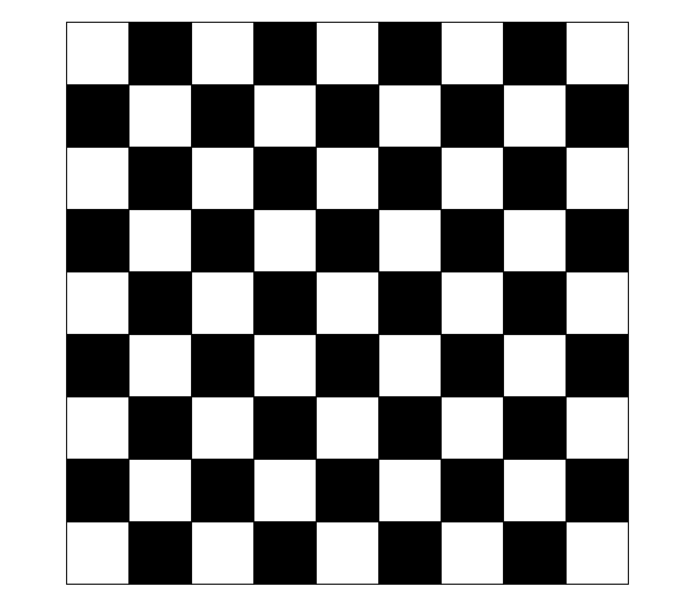
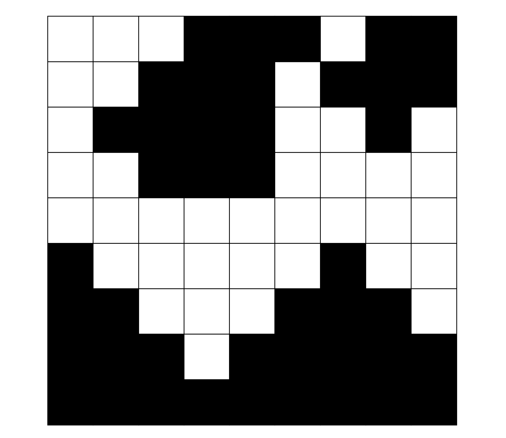
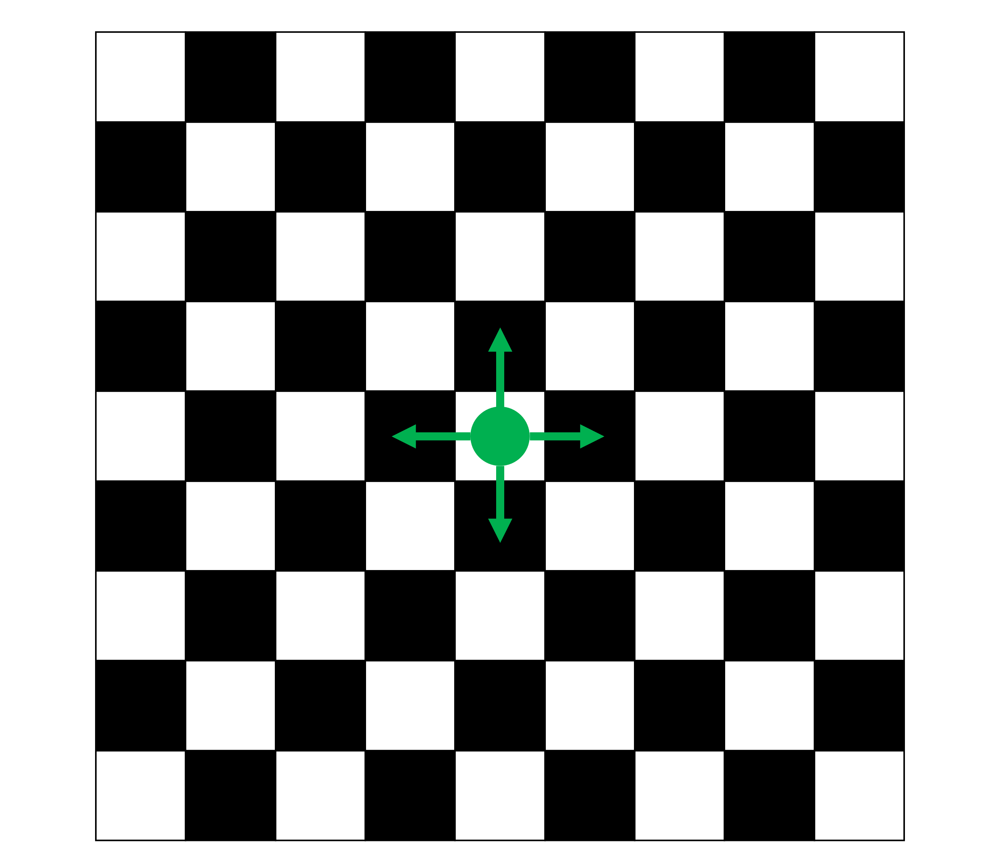
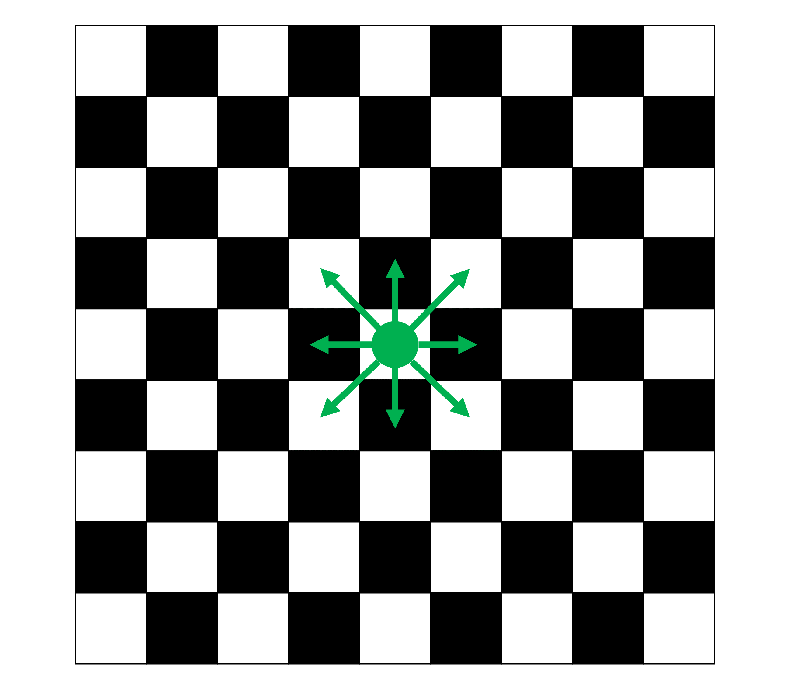
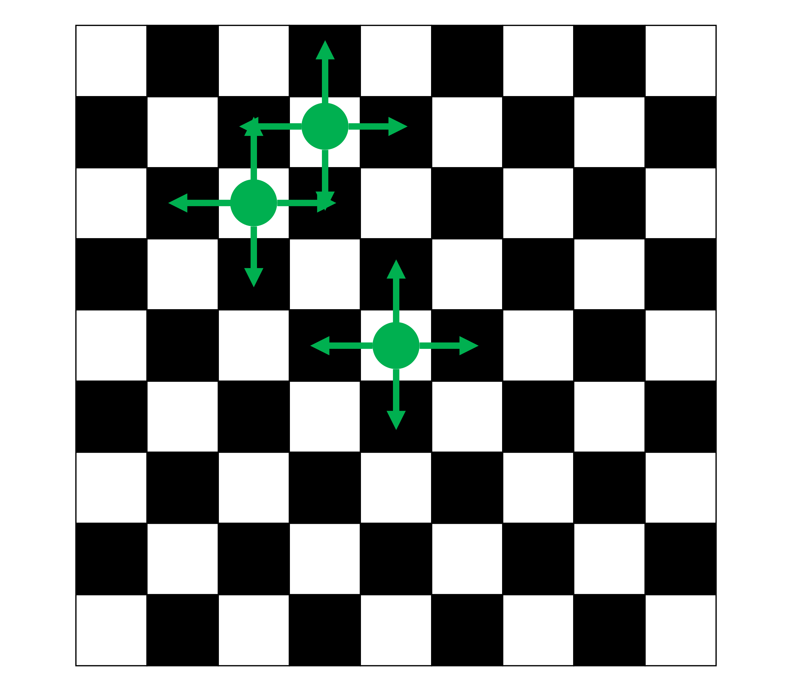
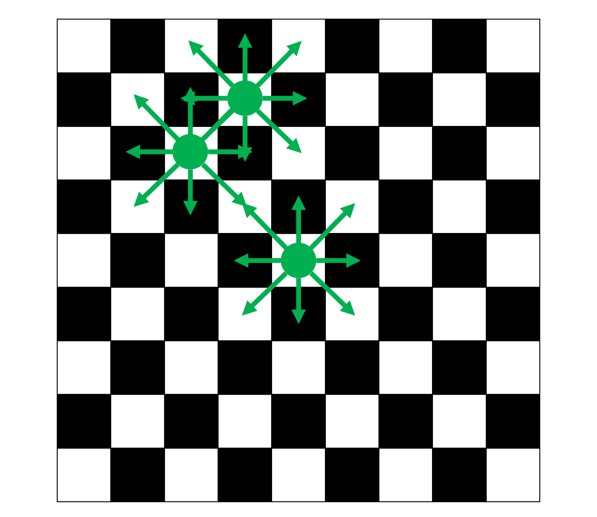

```{r}
#| include: false
library(dplyr)
library(ggplot2)
library(sf)
library(terra)
library(tmap)
```

## Now

```{r}
#| echo: false
source("course_content.R") 

course_content |> 
  kableExtra::row_spec(12, background = "yellow")
```

## Thus far

We've done some wrangling, mapping, and linking of geospatial data (with georeferenced survey data)

We've seen that geospatial data are relevant to provide context and this context can be communicated with maps--we can tell a story!

**However, geospatial data can also be utilized to detect and analyze social processes**

## Tobler's first law of geography

> [E]verything is related to everything else, but near things are more related than distant things (Tobler 1970, p. 236)^[Tobler, W. R. (1970). A Computer Movie Simulating Urban Growth in the Detroit Region. Economic Geography, 46, 234–240. https://doi.org/10.2307/143141]

This means nearby geographical regions, institutions, or people are more similar or have a stronger influence on each other.

**What we get is an interdependent system.**

## Spatial Interdependence

Tobler's law is the fundamental principle of doing spatial analysis. 

**Spatial autocorrelation** is the correlation of a variable with itself across space, conditional on a specified neighborhood or weights matrix.

We want to know

1. If observations in our data are spatially interdependent
2. And how this interdependence can be explained (= data generation process)

## Analyze spatial autocorrelation

Three crucial steps:

1. Define who is connected (**neighbourhood matrix**)
2. Define the (relative) strength of connectivity (**weights matrix**)
3. Compute **autocorrelation measures**

## Step 1: Model connectiveness

:::: columns
::: {.column width="50%"}
{fig-align="center" width="75%"}
:::

::: {.column width="50%"}
{fig-align="center" width="75%"}

:::
::::

## Rook and queen neighborhoods

:::: columns
::: {.column width="50%"}
{fig-align="center" width="75%"}
:::

::: {.column width="50%"}
{fig-align="center" width="75%"}
:::
::::

## It's an interdependent system

:::: columns
::: {.column width="50%"}
{fig-align="center" width="75%"}
:::

::: {.column width="50%"}
{fig-align="center" width="75%"}
:::
::::

In graph lingo: We have one (or more) disjoint connected subgraph(s)

## Our case study

Say we are interested in clusters of citizens' **party preferences** and associations with covariates such as **rent prices** or **immigrant shares**.

Again, we will focus on Cologne, utilizing **voting districts** instead of city districts this time.

## Voting districts

```{r}
#| eval: false
voting_districts <-
  sf::st_read("./data/Stimmbezirk.shp") |> 
  dplyr::mutate(
    district_id = as.numeric(nummer)
    ) |> 
  dplyr::select(district_id, Shape_Area, geometry) 

head(voting_districts, 2)
```

```{r}
#| echo: false
voting_districts <-
  sf::st_read("../../data/Stimmbezirk.shp") |> 
  dplyr::mutate(
    district_id = as.numeric(nummer)
    ) |> 
  dplyr::select(district_id, Shape_Area, geometry) 

head(voting_districts, 2)
```


## Federal elections 2021

```{r}
btw21_votes <-
  glue::glue(
    "https://www.stadt-koeln.de/wahlen/bundestagswahl/09-2021/praesentation/\\
    Open-Data-Bundestagswahl476.csv"
  ) |> 
  readr::read_csv2() |>
  dplyr::mutate(
    district_id = as.numeric(`gebiet-nr`),
    valid_votes = `F`,
    cdu_share = (F1 / valid_votes) * 100,
    spd_share = (F2 / valid_votes) * 100,
    fdp_share = (F3 / valid_votes) * 100,
    afd_share = (F4 / valid_votes) * 100,
    greens_share = (F5 / valid_votes) * 100,
    linke_share = (F6 / valid_votes) * 100,
    .keep = "none"
  )

head(btw21_votes, 2)
```


## Federal elections 2021

We create additional factor variables for highest and second-highest vote shares.

```{r}
btw21_votes <- btw21_votes |>
  dplyr::rowwise() |>
  dplyr::mutate(
    highest_vote = factor(
      sub(
        "_share$",
        "",
        names(dplyr::pick(dplyr::ends_with("_share")))[
          order(
            dplyr::c_across(dplyr::ends_with("_share")),
            decreasing = TRUE
          )[1]
        ]
      )
    ),
    second_highest_vote = factor(
      sub(
        "_share$",
        "",
        names(dplyr::pick(dplyr::ends_with("_share")))[
          order(
            dplyr::c_across(dplyr::ends_with("_share")),
            decreasing = TRUE
          )[2]
        ]
      )
    )
  ) |>
  dplyr::ungroup()

table(btw21_votes$highest_vote)
```


## Simple ID matching to link data

```{r}
election_results <-
  dplyr::left_join(
    voting_districts,
    btw21_votes,
    by = "district_id"
  )

head(election_results, 2)
```


## Do vote shares spatially cluster?

:::: columns
::: {.column width="50%"}
```{r}
#| eval: false
#| fig.asp: 1
plot_data <- election_results |>
  tidyr::pivot_longer(
    cols = ends_with("_share"),
    names_to = "party",
    values_to = "vote_share"
  ) |>
  mutate(
    party = sub("_share$", "", party),
    party = factor(party)
  )

ggplot(plot_data) +
  geom_sf(aes(fill = vote_share), color = NA) +
  facet_wrap(~ party, nrow = 2, ncol = 3) +
  scale_fill_viridis_c() +
  theme_void() +
  labs(fill = "Vote share")
```
:::

::: {.column width="50%"}
```{r}
#| echo: false
#| fig.asp: 1
plot_data <- election_results |>
  tidyr::pivot_longer(
    cols = ends_with("_share"),
    names_to = "party",
    values_to = "vote_share"
  ) |>
  mutate(
    party = sub("_share$", "", party),
    party = factor(party)
  )

ggplot(plot_data) +
  geom_sf(aes(fill = vote_share), color = NA) +
  facet_wrap(~ party, nrow = 2, ncol = 3) +
  scale_fill_viridis_c() +
  theme_void() +
  labs(fill = "Vote share")
```
:::
::::


## Pull in German Census data

```{r}
#| eval: false
immigrants_cologne <- terra::rast("./data/immigrants_cologne.tif")
inhabitants_cologne <- terra::rast("./data/inhabitants_cologne.tif")

immigrants_cologne  <- terra::subst(immigrants_cologne,  from = -9, to = NA)
inhabitants_cologne <- terra::subst(inhabitants_cologne, from = -9, to = NA)

immigrant_share_cologne <- (immigrants_cologne / inhabitants_cologne)*100

age_rast <- terra::rast("./data/census22_age_avg.tif")
rent_rast <- terra::rast("./data/census22_rent_avg.tif")
```

```{r}
#| echo: false
immigrants_cologne <- terra::rast("../../data/immigrants_cologne.tif")
inhabitants_cologne <- terra::rast("../../data/inhabitants_cologne.tif")

immigrants_cologne  <- terra::subst(immigrants_cologne,  from = -9, to = NA)
inhabitants_cologne <- terra::subst(inhabitants_cologne, from = -9, to = NA)

immigrant_share_cologne <- (immigrants_cologne / inhabitants_cologne)*100

age_rast <- terra::rast("../../data/census22_age_avg.tif")
rent_rast <- terra::rast("../../data/census22_rent_avg.tif")
```


## It's raster data

:::: columns
::: {.column width="50%"}
```{r}
#| eval: false
#| fig.asp: 1
ggplot() +
  tidyterra::geom_spatraster(
    data = rent_rast
    ) +
  scale_fill_viridis_c()
```
:::

::: {.column width="50%"}
```{r}
#| echo: false
#| fig.asp: 1
ggplot() +
  tidyterra::geom_spatraster(
    data = rent_rast
    ) +
  scale_fill_viridis_c()
```
:::
::::


## Side quest: Aggregating raster by vector

As the voting (vector) data differs from the Census raster data, we cannot use simple ID matching like before.

- We have to rely on spatial linking techniques
- We could use `terra::extract()`
  - But as a default, it only captures raster cells as a whole and not their spatial fraction
  - Which would be honestly okay for most applications
  - But we can also aggregate more precisely with `exactextractr::exact_extract()`

---


## <small>`exactextractr::exact_extract()`!</small>

```{r}
election_results <-
  election_results |>
  dplyr::mutate(
    immigrant_share = 
      exactextractr::exact_extract(
        immigrant_share_cologne, election_results, 'mean', progress = FALSE
      ),
    inhabitants = 
      exactextractr::exact_extract(
        inhabitants_cologne, election_results, 'mean', progress = FALSE
      ),
    age_avg = 
      exactextractr::exact_extract(
        age_rast, election_results, 'mean', progress = FALSE
      ),
    rent_avg = 
      exactextractr::exact_extract(
        rent_rast, election_results, 'mean', progress = FALSE
      )
  )

head(election_results, 2)
```


## Voilà

:::: columns
::: {.column width="50%"}
```{r}
#| eval: false
#| fig.asp: 1
ggplot() +
  geom_sf(
    data = election_results,
    aes(fill = rent_avg)
  ) +
  scale_fill_viridis_c()
```
:::

::: {.column width="50%"}
```{r}
#| echo: false
#| fig.asp: 1
ggplot() +
  geom_sf(
    data = election_results,
    aes(fill = rent_avg)
  ) +
  scale_fill_viridis_c()
```
:::
::::


## How to test spatial autocorrelation

:::: columns
::: {.column width="50%"}
We now have to ask

- Do the spatial units relate to each other?
- If yes, in which way?
  - Only if they are bordering each other? (i.e., Queens or Rooks)
  - Or also if they are in proximity but not necessarily contiguous?
:::

::: {.column width="50%"}
```{r}
#| echo: false
#| fig.asp: 1
ggplot() +
  geom_sf(
    data = election_results
    )
```
:::
::::


## Let's try Queens neighborhoods

```{r}
queens_neighborhoods <-
  spdep::poly2nb(
    election_results,
    queen = TRUE
  )

summary(queens_neighborhoods)
```


## And alternative rook neighborhoods

```{r}
rook_neighborhoods <-
  spdep::poly2nb(
    election_results,
    queen = FALSE
  )

summary(rook_neighborhoods)
```


## Connected regions

:::: columns
::: {.column width="50%"}
```{r}
#| eval: false
#| fig.asp: 1
rook_lines <- rook_neighborhoods |>
  spdep::nb2lines(
    coords = sf::st_as_sfc(election_results),
    as_sf = TRUE
  )

queen_lines <- queens_neighborhoods |>
  spdep::nb2lines(
    coords = sf::st_as_sfc(election_results),
    as_sf = TRUE
  )

nb_points <- sf::st_centroid(queen_lines)

ggplot() +
  geom_sf(data = queen_lines, color = "#1b9e77", 
          linewidth = 1, alpha = 0.6) +
  geom_sf(data = rook_lines, color = "#d95f02", 
          linewidth = 1, alpha = 0.9,
          linetype = "dashed") +
  geom_sf(data = nb_points, size = 2) +
  theme_void()
```
:::

::: {.column width="50%"}
```{r}
#| echo: false
#| fig.asp: 1
rook_lines <- rook_neighborhoods |>
  spdep::nb2lines(
    coords = sf::st_as_sfc(election_results),
    as_sf = TRUE
  )

queen_lines <- queens_neighborhoods |>
  spdep::nb2lines(
    coords = sf::st_as_sfc(election_results),
    as_sf = TRUE
  )

nb_points <- sf::st_centroid(queen_lines)

ggplot() +
  geom_sf(data = queen_lines, color = "#d95f02", 
          linewidth = 1, alpha = 0.6) +
  geom_sf(data = rook_lines, color = "#1b9e77", 
          linewidth = 1, alpha = 0.9,
          linetype = "dashed") +
  geom_sf(data = nb_points, size = 2) +
  theme_void()
```
:::
::::


## Can we now start?

Unfortunately, we are not yet done with creating the links between neighborhoods. What we receive is, in principle, a huge matrix with connected observations.

```{r}
#| echo: false
spdep::nb2mat(queens_neighborhoods, style = "B")[1:10, 1:10]
```

That's nothing we could plug into a statistical model, such as a regression or the like (see next session).


## Step 2: Normalization

Normalization is the process of creating actual **spatial weights**. There is a debate on how to do it (Neumayer & Plümper, 2016)^[Neumayer, E., & Plümper, T. (2016). W. Political Science Research and Methods, 4(01), 175–193. https://doi.org/10.1017/psrm.2014.40]. But nobody questions whether it should be done in the first place since, among others, it restricts the parameter space of the weights.

Without normalization:

- Units with many neighbors exert more influence
- Spatial lag depends on network density

**Goal**: make influence comparable across units

:::: columns
::: {.column width="50%"}
```{r}
#| echo: false
#| fig.asp: 1
spdep::nb2mat(queens_neighborhoods, style = "B")[1:5, 1:5]

rowSums(spdep::nb2mat(queens_neighborhoods, style = "B")[1:5, 1:5]) |> as.vector()
```
:::

::: {.column width="50%"}
```{r}
#| echo: false
#| fig.asp: 1
spdep::nb2mat(queens_neighborhoods, style = "W")[1:5, 1:5]

rowSums(spdep::nb2mat(queens_neighborhoods, style = "W")[1:5, 1:5]) |> as.vector()
```
:::
::::


## Row-normalization

One of the standard procedures is row-normalization. It divides all individual weights (=connections between spatial units) $w_{ij}$ by the row-wise sum of of all other weights:

Each weight is normalized by the sum of its row:

$$
w_{ij}^* = \frac{w_{ij}}{\sum_j w_{ij}}
$$

## Effect of row-normalization

```{r}
#| code-fold: true
#| code-summary: "Show R code"
#| fig-width: 12
#| fig-height: 7
#| out-width: 100%
#| fig-align: center
#| warning: false
#| message: false

library(dplyr)
library(ggplot2)
library(ggpattern)

make_case <- function(focal_x, focal_y, title_text) {
  grid <- expand.grid(x = 1:5, y = 1:5) |>
    as_tibble()
  
  grid <- grid |>
    mutate(
      dist = abs(x - focal_x) + abs(y - focal_y),
      role = case_when(
        x == focal_x & y == focal_y ~ "focal",
        dist == 1 ~ "neighbor",
        TRUE ~ "other"
      )
    )
  
  n_nb <- sum(grid$role == "neighbor")
  
  grid |>
    mutate(
      weight = ifelse(role == "neighbor", 1 / n_nb, NA),
      label = case_when(
        role == "focal" ~ "i",
        role == "neighbor" ~ paste0("1/", n_nb),
        TRUE ~ ""
      ),
      example = title_text
    )
}

df <- bind_rows(
  make_case(3, 3, "Central cell\n4 neighbors → 1/4 each"),
  make_case(3, 5, "Edge cell\n3 neighbors → 1/3 each")
)

ggplot(df, aes(x, y)) +
  geom_tile(fill = "grey95", color = "white", linewidth = 1) +
  ggpattern::geom_tile_pattern(
    data = subset(df, role == "neighbor"),
    fill = "grey95",
    pattern = "stripe",
    pattern_fill = "lightgreen",
    pattern_colour = "lightgreen",
    pattern_density = 0.35,
    pattern_spacing = 0.03,
    color = "white",
    linewidth = 1
  ) +
  geom_tile(
    data = subset(df, role == "focal"),
    fill = "gold",
    color = "white",
    linewidth = 1
  ) +
  geom_text(aes(label = label), size = 5) +
  facet_wrap(~example) +
  coord_equal() +
  scale_y_reverse() +
  theme_void() +
  theme(
    strip.text = element_text(size = 11, face = "bold"),
    legend.position = "none"
  )

```


## Alternatives to row-normalization

**"B"** (Binary)
- Keeps original neighbor structure

**"W"** (Row-standardized)
- Row-normalized weights / Each unit’s weights sum to 1 / Interpretable as average of neighbors

**"C"** (Globally standardized)
- Weights scaled so the total sum across all units equals n (number of observations) / Preserves global comparability

**"U"** (Equal to C but unscaled)
- Similar structure to "C", but total sum equals 1 / Less commonly used

**"S"** (Variance-stabilizing)
- Adjusts weights to stabilize variance across units / Reduces influence of highly connected units

**"minmax"**
- Scales weights by the minimum of the maximum row and column sums / Keeps weights bounded and comparable


## Apply row-normalization

```{r}
queens_W <- spdep::nb2listw(queens_neighborhoods, style = "W")

summary(queens_W)
```


## Tidyverse alternative: `sfdep` package

The [`sfdep`](https://cran.r-project.org/web/packages/sfdep/index.html) package provides a more `tidyverse`-compliant syntax to spatial weights. See:

```{r}
election_results <-
  election_results |> 
  dplyr::mutate(
    neighbors = sfdep::st_contiguity(election_results), # queen neighborhoods by default
    weights = sfdep::st_weights(neighbors)
  )

head(election_results, 2)
```


## Step 3: Tests of spatial autocorrelation

- Global measures consider the **average level of spatial autocorrelation across all observations**
- Bias can be induced through **edge effects** where important parts of the spatial process fall outside the study area (compare to left- and right-censoring longitudinal data)

Global tests in this session include:

  1. **Join-count tests** for categorical data
  2. **Moran's I**
  3. **Geary's C**

## Join-count tests for categorical data

- Evaluates whether adjacent areas share the **same category**
- The test counts joins: pairs of neighboring polygons (defined by your **weights matrix**)
- It compares observed joins to what would be expected under **spatial randomness** (null hypothesis)

$$
z_{kl} =
\frac{J_{kl} - \operatorname{E}(J_{kl})}
{\sqrt{\operatorname{Var}(J_{kl})}}
$$

where:

- $J_{kl}$ = observed number of joins between categories $k$ and $l$
- $\operatorname{E}(J_{kl})$ = expected joins under spatial randomness
- $\operatorname{Var}(J_{kl})$ = variance under the null hypothesis


## Join-count tests for categorical data

- Same-category joins higher than expected: **spatial clustering**
- Mixed-category joins lower than expected: **spatial segregation**
- Mixed-category joins higher than expected: **spatial dispersion**

```{r}
args(spdep::joincount.multi)
```


## Join-count tests for categorical data

:::: columns
::: {.column width="50%"}
```{r}
#| echo: true
#| fig.asp: 1
spdep::joincount.multi(
  election_results$highest_vote,
  listw = queens_W
)
```
:::

::: {.column width="50%"}
```{r}
#| echo: true
#| fig.asp: 1
ggplot(election_results) +
  geom_sf(aes(fill = highest_vote), color = "white", linewidth = 0.1) +
  scale_fill_manual(
    values = c(
      "greens" = "darkgreen",
      "spd" = "red",
      "cdu" = "black"
    )
  ) +
  theme_void() +
  labs(
    fill = "Highest vote",
    title = "Spatial clusters of winning parties"
  )
```
:::
::::


## Step 3: Tests of spatial autocorrelation

$$I=\frac{N}{\sum_{i=1}^N\sum_{j=1}^Nw_{ij}}\frac{\sum_{i=1}^{N}\sum_{j=1}^Nw_{ij}(x_i-\bar{x})(x_j-\bar{x})}{\sum_{i=1}^N(x_i-\bar{x})^2}$$

- Most and foremost, **Moran's I** use the previously created weights between all spatial unit pairs $w_{ij}$. 
- It weights deviations from an overall mean value of connected pairs according to the strength of the modeled spatial relations. 
- Moran's I can be interpreted as a correlation coefficient with a **range from -1 to +1** 


## Example patterns

```{r}
#| code-fold: true
#| code-summary: "Show R code"
#| fig-width: 12
#| fig-height: 7
#| out-width: 100%
#| fig-align: center
#| warning: false
#| message: false

library(dplyr)
library(ggplot2)
library(spdep)
library(tibble)

# 5x5 grid and rook neighbours
n <- 5
grid <- expand.grid(x = 1:n, y = 1:n) |>
  as_tibble()

nb <- spdep::cell2nb(nrow = n, ncol = n, type = "rook")
lw <- spdep::nb2listw(nb, style = "W", zero.policy = TRUE)

# helper to compute Moran's I
moran_I <- function(v) {
  spdep::moran(
    x = v,
    listw = lw,
    n = length(v),
    S0 = spdep::Szero(lw),
    zero.policy = TRUE
  )$I
}

# pattern close to +1: iteratively smooth a random field
make_positive_pattern <- function(target = 0.95, max_iter = 200) {
  set.seed(123)
  v <- rnorm(nrow(grid))
  
  for (i in seq_len(max_iter)) {
    v <- 0.35 * v + 0.65 * spdep::lag.listw(lw, v, zero.policy = TRUE)
    if (moran_I(v) > target) break
  }
  
  as.numeric(scale(v))
}

# pattern close to 0: search for a near-random arrangement
make_zero_pattern <- function(tol = 0.05, max_iter = 10000) {
  best_v <- NULL
  best_I <- Inf
  
  for (i in seq_len(max_iter)) {
    v <- sample.int(nrow(grid))
    I <- moran_I(v)
    
    if (abs(I) < abs(best_I)) {
      best_v <- v
      best_I <- I
    }
    
    if (abs(I) <= tol) break
  }
  
  as.numeric(scale(best_v))
}

# pattern close to -1: checkerboard
v_neg <- ifelse((grid$x + grid$y) %% 2 == 0, 1, -1)
v_zero <- make_zero_pattern()
v_pos <- make_positive_pattern()

# combine for plotting
plot_df <- bind_rows(
  grid |>
    mutate(
      value = v_neg,
      panel = sprintf("Moran's I close to -1\nDispersion pattern", moran_I(v_neg))
    ),
  grid |>
    mutate(
      value = v_zero,
      panel = sprintf("Moran's I close to 0\nRandom pattern", moran_I(v_zero))
    ),
  grid |>
    mutate(
      value = v_pos,
      panel = sprintf("Moran's I close to 1\nClustering pattern", moran_I(v_pos))
    )
)

ggplot(plot_df, aes(x, y, fill = value)) +
  geom_tile(color = "white", linewidth = 1) +
  facet_wrap(~panel, nrow = 1) +
  coord_equal() +
  scale_y_reverse() +
  scale_fill_gradient2(
    low = "steelblue",
    mid = "white",
    high = "firebrick",
    midpoint = 0
  ) +
  theme_void() +
  theme(
    strip.text = element_text(size = 12, face = "bold"),
    legend.position = "none"
  )

```


## Moran's I in `spdep`

:::: columns
::: {.column width="50%"}
```{r}
#| echo: true
#| fig.asp: 1
spdep::moran.test(
  election_results$rent_avg, 
  listw = queens_W
)
```
:::

::: {.column width="50%"}
```{r}
#| echo: false
#| fig.asp: 1
ggplot() +
  geom_sf(
    data = election_results,
    aes(fill = rent_avg)
  ) +
  scale_fill_viridis_c()
```
:::
::::


## Moran scatterplot

:::: columns
::: {.column width="50%"}
```{r}
#| eval: false
#| fig.asp: 1
mp <- spdep::moran.plot(
  x = election_results$rent_avg,
  listw = queens_W,
  labels = election_results$district_id,
  xlab = "Rent average",
  ylab = "Spatial lag of rent average"
)

x_mean <- mean(election_results$rent_avg, na.rm = TRUE)
lag_rent <- spdep::lag.listw(queens_W, election_results$rent_avg)
y_mean <- mean(lag_rent, na.rm = TRUE)

x_range <- range(mp$x, na.rm = TRUE)
y_range <- range(mp$wx, na.rm = TRUE)

x_left  <- mean(c(x_range[1], x_mean))
x_right <- mean(c(x_mean, x_range[2]))

text(x_right, y_range[2], "High–High", pos = 1, col = "red")
text(x_left,  y_range[2], "Low–High",  pos = 1, col = "red")
text(x_left,  y_range[1], "Low–Low",   pos = 3, col = "red")
text(x_right, y_range[1], "High–Low",  pos = 3, col = "red")
```
:::

::: {.column width="50%"}
```{r}
#| echo: false
#| fig.asp: 1
mp <- spdep::moran.plot(
  x = election_results$rent_avg,
  listw = queens_W,
  labels = election_results$district_id,
  xlab = "Rent average",
  ylab = "Spatial lag of rent average"
)

x_mean <- mean(election_results$rent_avg, na.rm = TRUE)
lag_rent <- spdep::lag.listw(queens_W, election_results$rent_avg)
y_mean <- mean(lag_rent, na.rm = TRUE)

x_range <- range(mp$x, na.rm = TRUE)
y_range <- range(mp$wx, na.rm = TRUE)

x_left  <- mean(c(x_range[1], x_mean))
x_right <- mean(c(x_mean, x_range[2]))

text(x_right, y_range[2], "High–High", pos = 1, col = "red")
text(x_left,  y_range[2], "Low–High",  pos = 1, col = "red")
text(x_left,  y_range[1], "Low–Low",   pos = 3, col = "red")
text(x_right, y_range[1], "High–Low",  pos = 3, col = "red")
```
:::
::::

## Moran's I in `sfdep`

```{r}
library(magrittr)

election_results %$% 
  sfdep::global_moran_test(rent_avg, neighbors, weights)
```


## Test of spatial autocorrelation: Geary's C

Moran's I is based on **covariance** between values and their spatial lag and captures overall similarity patterns. It can produce issues when there are only local clusters of spatial interdependence in the data. An alternative is the use of `Geary's C`:

$$C=\frac{(N-1)\sum_i\sum_jw_{ij}(x_i-x_j)^2}{2\sum_{i=1}^N\sum_{j=1}^Nw_{ij}\sum_i(x_i-\bar{x})^2}$$

It is based on **squared differences** between neighbors and emphasizes local dissimilarities. 

Geary's C only produces values between 0 and 2: 

- values near 0 = positive spatial autocorrelation; 
- values near 1 = no spatial autocorrelation; 
- values near 2 = negative spatial autocorrelation.


## Geary's C in `spdep`

```{r}
spdep::geary.test(
  election_results$rent_avg, 
  listw = queens_W
)
```


## Geary's C in `sfdep`

```{r}
election_results %$% 
  sfdep::global_c_test(rent_avg, neighbors, weights)
```


## Measures of local spatial autocorrelation: LISA clusters

We show you the `sfdep` package because it provides nice functions to calculate *local* measures of spatial autocorrelation. One popular choice is the estimation of Local Indicators of Spatial Autocorrelation (i.e., LISA clusters). Most straightforwardly, they can be interpreted as case-specific indicators of spatial autocorrelation:

$$I_i=\frac{x_i-\bar{x}}{\frac{\sum_{i-1}^N(x_i-\bar{x})^2}{N}}\sum_{j=1}^Nw_{ij}(x_j-\bar{x})$$

## Local Moran's I in `sfdep`

```{r}
lisa <- 
  election_results |> 
  dplyr::mutate(
    lisa = sfdep::local_moran(rent_avg, neighbors, weights)
  ) |>
  tidyr::unnest(cols = lisa)

head(lisa, 2)
```

## It's also nice for mapping

:::: columns
::: {.column width="50%"}
```{r}
#| eval: false
#| fig.asp: 1
ggplot() +
  geom_sf(
    data = lisa,
    aes(fill = ii)
  ) +
  scale_fill_viridis_c()
```
:::

::: {.column width="50%"}
```{r}
#| echo: false
#| fig.asp: 1
ggplot() +
  geom_sf(
    data = lisa,
    aes(fill = ii)
  ) +
  scale_fill_viridis_c()
```
:::
::::


## It's suitable for hot-spot analysis

:::: columns
::: {.column width="50%"}
```{r}
#| eval: false
#| fig.asp: 1
lisa <- lisa |>
  dplyr::mutate(
    lisa_cluster_rent = dplyr::if_else(
      p_folded_sim < 0.05,
      as.character(mean),
      "Not significant"
    ),
    lisa_cluster_rent = factor(
      lisa_cluster_rent,
      levels = c(
        "High-High",
        "Low-Low",
        "High-Low",
        "Low-High",
        "Not significant"
      )
    )
  )

ggplot(lisa) +
  geom_sf(aes(fill = lisa_cluster_rent), color = NA) +
  scale_fill_manual(
    values = c(
      "High-High" = "red",
      "Low-Low" = "blue",
      "High-Low" = "orange",
      "Low-High" = "lightgreen",
      "Not significant" = "grey90"
    ),
    drop = FALSE
  ) +
  theme_void() +
  labs(
    fill = "LISA cluster",
    title = "Local Moran clusters for average rent",
    subtitle = "Significance based on p_folded_sim < 0.05"
  )
```
:::

::: {.column width="50%"}
```{r}
#| echo: false
#| fig.asp: 1
lisa <- lisa |>
  dplyr::mutate(
    lisa_cluster_rent = dplyr::if_else(
      p_folded_sim < 0.05,
      as.character(mean),
      "Not significant"
    ),
    lisa_cluster_rent = factor(
      lisa_cluster_rent,
      levels = c(
        "High-High",
        "Low-Low",
        "High-Low",
        "Low-High",
        "Not significant"
      )
    )
  )

ggplot(lisa) +
  geom_sf(aes(fill = lisa_cluster_rent), color = NA) +
  scale_fill_manual(
    values = c(
      "High-High" = "red",
      "Low-Low" = "blue",
      "High-Low" = "orange",
      "Low-High" = "lightgreen",
      "Not significant" = "grey90"
    ),
    drop = FALSE
  ) +
  theme_void() +
  labs(
    fill = "LISA cluster",
    title = "Local Moran clusters for average rent",
    subtitle = "Significance based on p_folded_sim < 0.05"
  )
```
:::
::::

## Exercise 7: Neighborhood Matrices

[Exercise](https://stefanjuenger.github.io/gesis-workshop-geospatial-techniques-R-2026/exercises/7_Neighborhood_Matrices.html)

## One last bit: bivariate local Moran's I

:::: columns
::: {.column width="50%"}
```{r}
#| eval: true
#| fig.asp: 1
lisa_bivariate <- 
  election_results |> 
  dplyr::mutate(
    lisa_bv = sfdep::local_moran_bv(
      cdu_share, 
      rent_avg, 
      neighbors, 
      weights
    )
  ) |> 
  tidyr::unnest(cols = lisa_bv)

head(lisa_bivariate)
```
:::

::: {.column width="50%"}
```{r}
#| echo: true
#| fig.asp: 1
ggplot() +
  geom_sf(
    data = lisa_bivariate,
    aes(fill = Ib)
  ) +
  scale_fill_viridis_c()
```
:::
::::

## Wrap up

You now know how to model the connectedness of spatial units, investigate spatial autocorrelation globally and locally, and map it. 
  
There's way more, particularly regarding spatial weights (see exercise), clustering techniques (e.g., Hot Spot Analysis), or autocorrelation with more than one or two variables.

**Nevertheless, now we know our data are spatially autocorrelated. Let's try to find out why this is the case via some spatial econometrics**
