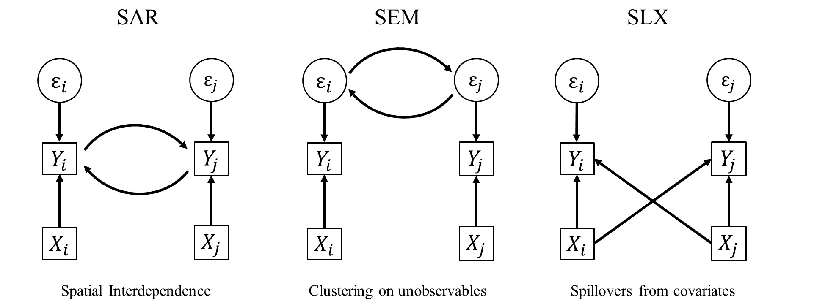
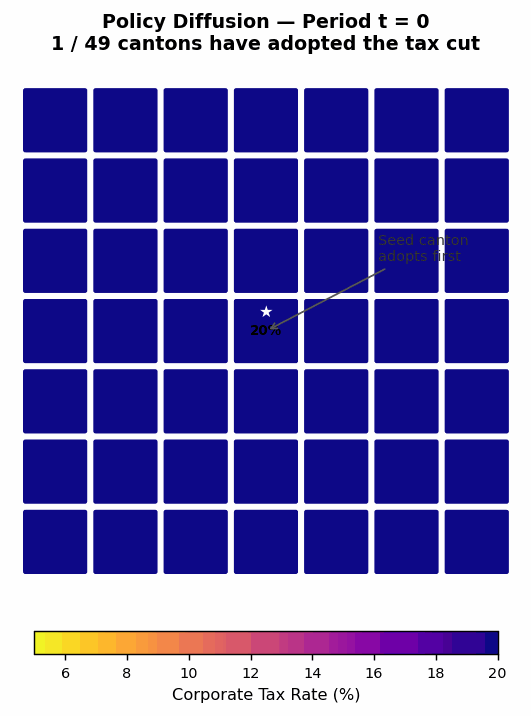
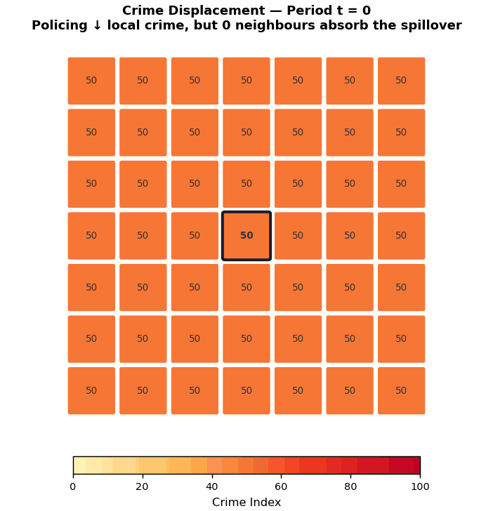
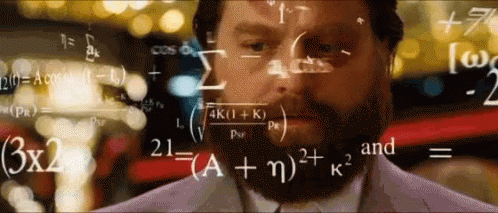
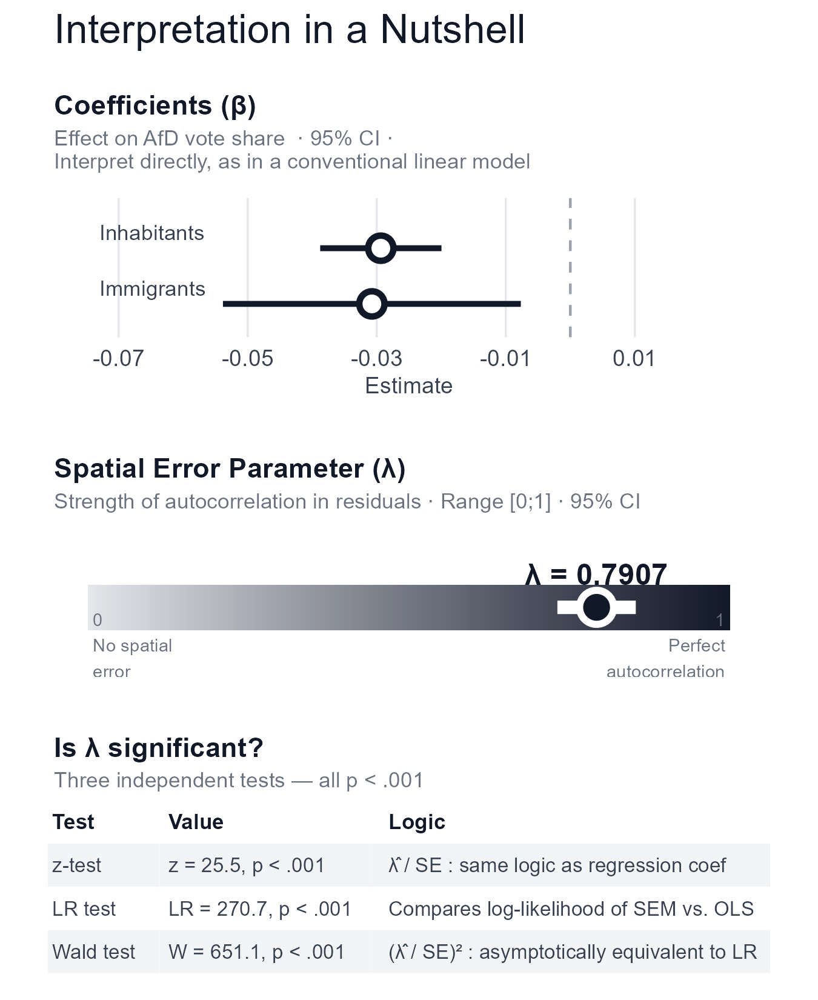
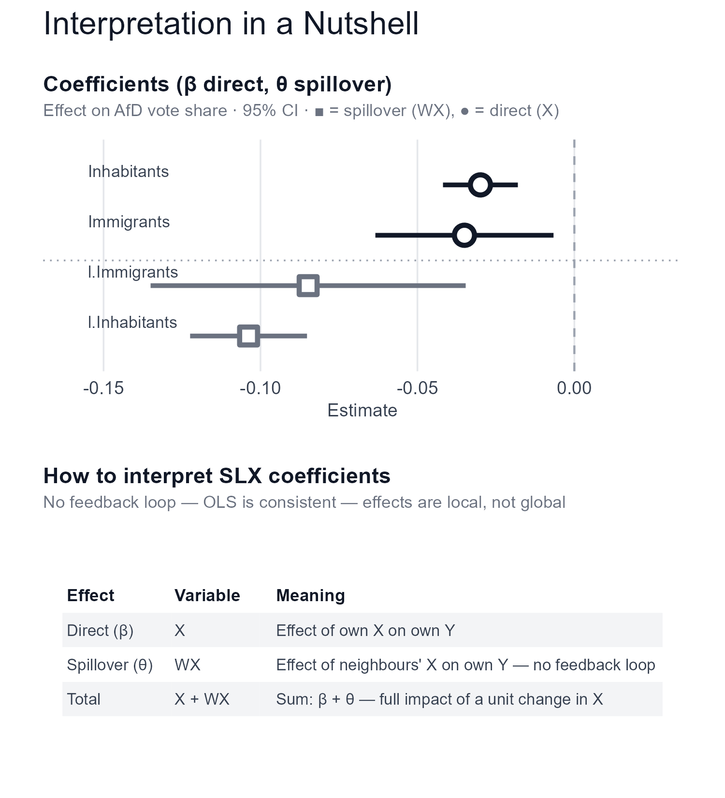
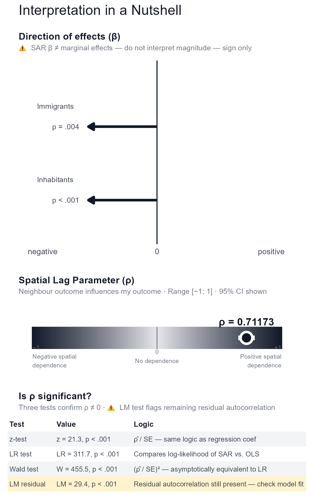
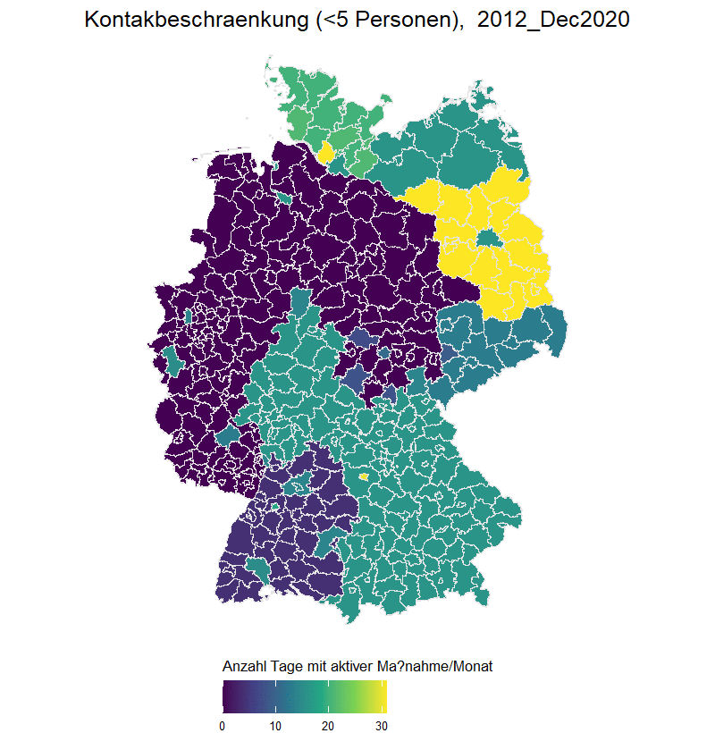
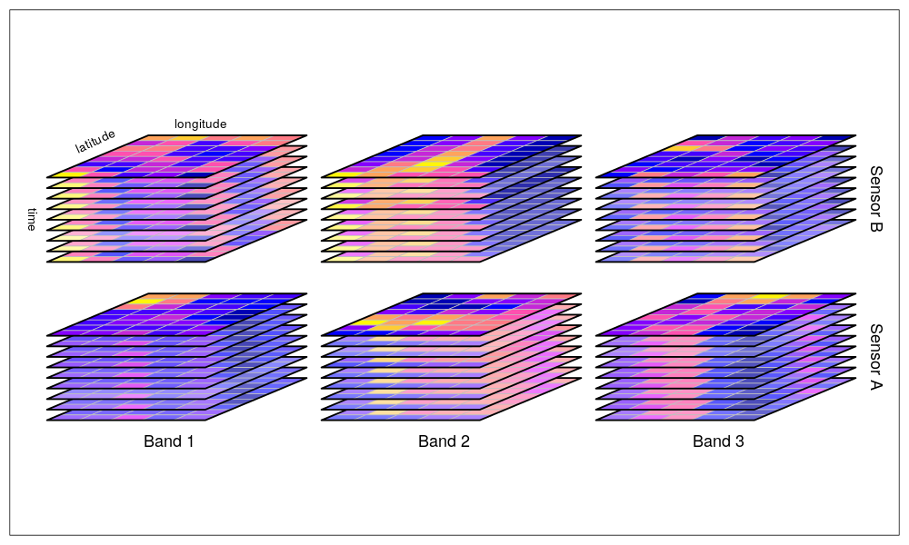
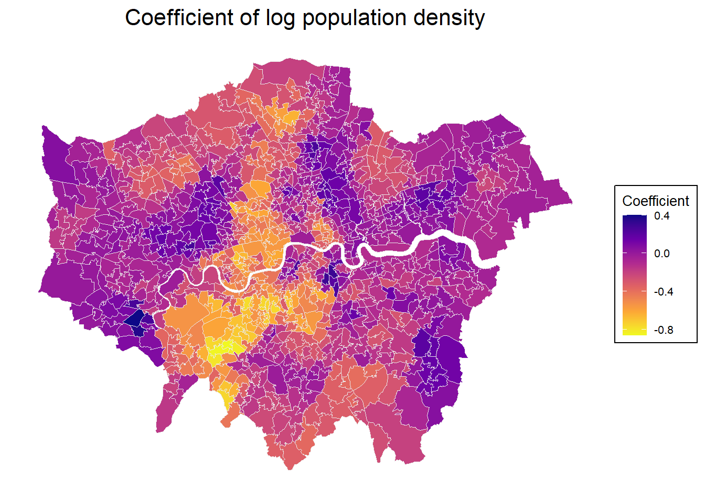

```{r}
#| include: false
library(dplyr)
library(ggplot2)
library(sf)
library(terra)
library(tmap)
```

## Now

```{r}
#| echo: false
source("course_content.R") 

course_content |> 
  kableExtra::row_spec(14, background = "yellow") |> 
  kableExtra::kable_styling(font_size = 20)
```

## What are spatial econometrics?

Classic econometrics:

- Using statistics to model (complex) theories, esp. causal thinking
- As default, we think about regression analysis

One core assumption: Observations are independent of each other. However, we just learnt that is often not the case.
  
Spatial econometrics:  

- **Where does spatial dependence and spatial processes enter our models and affect our outcome of interest?**

## Is it meaningful or just nuisances?

Space can be important in our analysis in two ways. 

- It's meaningful in our theory, and we thus interpret it accordingly after estimation
- It can distort our empirical estimates, producing bias, inconsistency, and inefficiency

**We can address these different perspectives in our analysis with spatial econometric methods.**

{.r-stretch fig-align="center"}


## Spatial Diffusion

:::: columns
::: {.column width="50%"}
- $y_i$ affects $y_j$ through $w_{ij}$
- $y_j$ affects $y_i$ through $w_{ji}$
- endogenous by design! 
- Examples:
  - tax competition:  if a state cuts corporate tax, neighbours respond by cutting theirs too
  - civil war onset: conflict in one country raises the probability of onset in neighbours 
:::

::: {.column width="50%"}

{fig-align="center" width="70%"}
:::
::::

## Spatial Spill-Over

:::: columns
::: {.column width="50%"}
- $x_i$ affects $y_j$ through $w_{ij}$
- $x_j$ affects $y_i$ through $w_{ij}$
- Examples:
  - trade and export:  a neighbour region's GDP (their X) raises your export volumes or wages (your Y) 
  - crime displacement: increased policing in one neighbourhood raises crime in your neighbourhood, as criminals relocate
:::

::: {.column width="50%"}

 {fig-align="center" width="80%"}
:::
::::


## Formulas... 

<ul style="font-size:.8em;">


Linear Regression:
$$\small Y = X\beta + \epsilon$$
Spatial Lag Y / Spatial Autoregressive Model (SAR, Diffusion):
$$\small Y = \rho WY + X\beta + \epsilon$$

Spatial Lag X Model (SLX, Spillover):
$$\small Y = X\beta + WX\theta + \epsilon$$

Spatial Error Model (SEM): 
$$\small Y = X\beta + u$$
$$\small u = \lambda Wu + \epsilon$$

</ul>

## Flavors and extensions

But what if....

- ... you have interdependence and spillovers in covariates?
- ... spillovers and clustering in errors?
- ... interdependence and clustering in errors?
- ... everything is related with everything?

{.r-stretch fig-align="center"}


## Flavors and extensions

:::: columns
::: {.column width="50%" style="text-align:center"}
**Spatial Durbin Model**

$$Y = \rho WY + X\beta + WX\theta + \epsilon$$

**Spatial Durbin Error Model**

$$Y = X\beta + WX\theta + u$$
$$u = \lambda Wu + \epsilon$$
:::

::: {.column width="50%" style="text-align:center"}
**Combined Spatial Autocorrelation Model**

$$Y = \rho WY + X\beta + u$$
$$u = \lambda Wu + \epsilon$$

**Manski Model**

$$Y = \rho WY + WX\theta + X\beta + u$$
$$u = \lambda Wu + \epsilon$$
:::
::::

## Which model to choose?

<iframe src="../img/spatial_decision_tree.html" width="100%" height="580px"
  style="border:none; border-radius:4px;"></iframe> 


## Intermediate summary

There are a lot of models you could estimate to *explain* spatial autocorrelation. And there's a vast body of literature on the best choice for which application. Important for us: theory-grounded reasoning for the underlying data generating process.

Getting this wrong has real consequences:

- Misspecifying SAR as OLS → biased β (omitted variable: Wy)
- Misspecifying SEM as OLS → correct β, wrong inference (deflated SEs)
- Misspecifying SEM as SAR → spurious  diffusion, inefficient β 
- Misspecifying SAR as SLX → underestimates spillovers (captures first-order neighbour effect)

We'd explicitly like to recommend the work of [Tobias Rüttenauer](https://ruettenauer.github.io/publication/) for us social scientists. [Here](https://ruettenauer.github.io/Geodata_Spatial_Regression) are some really nice workshop materials.

## 'Research' question and data

We will use the same example as in the previous session. But this time, we will test if one of our spatial regression models helps further investigate the data generation process. We may ask:

1. Do immigrant shares affect AfD voting shares within voting districts?
2. Do immigrant shares affect AfD voting shares between neighborhoods? (=spillover)
3. Do AfD voting shares affect AfD voting shares between neighborhoods? (=diffusion)

Controlling inhabitant numbers within the voting districts might also be a good idea.

```{r}
#| include: false
voting_districts <-
  sf::st_read("../../data/Stimmbezirk.shp") |> 
  dplyr::transmute(Stimmbezirk = as.numeric(nummer)) |> 
  sf::st_transform(3035)

afd_votes <-
  glue::glue(
    "https://www.stadt-koeln.de/wahlen/bundestagswahl/09-2021/praesentation/\\
    Open-Data-Bundestagswahl476.csv"
  ) |> 
  readr::read_csv2() |> 
  dplyr::transmute(Stimmbezirk = `gebiet-nr`, afd_share = (F1 / F) * 100)

election_results <-
  dplyr::left_join(
    voting_districts,
    afd_votes,
    by = "Stimmbezirk"
  )

immigrants_cologne <- terra::rast("../../data/immigrants_cologne.tif")

inhabitants_cologne <- terra::rast("../../data/inhabitants_cologne.tif")

immigrant_share_cologne <-
  (immigrants_cologne / inhabitants_cologne) * 100

election_results <-
  election_results |> 
  dplyr::mutate(
    immigrant_share = 
      exactextractr::exact_extract(
        immigrant_share_cologne, election_results, 'mean', progress = FALSE
      ),
    inhabitants = 
      exactextractr::exact_extract(
        inhabitants_cologne, election_results, 'mean', progress = FALSE
      )
  )
```

## Linear regression

```{r}
linear_regression <-
  lm(afd_share ~ immigrant_share + inhabitants, data = election_results)

summary(linear_regression)
```

## Now we need a spatial weight

Once again, we have to construct a spatial weight as in the analysis of spatial autocorrelation to estimate a spatial regression. In fact, we'll use the same approach as before.

```{r}
queen_neighborhoods <- spdep::poly2nb(election_results, queen = TRUE)

queen_W <- spdep::nb2listw(queen_neighborhoods, style = "W")
```

## Spatial Error Model

:::: columns
::: {.column width="60%"}
```{r}
spatial_error_model <-
  spatialreg::errorsarlm(
    afd_share ~ immigrant_share + inhabitants,
    data = election_results, listw = queen_W)

summary(spatial_error_model)
```
:::

::: {.column width="40%"}
```{r}
#| echo: false

# NOTE: quick and dirty claude solution for visualization
# ── Model values (from spatialreg::errorsarlm output) ─────────────────────────

lambda      <- 0.7907
lambda_se   <- 0.030988
lambda_lo   <- lambda - 1.96 * lambda_se
lambda_hi   <- lambda + 1.96 * lambda_se

# ── Shared theme (black & white) ──────────────────────────────────────────────

clr_accent  <- "#111827"
clr_neutral <- "#6b7280"
clr_bg      <- "#ffffff"

theme_clean <- ggplot2::theme_minimal(base_family = "sans") +
  ggplot2::theme(
    plot.background    = ggplot2::element_rect(fill = clr_bg, colour = NA),
    panel.background   = ggplot2::element_rect(fill = clr_bg, colour = NA),
    panel.grid.major.y = ggplot2::element_blank(),
    panel.grid.minor   = ggplot2::element_blank(),
    panel.grid.major.x = ggplot2::element_line(colour = "#e5e7eb", linewidth = 0.4),
    axis.text          = ggplot2::element_text(colour = "#374151", size = 9),
    axis.title         = ggplot2::element_text(colour = "#374151", size = 9),
    plot.title         = ggplot2::element_text(colour = "#111827", size = 11, face = "bold", margin = ggplot2::margin(b = 4)),
    plot.subtitle      = ggplot2::element_text(colour = clr_neutral, size = 8.5, margin = ggplot2::margin(b = 10)),
    plot.margin        = ggplot2::margin(12, 16, 12, 16)
  )

# ── Panel A: Coefficient plot ──────────────────────────────────────────────────

coefs <- tibble::tibble(
  term      = c("Immigrants", "Inhabitants"),
  estimate  = c(-0.0307508, -0.0293662),
  std_error = c(0.0117756,  0.0047947),
  ci_lo     = estimate - 1.96 * std_error,
  ci_hi     = estimate + 1.96 * std_error,
  # labels placed just above each point, inside the plot
  label     = c("\u03b2 = -0.031\np = .009", "\u03b2 = -0.029\np < .001")
)

p_coef <- ggplot2::ggplot(coefs, ggplot2::aes(x = estimate, y = term)) +
  ggplot2::geom_vline(xintercept = 0, linetype = "dashed",
                      colour = "#9ca3af", linewidth = 0.5) +
  ggplot2::geom_linerange(ggplot2::aes(xmin = ci_lo, xmax = ci_hi),
                          colour = clr_accent, linewidth = 1.1) +
  ggplot2::geom_point(colour = clr_accent, size = 3.5, shape = 21,
                      fill = "white", stroke = 1.8) +
    # term name inside, left-anchored near the left edge of the panel
  ggplot2::geom_text(
    ggplot2::aes(label = term, x = -0.073),
    hjust      = 0,
    nudge_y    = 0.28,
    size       = 3,
    colour     = "#374151",
    lineheight = 1.2
  ) +
  ggplot2::scale_x_continuous(
    limits = c(-0.075, 0.025),
    breaks = seq(-0.07, 0.02, by = 0.02)
  ) +
  ggplot2::scale_y_discrete(expand = ggplot2::expansion(add = c(0.6, 0.9))) +
  ggplot2::labs(
    title    = "Coefficients (\u03b2)",
    subtitle = "Effect on AfD vote share  \u00b7 95% CI \u00b7 \nInterpret directly, as in a conventional linear model",
    x        = "Estimate", y = NULL
  ) +
  theme_clean +
  ggplot2::theme(
    panel.grid.major.x = ggplot2::element_line(colour = "#e5e7eb", linewidth = 0.4),
    axis.text.y        = ggplot2::element_blank()
  )

# ── Panel B: Lambda gauge ─────────────────────────────────────────────────────

lambda_df <- tibble::tibble(
  x = seq(0, 1, length.out = 200),
  y = 0.5
)

p_lambda_gauge <- ggplot2::ggplot() +
  ggplot2::geom_tile(
    data = lambda_df,
    ggplot2::aes(x = x, y = y, fill = x), height = 0.18, show.legend = FALSE
  ) +
  ggplot2::scale_fill_gradient(low = "#e5e7eb", high = "#111827") +
  ggplot2::annotate("segment",
                    x = lambda_lo, xend = lambda_hi, y = 0.5, yend = 0.5,
                    colour = "white", linewidth = 2.5
  ) +
  ggplot2::annotate("point",
                    x = lambda, y = 0.5,
                    colour = "white", size = 5, shape = 21, fill = "#111827", stroke = 2
  ) +
  ggplot2::annotate("text",
                    x = lambda, y = 0.63,
                    label = paste0("\u03bb = ", lambda),
                    colour = "#111827", fontface = "bold", size = 4.2
  ) +
  ggplot2::annotate("text",
                    x = 0.01, y = 0.35, label = "0\nNo spatial\nerror",
                    colour = clr_neutral, size = 2.5, hjust = 0, lineheight = 1.2
  ) +
  ggplot2::annotate("text",
                    x = 0.99, y = 0.35, label = "1\nPerfect\nautocorrelation",
                    colour = clr_neutral, size = 2.5, hjust = 1, lineheight = 1.2
  ) +
  ggplot2::scale_x_continuous(limits = c(0, 1), breaks = NULL) +
  ggplot2::scale_y_continuous(limits = c(0.25, 0.75), breaks = NULL) +
  ggplot2::labs(
    title    = "Spatial Error Parameter (\u03bb)",
    subtitle = "Strength of autocorrelation in residuals \u00b7 Range [0;1] \u00b7 95% CI",
    x = NULL, y = NULL
  ) +
  theme_clean +
  ggplot2::theme(panel.grid = ggplot2::element_blank(), axis.text = ggplot2::element_blank())

# ── Panel C: Lambda significance table ───────────────────────────────────────

lambda_tbl <- data.frame(
  Test  = c("z-test", "LR test", "Wald test"),
  Value = c("z = 25.5, p < .001", "LR = 270.7, p < .001", "W = 651.1, p < .001"),
  Logic = c(
    "\u03bb\u0302 / SE : same logic as regression coef",
    "Compares log-likelihood of SEM vs. OLS",
    "(\u03bb\u0302 / SE)\u00b2 : asymptotically equivalent to LR"
  )
)

tbl_theme <- gridExtra::ttheme_minimal(
  base_size    = 8,
  base_colour  = "#374151",
  base_family  = "sans",
  core    = list(
    fg_params = list(hjust = 0, x = 0.04, fontsize = 8),
    bg_params = list(fill = c("#f3f4f6", clr_bg), col = NA)   # light grey / white
  ),
  colhead = list(
    fg_params = list(
      hjust = 0, x = 0.04,
      fontsize = 8.5, fontface = "bold",
      col = "#111827"
    ),
    bg_params = list(fill = clr_bg, col = NA)
  )
)

lambda_grob <- gridExtra::tableGrob(lambda_tbl, rows = NULL, theme = tbl_theme)

p_lambda_tests <- patchwork::wrap_elements(lambda_grob) +
  ggplot2::labs(
    title    = "Is \u03bb significant?",
    subtitle = "Three independent tests \u2014 all p < .001"
  ) +
  theme_clean +
  ggplot2::theme(
    plot.title    = ggplot2::element_text(size = 11, face = "bold", colour = "#111827"),
    plot.subtitle = ggplot2::element_text(size = 8.5, colour = clr_neutral),
    plot.margin   = ggplot2::margin(12, 16, 12, 16)
  )

# ── Combine ───────────────────────────────────────────────────────────────────

p_lambda <-
  p_coef / p_lambda_gauge / p_lambda_tests +
  patchwork::plot_annotation(
    title = "Interpretation in a Nutshell",
    theme = ggplot2::theme(
      plot.title      = ggplot2::element_text(size = 16, colour = "#111827"),
      plot.background = ggplot2::element_rect(fill = clr_bg, colour = NA)
    )
  )

ggplot2::ggsave(
  filename = "../img/sem_interpretation.png",
  plot     = p_lambda,
  width    = 4.5,
  height   = 5.5,
  dpi      = 300,
  bg       = clr_bg
)


```
{fig-align="center" width="80%"}

:::
::::

## Spatial Lag X Model

:::: columns
::: {.column width="60%"}
```{r}
spatial_lag_x_model <-
  spatialreg::lmSLX(
    afd_share ~ immigrant_share + inhabitants,
    data = election_results, listw = queen_W
  )

summary(spatial_lag_x_model)
```
:::

:::{.column width = "40%"}
```{r}
#| echo: false


# NOTE: quick and dirty claude solution for visualization — SLX model
# ── Model values (from spatialreg::lmSLX output) ──────────────────────────────

coefs <- tibble::tibble(
  term      = c("Immigrants", "Inhabitants",
                "l.Immigrants", "l.Inhabitants"),
  estimate  = c(-3.502e-02, -2.993e-02, -8.482e-02, -1.038e-01),
  std_error = c( 1.448e-02,  6.086e-03,  2.561e-02,  9.502e-03),
  ci_lo     = estimate - 1.96 * std_error,
  ci_hi     = estimate + 1.96 * std_error,
  sig       = c("p = .016", "p < .001", "p < .001", "p < .001"),
  type      = c("Direct", "Direct", "Spillover (WX)", "Spillover (WX)")
)

# ── Shared theme (black & white) ──────────────────────────────────────────────

clr_direct   <- "#111827"
clr_spillover <- "#6b7280"
clr_neutral  <- "#9ca3af"
clr_bg       <- "#ffffff"

theme_clean <- ggplot2::theme_minimal(base_family = "sans") +
  ggplot2::theme(
    plot.background    = ggplot2::element_rect(fill = clr_bg, colour = NA),
    panel.background   = ggplot2::element_rect(fill = clr_bg, colour = NA),
    panel.grid.major.y = ggplot2::element_blank(),
    panel.grid.minor   = ggplot2::element_blank(),
    panel.grid.major.x = ggplot2::element_line(colour = "#e5e7eb", linewidth = 0.4),
    axis.text          = ggplot2::element_text(colour = "#374151", size = 9),
    axis.title         = ggplot2::element_text(colour = "#374151", size = 9),
    plot.title         = ggplot2::element_text(colour = "#111827", size = 11, face = "bold",
                                               margin = ggplot2::margin(b = 4)),
    plot.subtitle      = ggplot2::element_text(colour = "#6b7280", size = 8.5,
                                               margin = ggplot2::margin(b = 10)),
    plot.margin        = ggplot2::margin(12, 16, 12, 16)
  )

# ── Panel A: Coefficient plot ──────────────────────────────────────────────────
# Direct (β) and spillover (θ = WX) coefficients distinguished by shape + shade

p_coef <- ggplot2::ggplot(
  coefs,
  ggplot2::aes(
    x     = estimate,
    y     = stats::reorder(term, estimate),
    colour = type,
    shape  = type
  )
) +
  ggplot2::geom_vline(xintercept = 0, linetype = "dashed",
                      colour = clr_neutral, linewidth = 0.5) +
  # separator line between direct and spillover groups
  ggplot2::geom_hline(yintercept = 2.5, linetype = "dotted",
                      colour = clr_neutral, linewidth = 0.4) +
  ggplot2::geom_linerange(
    ggplot2::aes(xmin = ci_lo, xmax = ci_hi),
    linewidth = 1.1
  ) +
  ggplot2::geom_point(size = 3.5, fill = "white", stroke = 1.8) +
  # term label inside, left-anchored
  ggplot2::geom_text(
    ggplot2::aes(label = term, x = -0.155),
    hjust      = 0,
    nudge_y    = 0.28,
    size       = 2.9,
    colour     = "#374151",
    lineheight = 1.2
  ) +
  ggplot2::scale_colour_manual(values = c("Direct" = clr_direct, "Spillover (WX)" = clr_spillover)) +
  ggplot2::scale_shape_manual(values  = c("Direct" = 21,          "Spillover (WX)" = 22)) +
  ggplot2::scale_x_continuous(
    limits = c(-0.16, 0.025),
  ) +
  ggplot2::scale_y_discrete(expand = ggplot2::expansion(add = c(0.7, 0.9))) +
  ggplot2::labs(
    title    = "Coefficients (\u03b2 direct, \u03b8 spillover)",
    subtitle = "Effect on AfD vote share \u00b7 95% CI \u00b7 \u25a0 = spillover (WX), \u25cf = direct (X)",
    x = "Estimate", y = NULL
  ) +
  theme_clean +
  ggplot2::theme(
    legend.position    = "none",
    axis.text.y        = ggplot2::element_blank()
  )

# ── Panel B: Interpretation table ─────────────────────────────────────────────
# SLX has no lambda — key message is about the two types of effects

interp_tbl <- data.frame(
  Effect   = c("Direct (\u03b2)", "Spillover (\u03b8)", "Total"),
  Variable = c("X", "WX", "X + WX"),
  Meaning  = c(
    "Effect of own X on own Y",
    "Effect of neighbours' X on own Y — no feedback loop",
    "Sum: \u03b2 + \u03b8 \u2014 full impact of a unit change in X"
  )
)

tbl_theme <- gridExtra::ttheme_minimal(
  base_size   = 8,
  base_colour = "#374151",
  base_family = "sans",
  core    = list(
    fg_params = list(hjust = 0, x = 0.04, fontsize = 8),
    bg_params = list(fill = c("#f3f4f6", clr_bg), col = NA)
  ),
  colhead = list(
    fg_params = list(hjust = 0, x = 0.04, fontsize = 8.5,
                     fontface = "bold", col = "#111827"),
    bg_params = list(fill = clr_bg, col = NA)
  )
)

interp_grob <- gridExtra::tableGrob(interp_tbl, rows = NULL, theme = tbl_theme)

p_interp <- patchwork::wrap_elements(interp_grob) +
  ggplot2::labs(
    title    = "How to interpret SLX coefficients",
    subtitle = "No feedback loop \u2014 OLS is consistent \u2014 effects are local, not global"
  ) +
  theme_clean +
  ggplot2::theme(
    plot.title    = ggplot2::element_text(size = 11, face = "bold", colour = "#111827"),
    plot.subtitle = ggplot2::element_text(size = 8.5, colour = "#6b7280"),
    plot.margin   = ggplot2::margin(12, 16, 12, 16)
  )

# ── Combine ───────────────────────────────────────────────────────────────────

p_slx <- p_coef / p_interp +
  patchwork::plot_annotation(
    title = "Interpretation in a Nutshell",
    theme = ggplot2::theme(
      plot.title      = ggplot2::element_text(size = 16, colour = "#111827"),
      plot.background = ggplot2::element_rect(fill = clr_bg, colour = NA)
    )
  )

ggplot2::ggsave(
  filename = "../img/slx_interpretation.png",
  plot     = p_slx,
  width    = 5,
  height   = 5.5,
  dpi      = 300,
  bg       = clr_bg
)
```
{fig-align="center" width="80%"}

:::
::::

## Spatial Lag Y Model

:::: columns
:::{.column width = "60%"}

```{r}
spatial_lag_y_model <-
  spatialreg::lagsarlm(
    afd_share ~ immigrant_share + inhabitants,
    data = election_results, listw = queen_W)

summary(spatial_lag_y_model)
```
:::
:::{.column width = "40%"}
```{r}
#| echo: false


# NOTE: quick and dirty claude solution for visualization — SAR model
# ── Model values (from spatialreg::lagsarlm output) ───────────────────────────

coefs <- tibble::tibble(
  term      = c("Immigrants", "Inhabitants"),
  estimate  = c(-0.0295856, -0.0323508),
  std_error = c( 0.0101910,  0.0038451),
  ci_lo     = estimate - 1.96 * std_error,
  ci_hi     = estimate + 1.96 * std_error,
  sig       = c("p = .004", "p < .001")
)

rho      <- 0.71173
rho_se   <- 0.033348
rho_lo   <- rho - 1.96 * rho_se
rho_hi   <- rho + 1.96 * rho_se

# ── Shared theme (black & white) ──────────────────────────────────────────────

clr_accent  <- "#111827"
clr_neutral <- "#6b7280"
clr_bg      <- "#ffffff"

theme_clean <- ggplot2::theme_minimal(base_family = "sans") +
  ggplot2::theme(
    plot.background    = ggplot2::element_rect(fill = clr_bg, colour = NA),
    panel.background   = ggplot2::element_rect(fill = clr_bg, colour = NA),
    panel.grid.major.y = ggplot2::element_blank(),
    panel.grid.minor   = ggplot2::element_blank(),
    panel.grid.major.x = ggplot2::element_line(colour = "#e5e7eb", linewidth = 0.4),
    axis.text          = ggplot2::element_text(colour = "#374151", size = 9),
    axis.title         = ggplot2::element_text(colour = "#374151", size = 9),
    plot.title         = ggplot2::element_text(colour = "#111827", size = 11, face = "bold",
                                               margin = ggplot2::margin(b = 4)),
    plot.subtitle      = ggplot2::element_text(colour = "#6b7280", size = 8.5,
                                               margin = ggplot2::margin(b = 10)),
    plot.margin        = ggplot2::margin(12, 16, 12, 16)
  )

# ── Panel A: Coefficient plot ──────────────────────────────────────────────────
# ⚠ SAR coefficients ≠ marginal effects — flagged in subtitle

p_coef <- ggplot2::ggplot(coefs, ggplot2::aes(y = stats::reorder(term, estimate))) +
  ggplot2::geom_vline(xintercept = 0, colour = "#374151", linewidth = 0.7) +
  # arrow from 0 to direction of effect — length conveys nothing, only sign
  ggplot2::geom_segment(
    ggplot2::aes(x = 0, xend = sign(estimate) * 0.6, yend = stats::reorder(term, estimate)),
    colour   = clr_accent,
    linewidth = 1.4,
    arrow    = ggplot2::arrow(length = ggplot2::unit(0.25, "cm"), type = "closed")
  ) +
  # significance label at arrow tip
  ggplot2::geom_text(
    ggplot2::aes(x = sign(estimate) * 0.68, label = sig),
    hjust  = ifelse(coefs$estimate < 0, 1, 0),
    size   = 3,
    colour = "#374151"
  ) +
  # term label inside, anchored to the left
  ggplot2::geom_text(
    ggplot2::aes(label = term, x = -1.05),
    hjust      = 0,
    nudge_y    = 0.28,
    size       = 3,
    colour     = "#374151"
  ) +
  ggplot2::scale_x_continuous(
    limits = c(-1.1, 1.1),
    breaks = c(-1, 0, 1),
    labels = c("negative", "0", "positive")
  ) +
  ggplot2::scale_y_discrete(expand = ggplot2::expansion(add = c(0.6, 0.9))) +
  ggplot2::labs(
    title    = "Direction of effects (\u03b2)",
    subtitle = "\u26a0 SAR \u03b2 \u2260 marginal effects \u2014 do not interpret magnitude \u2014 sign only",
    x = NULL, y = NULL
  ) +
  theme_clean +
  ggplot2::theme(
    axis.text.y        = ggplot2::element_blank(),
    panel.grid.major.x = ggplot2::element_blank()
  )

# ── Panel B: Rho gauge + significance tests ───────────────────────────────────

rho_df <- tibble::tibble(x = seq(-1, 1, length.out = 200), y = 0.5)

p_rho_gauge <- ggplot2::ggplot() +
  ggplot2::geom_tile(
    data = rho_df,
    ggplot2::aes(x = x, y = y, fill = x), height = 0.18, show.legend = FALSE
  ) +
  # diverging gradient: dark left (negative) → light centre (zero) → dark right (positive)
  ggplot2::scale_fill_gradient2(low = "#111827", mid = "#e5e7eb", high = "#111827", midpoint = 0) +
  # zero reference line
  ggplot2::annotate("segment",
                    x = 0, xend = 0, y = 0.41, yend = 0.59,
                    colour = "#9ca3af", linewidth = 0.8) +
  # CI bar
  ggplot2::annotate("segment",
                    x = rho_lo, xend = rho_hi, y = 0.5, yend = 0.5,
                    colour = "white", linewidth = 2.5) +
  # point estimate
  ggplot2::annotate("point",
                    x = rho, y = 0.5, colour = "white", size = 5,
                    shape = 21, fill = "#111827", stroke = 2) +
  # value label
  ggplot2::annotate("text",
                    x = rho, y = 0.63,
                    label = paste0("\u03c1 = ", rho),
                    colour = "#111827", fontface = "bold", size = 4.2) +
  # anchor labels
  ggplot2::annotate("text",
                    x = -0.99, y = 0.35,
                    label = "\u22121\nNegative spatial\ndependence",
                    colour = clr_neutral, size = 2.5, hjust = 0, lineheight = 1.2) +
  ggplot2::annotate("text",
                    x = 0, y = 0.35,
                    label = "0\nNo dependence",
                    colour = clr_neutral, size = 2.5, hjust = 0.5, lineheight = 1.2) +
  ggplot2::annotate("text",
                    x = 0.99, y = 0.35,
                    label = "+1\nPositive spatial\ndependence",
                    colour = clr_neutral, size = 2.5, hjust = 1, lineheight = 1.2) +
  ggplot2::scale_x_continuous(limits = c(-1, 1), breaks = NULL) +
  ggplot2::scale_y_continuous(limits = c(0.25, 0.75), breaks = NULL) +
  ggplot2::labs(
    title    = "Spatial Lag Parameter (\u03c1)",
    subtitle = "Neighbour outcome influences my outcome \u00b7 Range [\u22121; 1] \u00b7 95% CI shown",
    x = NULL, y = NULL
  ) +
  theme_clean +
  ggplot2::theme(panel.grid = ggplot2::element_blank(), axis.text = ggplot2::element_blank())

# Three tests for ρ significance + LM residual test
rho_tbl <- data.frame(
  Test  = c("z-test", "LR test", "Wald test", "LM residual"),
  Value = c("z = 21.3, p < .001", "LR = 311.7, p < .001",
            "W = 455.5, p < .001", "LM = 29.4, p < .001"),
  Logic = c(
    "\u03c1\u0302 / SE \u2014 same logic as regression coef",
    "Compares log-likelihood of SAR vs. OLS",
    "(\u03c1\u0302 / SE)\u00b2 \u2014 asymptotically equivalent to LR",
    "Residual autocorrelation still present \u2014 check model fit"
  )
)

tbl_theme <- gridExtra::ttheme_minimal(
  base_size   = 8,
  base_colour = "#374151",
  base_family = "sans",
  core    = list(
    fg_params = list(hjust = 0, x = 0.04, fontsize = 8),
    bg_params = list(fill = c("#f3f4f6", clr_bg, "#f3f4f6", "#fff3cd"), col = NA)
  ),
  colhead = list(
    fg_params = list(hjust = 0, x = 0.04, fontsize = 8.5,
                     fontface = "bold", col = "#111827"),
    bg_params = list(fill = clr_bg, col = NA)
  )
)

rho_grob <- gridExtra::tableGrob(rho_tbl, rows = NULL, theme = tbl_theme)

p_rho_tests <- patchwork::wrap_elements(rho_grob) +
  ggplot2::labs(
    title    = "Is \u03c1 significant?",
    subtitle = "Three tests confirm \u03c1 \u2260 0 \u00b7 \u26a0 LM test flags remaining residual autocorrelation"
  ) +
  theme_clean +
  ggplot2::theme(
    plot.title    = ggplot2::element_text(size = 11, face = "bold", colour = "#111827"),
    plot.subtitle = ggplot2::element_text(size = 8.5, colour = "#6b7280"),
    plot.margin   = ggplot2::margin(12, 16, 12, 16)
  )

p_rho <- p_rho_gauge / p_rho_tests

# ── Combine ───────────────────────────────────────────────────────────────────

p_sar <- p_coef / p_rho +
  patchwork::plot_annotation(
    title = "Interpretation in a Nutshell",
    theme = ggplot2::theme(
      plot.title      = ggplot2::element_text(size = 16, colour = "#111827"),
      plot.background = ggplot2::element_rect(fill = clr_bg, colour = NA)
    )
  )

ggplot2::ggsave(
  filename = "../img/sar_interpretation.png",
  plot     = p_sar,
  width    = 5,
  height   = 8,
  dpi      = 300,
  bg       = clr_bg
)
```
{fig-align="center" width="80%"}
:::
::::

## Comparison: What's 'better'?

```{r}
AIC(spatial_error_model, spatial_lag_x_model, spatial_lag_y_model)

spdep::lm.LMtests(linear_regression, queen_W, test = c("LMerr", "LMlag"))
```

## Comparison: What's 'better'?


| Test | Estimate | Points to |
|------|-----------|-----------|
| RSerr | 245.5, p < .001 | SEM ($\lambda \neq 0$) |
| RSlag | 372.5, p < .001 | SAR ($\rho \neq 0$) |


> RSlag > RSerr → SAR preferred ... but the SAR residuals still show autocorrelation (LM = 29.4, p < .001).

> Let's stick to our theory, shall we?

## Of higher importance: interpretation

Unfortunately, in a Spatial Lag Y Model, the spatial parameter $\rho$ only tells us whether the effect is (statistically) significant. 

- Remember: these models are endogenous by design
  - We have effects of $y_j$ on $y_i$ and vice versa
  - What a mess
  
Luckily, there's a method to decompose the spatial effects into direct, indirect, and total effects: **estimating impacts**

## Impact estimation in `R`

This time, let's start with the Spatial Lag Y Model:

```{r}
spatialreg::impacts(spatial_lag_y_model, listw = queen_W)
```

Compare it to the 'simple' regression output:

```{r}
coef(spatial_lag_y_model)
```

A **1pp increase** in immigrant share  **decreases** AfD vote share **in this unit** by **0.0341pp** (direct), and decreases AfD vote share **in the whole neighbourhood system** by a further **0.685pp** (indirect). 

## Spatial Lag X impacts

```{r}
spatialreg::impacts(spatial_lag_x_model, listw = queen_W)
```

Compare it to the 'simple' regression output:

```{r}
coef(spatial_lag_x_model)
```

Nothing is really gained.

## If you need p-values and stuff

```{r}
spatialreg::impacts(spatial_lag_y_model, listw = queen_W, R = 500) |> 
  summary(zstats = TRUE, short = TRUE)
```

## Exercise 2_3_2: Spatial Regression

[Exercise](https://stefanjuenger.github.io/gesis-workshop-geospatial-techniques-R-2026/exercises/2_4_1_Spatial_Regression.html)

[Solution](https://stefanjuenger.github.io/gesis-workshop-geospatial-techniques-R-2026/solutions/2_4_1_Spatial_Regression.html)


## Outlook {.center style="text-align: center;"}

## This workshop

```{r}
#| echo: false
course_content |> 
  kableExtra::kable_styling(font_size = 20)
```

## What's left

:::: columns
::: {.column width="50%"}
Other map types, such as

- Cartograms
- Hexagon maps
- (more)animated maps
- Network graphs


GIS techniques, such as

- Geocoding
- Routing
- Cluster analysis


More Advanced Spatial(-temporal) Modeling 

More data sources...
:::

::: {.column width="50%"}
{fig-align="center" width="50%"}
:::
::::


## Data Sources

Some more information:

- Geospatial data are interdisciplinary
- Amount of data feels unlimited
- Data providers and data portals are often specific in the area and/or the information they cover

Some random examples: 

- [Eurostat](https://ec.europa.eu/eurostat/web/gisco/geodata)
- [European Spatial Data Infrastructure](https://inspire.ec.europa.eu/about-inspire/563)
- [John Hopkins Corona Data Hub and Dashboard](https://coronavirus.jhu.edu/map.html)
- [US Census Bureau](https://www.census.gov/geographies/mapping-files/time-series/geo/carto-boundary-file.html)
- ...


## Advanced Geospatial Data Processing for Social Scientists

- **09-20 June 2026 Online**
- [Register online](https://training.gesis.org/?site=pDetails&pID=0xA15F954A628C4D36B65167B160D89ED6)
- With Stefan and Dennis
- Expand your knowledge of geospatial data wrangling
- Focus on raster data and complex datacubes
- Remote sensing and Earth observation APIs

{.r-stretch fig-align="center"}
</small>Source:[R-Spatial](https://raw.githubusercontent.com/r-spatial/stars/master/images/cube2.png)</small>

## Geodata and Spatial Regression Analysis

- **30-2 July 2026 On-Site Mannheim**
- [Register online](https://training.gesis.org/?site=pDetails&child=full&pID=0xB1DFA1C064924FF290362BB5D8D70177)
- With Tobias Rüttenauer
- Analyzing spatial research questions
- Various spatial regression techniques

{.r-stretch fig-align="center"}
</small>Source:[R-Spatial](https://ruettenauer.github.io/Geodata_Spatial_Regression/10_other.html)</small>


## The End {.center style="text-align: center;"}


